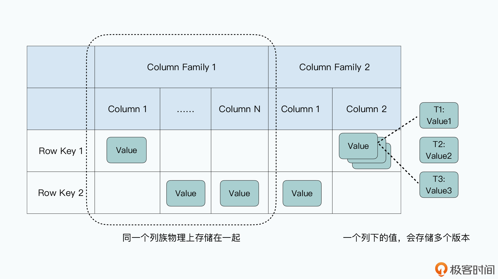
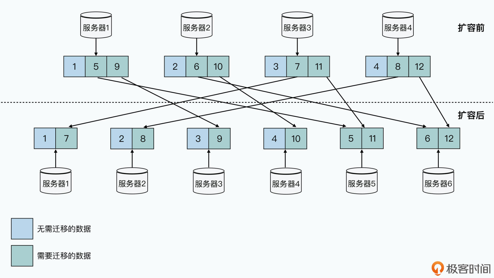
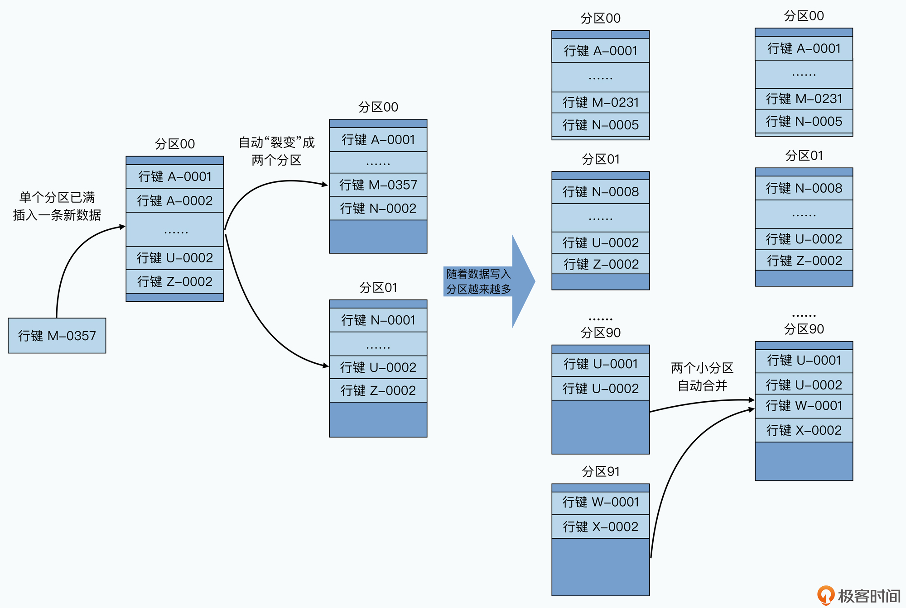
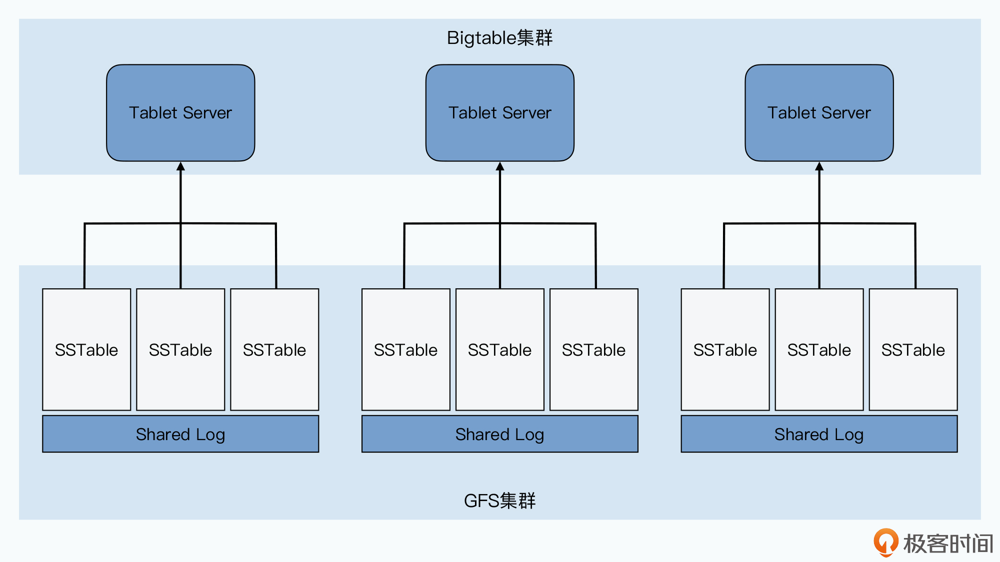
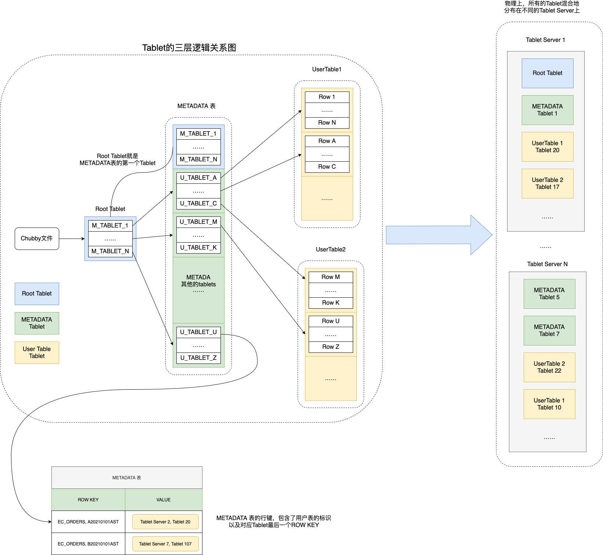
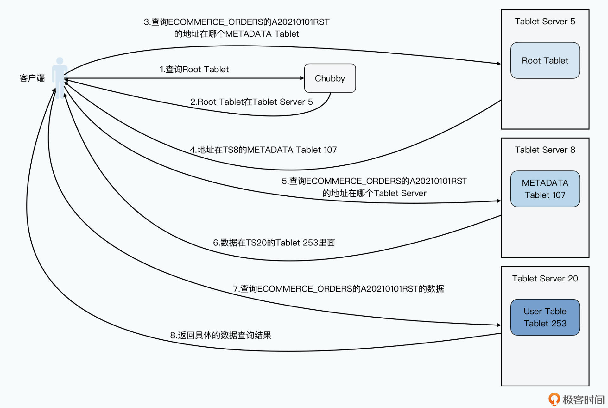
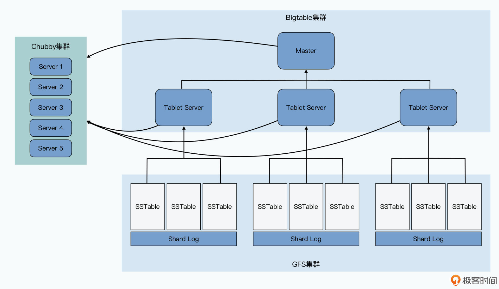

# 09 | Bigtable（二）：不认识“主人”的分布式架构

你好，我是徐文浩。上一讲里我们一起分析了如何对一个 MySQL 集群进行扩容，来支撑更高的随机读写请求。而在扩容过程中遇到的种种不便，也让我们深入理解了 Bigtable 的设计中需要重点解决的问题。

第一个问题，自然还是如何支撑好每秒十万、乃至百万级别的随机读写请求。

第二个问题，则是如何解决好“可伸缩性”和“可运维性”的问题。在一个上千台服务器的集群上，Bigtable 怎么能够做到自动分片和灾难恢复。

今天我们就先来看看第二个问题，其实也是 Bigtable 的整体架构。而第一个问题，一半要依赖第二个问题，也就是可以不断将集群扩容到成百上千个节点。另一半，则取决于在每一个节点上，Bigtable 的读写操作是怎么进行的，这一部分我们会放到下一讲，也就是 Bigtable 的底层存储 SSTable 究竟是怎么一回事儿。

那么接下来，我们就一起来看看 Bigtable 的整体架构。在学完这一讲后，希望你可以掌握 Bigtable 三个重要的知识点：

第一个，Bigtable 是如何进行数据分区，使得整个集群灵活可扩展的；

第二个，Bigtable 是如何设计，使得 Master 不会成为单点故障，乃至单点性能的瓶颈；

最后，自然是整个 Bigtable 的整体架构和组件由哪些东西组成。

相信在学完这一讲后，你也能自己设计一个分布式数据库的基本架构。并且，你也会对分布式数据库设计的分区和复制机制、系统整体架构设计，以及如何分析和优化整个架构的瓶颈所在，有一个清晰的了解。

## 理解 Bigtable 的基本数据模型

在进入到针对 Bigtable 的架构设计解读之前，我们先来弄清楚 Bigtable 基本的数据模型。

上一讲里，我们举了很多 MySQL 的例子。在这个过程中，相信你会发现，一旦我们开始分库分表了，我们就很难使用关系数据库的一系列的特性了。比如 SQL 里面的 Join 功能，或者是跨行的事务。因为这些功能在分库分表的场景下，都要涉及到多台服务器，不是说做不到，但是问题一下子就复杂了。

所以，Bigtable 在一开始，也不准备先考虑事务、Join 等高级的功能，而是**把核心放在了“可伸缩性”上**。因此，Bigtable 自己的数据模型也特别简单，是一个很宽的稀疏表。

每一张 Bigtable 的表都特别简单，每一行就是一条数据：

一条数据里面，有一个行键（Row Key），也就是这条数据的主键，Bigtable 提供了通过这个行键随机读写这条记录的接口。因为总是通过行键来读写数据，所以很多人也把这样的数据库叫做 **KV 数据库**。

每一行里的数据呢，你需要指定一些列族（Column Family），每个列族下，你不需要指定列（Column）。**每一条数据都可以有属于自己的列，每一行数据的列也可以完全不一样**，因为列不是固定的。这个所谓不是固定的，其实就是列下面没有值。因为 Bigtable 在底层存储数据的时候，每一条记录都要把列和值存下来，没有值，意味着对应的这一行就没有这个列。这也是为什么说 Bigtable 是一个“稀疏”的表。

列下面如果有值的话，可以存储多个版本，不同版本都会存上对应版本的时间戳（Timestamp），你可以指定保留最近的 N 个版本（比如 N=3，就是保留时间戳最近的三个版本），也可以指定保留某一个时间点之后的版本。

其实，这里的有些命名容易让人误解，比如列族，这个名字很容易让人误解 Bigtable 是一个基于列存储的数据库。但事实完全不是这样，我觉得**对于列族，更合理的解读是，它是一张“物理表”，同一个列族下的数据会在物理上存储在一起。而整个表，是一张“逻辑表”。**

在现实当中，Bigtable 的开源实现 HBase，就是把每一个列族的数据存储在同一个 HFile 文件里。而在 Bigtable 的论文中，Google 定义了一个叫做**本地组**（Locality Group）的概念，我们可以把多个列族放在同一个本地组中，而同一个本地组的所有列的数据，都会存储在同一个 SSTable 文件里。

这个设计，就使得我们不需要针对字段多的数据表，像 MySQL 那样，进行纵向拆表了。

Bigtable 的这个数据模型，使得我们能很容易地去增加列，而且增加列并不算是修改 Bigtable 里一张表的 Schema，而是在某些这个列需要有值的行里面，直接写入数据就好了。这里的列和值，其实是直接以 key-value 键值对的形式直接存储下来的。

这个灵活、稀疏而又宽的表，特别适合早期的互联网业务。虽然数据量很大，但是数据本身的 Schema 我们可能没有想清楚，加减字段都不需要停机或者锁表。要知道，MySQL 直到 5.5 版本，用 ALTER 命令修改表结构仍然需要将整张表锁住。并且在锁住这张表的时候，我们是不能往表里写数据的。对于一张数据量很大的表来说，这会让整张表有很长一段时间不能写入数据。

而 Bigtable 这个稀疏列的设计，就为我们带来了很大的灵活性，如同《架构整洁之道》的作者Uncle Bob说的那样：“架构师的工作不是作出决策，而是尽可能久地推迟决策，在现在不作出重大决策的情况下构建程序，以便以后有足够信息时再作出决策。”

## 数据分区，可伸缩的第一步

搞清楚了 Bigtable 的数据模型，我们再来一起看一看，Bigtable 是怎么解决上一讲 MySQL 集群解决不好的**水平分库问题**的。

把一个数据表，根据主键的不同，拆分到多个不同的服务器上，在分布式数据库里被称之为**数据分区**（ Paritioning）。分区之后的每一片数据，在不同的分布式系统里有不同的名字，在 MySQL 里呢，我们一般叫做 Shard，Bigtable 里则叫做 Tablet。

上一讲里，MySQL 集群的分区之所以遇到种种困难，是因为我们通过取模函数来进行分区，也就是所谓的**哈希分区**。我们会拿一个字段哈希取模，然后划分到预先定好 N 个分片里面。这里最大的问题，在于分区需要在一开始就设计好，而不是自动随我们的数据变化动态调整的。

但是往往计划不如变化快，当我们的业务变化和计划稍有不同，就会遇到需要搬运数据或者各个分片负载不均衡的情况。你可以看一下我从上一讲里搬过来的这张图，当我们将 4 台服务器扩展到 6 台服务器的时候，哈希分区的方式使得我们要在网络上搬运整个数据库 2/3 的数据。

上一讲里，我们看过这个图片，哈希分区如果不是翻倍扩容，就需要搬运大量数据

所以，在 Bigtable 里，我们就采用了另外一种分区方式，也就是**动态区间分区**。我们不再是一开始就定义好需要多少个机器，应该怎么分区，而是采用了一种**自动去“分裂”（split）的方式**来动态地进行分区。

我们的整个数据表，会按照行键排好序，然后按照连续的行键一段段地分区。如果某一段行键的区间里，写的数据越来越多，占用的存储空间越来越大，那么整个系统会自动地将这个分区一分为二，变成两个分区。而如果某一个区间段的数据被删掉了很多，占用的空间越来越小了，那么我们就会自动把这个分区和它旁边的分区合并到一起。

这个分区的过程，就好像你按照 A~Z 的字母顺序去管理你的书的过程。一开始，你只有一个空箱子放在地上，然后你把你的书按照书名的拼音，从上到下放在箱子里。当有一本新书需要放进来的时候，你就按照字母顺序插在某两本书中间。而当箱子放不下的时候，你就再拿一个空箱子，放在放不下的箱子下面，然后把之前的箱子里的图书从中间一分，把下面的一半放到新箱子里。

而我们删除数据的时候，就要把书从箱子里面拿走。当两个相邻的箱子里都很空的时候，我们就可以把两个箱子里面的书放到一个箱子里面，然后把腾出来的空箱子挪走。这里的一个个“箱子”就是我们的分片，这里面的一本本书，就是我们的一行数据，而书名的拼音，就是我们的行键。可能以 A、B、C 开头的书多一些，那么它们占用的分区就会多一些，以 U、V、W 开头的书少一些，可能这些书就都在一个分区里面。

动态区间分区：自动根据当前数据分布，进行分区或者合并

采用这样的方式，你会发现，你可以动态地调整数据是如何分区的，并且每个分区在数据量上，都会相对比较均匀。而且，在分区发生变化的时候，你需要调整的只有一个分区，再没有需要大量搬运数据的压力了。

## 通过 Master + Chubby 进行分区管理

那么看到这儿，你可能要问了：要是上一讲的 MySQL 集群也用这样的分区方式，问题是不是就解决了？

答案当然是办不到了。因为我们还需要有一套存储、管理分区信息的机制，这在哈希分片的 MySQL 集群里是没有的。在 Bigtable 里，我们是通过 **Master 和 Chubby** 这两个组件来完成这个任务的。这两个组件，加上每个分片提供服务的 **Tablet Server**，以及实际存储数据的 **GFS**，**共同组成了整个 Bigtable 集群**。

### Master、Chubby 和 Tablet Server 的用途

Tablet Server 的角色最明确，就是用来**实际提供数据读写服务**的。一个 Tablet Server 上会分配到 10 到 1000 个 Tablets，Tablet Server 就去负责这些 Tablets 的读写请求，并且在单个 Tablet 太大的时候，对它们进行分裂。

而哪些 Tablets 分配给哪个 Tablet Server，自然是由 Master 负责的，而且 Master 可以根据每个 Tablet Server 的负载进行动态的调度，也就是 Master 还能起到**负载均衡**（load balance）的作用。而这一点，也是 MySQL 集群很难做到的。

这是因为，Bigtable 的 Tablet Server 只负责在线服务，不负责数据存储。实际的存储，是通过一种叫做 SSTable 的数据格式写入到 GFS 上的。也就是 **Bigtable 里，数据存储和在线服务的职责是完全分离的**。我们调度 Tablet 的时候，只是调度在线服务的负载，并不需要把数据也一并搬运走。

而在上一讲里的 **MySQL 集群，服务职责和数据存储是在同一个节点上的**。我们要想把负载大的节点调度到其他地方去，就意味着数据也要一并迁移走，而复制和迁移数据又会进一步加大节点的负载，很有可能造成雪崩效应。

Bigtable的集群，在线服务和存储是分离的，数据存储依赖GFS
我们可以把Bigtable的进程直接部署在GFS里
但即便这样，我们也并不保障Tablet Server所服务的Tablets下的底层SSTable数据，在同一个物理服务器上

事实上，Master 一共会负责 5 项工作：

分配 Tablets 给 Tablet Server；

检测 Tablet Server 的新增和过期；

平衡 Tablet Server 的负载；

对于 GFS 上的数据进行垃圾回收（GC）；

管理表（Table）和列族的 Schema 变更，比如表和列族的创建与删除。

那看到这里你可能要问了，好像 Master 加上 Tablet Server 就足以组成 Bigtable 了，**为什么还有一个 Chubby 这个组件呢？**别着急，你接着往下看。

Bigtable 需要 Chubby 来搞定这么几件事儿：

确保我们只有一个 Master；

存储 Bigtable 数据的引导位置（Bootstrap Location）；

发现 Tablet Servers 以及在它们终止之后完成清理工作；

存储 Bigtable 的 Schema 信息；

存储 ACL，也就是 Bigtable 的访问权限。

这里面的最后两项只是简单的数据存储功能，我们就不多讲了，我们重点来看看前三项。

如果没有 Chubby 的话，我能想到最直接的集群管理方案，就是让所有的 Tablet Server 直接和 Master 通信，把分区信息以及 Tablets 分配到哪些 Tablet Server，也直接放在 Master 的内存里面。这个办法，就和我们之前在 GFS 里的办法一样。但是这个方案，也就使得 Master 变成了一个**单点故障点**（SPOF-Single Point of Failure）。当然，我们可以通过 Backup Master 以及 Shadow Master 等方式，来尽可能提升可用性。

可是这样第一个问题就来了，我们在 GFS 的论文里面说过，我们可以通过一个外部服务去监控 Master 的存活，等它挂了之后，自动切换到 Backup Master。但是，**我们怎么知道 Master 是真的挂了，还是只是“外部服务”和 Master 之间的网络出现故障了呢？**

如果是后者的话，我们很有可能会遇到一个很糟糕的情况，就是系统里面出现了两个 Master。这个时候，可能两个客户端分别认为这两个 Master 是真的，当它们分头在两边写入数据的时候，我们就会遇到**数据不一致**的问题。

那么 Chubby，就是这里的这个**外部服务**，不过 Chubby 不是 1 台服务器，而是 5 台服务器组成的一个集群，它会通过 Paxos 这样的共识算法，来确保不会出现误判。而且因为它有 5 台服务器，所以也一并解决了高可用的问题，就算挂个 1~2 台，也并不会丢数据。关于具体 Chubby 的原理和使用，我们会在后面讲解 Chubby 论文的时候专门介绍，今天就先不展开了。

### 为什么数据读写不需要 Master？

Chubby 帮我们保障了只有一个 Master，那么我们再来看看分区和 Tablets 的分配信息，这些信息也没有放在 Master。Bigtable 在这里用了一个很巧妙的方法，就是直接把这个信息，存成了 Bigtable 的一张 **METADATA 表**，而这张表在哪里呢，它是直接存放在 Bigtable 集群里面的，其实 METADATA 表自己就是一张 Bigtable 的数据表。

这其实有点像 MySQL 里面的 information_schema 表，也就是数据库定义了一张特殊的表，用来存放自己的元数据。不过，Bigtable 是一个分布式数据库，所以我们还要知道，这个元数据究竟存放在哪个 Tablet Server 里，这个就需要通过 Chubby 来告诉我们了。

Bigtable 在 Chubby 里的一个指定的文件里，存放了一个叫做 **Root Tablet** 的分区所在的位置。

然后，这个 Root Tablet 的分区，是 METADATA 表的第一个分区，**这个分区永远不会分裂**。它里面存的，是 METADATA 里其他 Tablets 所在的位置。

而 METADATA 剩下的这些 Tablets，每一个 Tablet 中，都存放了用户创建的那些数据表，所包含的 Tablets 所在的位置，也就是所谓的 User Tablets 的位置。

这里我们来看一个具体的 Bigtable 数据读写的例子，来帮助你理解这样一个三层结构。比如，客户端想要根据订单号，查找我们的订单信息，订单都存在 Bigtable 的 ECOMMERCE_ORDERS 表里，这张要查的订单号，就是 A20210101RST。

那么，我们的客户端具体是怎么查询的呢？

客户端先去发起请求，查询 Chubby，看我们的 Root Tablet 在哪里。

Chubby 会告诉客户端，Root Tablet 在 5 号 Tablet Server，这里我们简写成 TS5。

客户端呢，会再向 TS5 发起请求，说我要查 Root Tablet，告诉我哪一个 METADATA Tablet 里，存放了 ECOMMERCE_ORDERS 业务表，行键为 A20210101RST 的记录的位置。

TS5 会从 Root Tablet 里面查询，然后告诉客户端，说这个记录的位置啊，你可以从 TS8 上面的 METADATA 的 tablet 107，找到这个信息。

然后，客户端再发起请求到 TS8，说我要在 tablet 107 里面，找 ECOMMERCE_ORDERS 表，行键为 A20210101RST 具体在哪里。

TS8 告诉客户端，这个数据在 TS20 的 tablet 253 里面。

客户端发起最后一次请求，去问 TS20 的 tablet 253，问 ECOMMERCE_ORDERS 表，行键为 A20210101RST 的具体数据。

TS20 最终会把数据返回给客户端。

一次Bigtable的查询过程
会有3次网络请求，找到数据所在的位置
再通过1次网络请求获取到具体数据

可以看到，在这个过程里，我们用了三次网络查询，找到了想要查询的数据的具体位置，然后再发起一次请求拿到最终的实际数据。一般我们会把前三次查询位置结果缓存起来，以减少往返的网络查询次数。而对于整个 METADATA 表来说，我们都会把它们保留在**内存**里，这样每个 Bigtable 请求都要读写的数据，就不需要通过访问 GFS 来读取到了。

这个 Tablet 分区信息，其实是一个三层 Tablet 信息存储的架构，**而三层结构让 Bigtable 可以“伸缩”到足够大**。METADATA 的一条记录，大约是 1KB，而 METADATA 的 Tablet 如果限制在 128MB，三层记录可以存下大约 (128*1000)**2=2**34 个 Tablet 的位置，也就是大约 160 亿个 Tablet，肯定是够用了。

这个设计带来了一个很大的好处，就是**查询 Tablets 在哪里这件事情，尽可能地被分摊到了 Bigtable 的整个集群，而不是集中在某一个 Master 节点上。**而唯一所有人都需要查询的 Root Tablet 的位置和里面的数据，考虑到 Root Tablet 不会分裂，并且客户端可以有缓存，Chubby 和 Root Tablet 所在的 Tablet 服务器也不会有太大压力。

另外你还会发现，在整个数据读写的过程中，客户端是不需要经过 Master 的。即使 Master 节点已经挂掉了，也不会影响数据的正常读写。客户端不需要认识 Master 这个“主人”，也不依赖 Master 这个“主人”为我们提供服务。这个设计，让 Bigtable 更加“高可用”了。

而如果我们回顾前面整个查询过程，其实就很容易理解，为什么 Chubby 里面存的叫做 Bigtable 的引导位置，因为这个过程和操作系统启动的过程很类似，都是要从一个固定的位置读取信息，来获得后面的动态的信息。在操作系统里，这个是读取硬盘的第一个扇区，而在 Bigtable 里，则是 Chubby 里存放 Root Tablet 位置的固定文件。

### Master 的调度者角色

的确，在单纯的数据读写的过程中不需要 Master。Master 只负责 Tablets 的调度而已，而且这个调度功能，也对 Chubby 有所依赖。我们来看一看这个过程是怎么样的：

所有的 Tablet Server，一旦上线，就会在 Chubby 下的一个指定目录，获得一个和自己名字相同的**独占锁**（exclusive lock）。你可以看作是，Tablet Server 把自己注册到集群上了。

Master 会一直监听这个目录，当发现一个 Tablet Server 注册了，它就知道有一个新的 Tablet Server 可以用了，也就是可以分配 Tablets。

分配 Tablets 的情况很多，可能是因为其他的 Tablet Server 挂了，导致部分 Tablets 没有分配出去，或者因为别的 Tablet Server 的负载太大，这些情况都可以让 Master 去重新分配 Tablet。具体的分配策略论文里并没有说，你可以根据自己的需要实现对应的分配策略。

Tablet Server 本身，是根据**是否还独占着 Chubby 上对应的锁，以及锁文件是否还在**，来确定自己是否还为自己分配到的 Tablets 服务。比如 Tablet Server 到 Chubby 的网络中断了，那么 Tablet Server 就会失去这个独占锁，也就不再为原先分配到的 Tablets 提供服务了。

而如果我们把 Tablet Server 从集群中挪走，那么 Tablet Server 会主动释放锁，当然它也不再服务那些 Tablets 了，这些 Tablets 都需要重新分配。

无论是前面的第 4、5 点这样异常或者正常的情况，都是由 Master 来检测 Tablet Server 是不是正常工作的。检测的方法也不复杂，其实就是通过**心跳**。Master 会定期问 Tablets，你是不是还占着独占锁呀？无论是 Tablet Server 说它不再占有锁了，还是 Master 连不上 Tablet Server 了，Master 都会做一个小小的测试，就是自己去获取这个锁。如果 Master 能够拿到这个锁，说明 Chubby 还活得好好的，那么一定是 Tablet Server 那边出了问题，Master 就会删除这个锁，确保 Tablet Server 不会再为 Tablets 提供服务。而原先 Tablet Server 上的 Tablets 就会变回一个未分配的状态，需要回到上面的第 3 点重新分配。

而 Master 自己，一旦和 Chubby 之间的网络连接出现问题，也就是它和 Chubby 之间的会话过期了，它就会选择“自杀”，这个是为了**避免出现两个 Master 而不自知**的情况。反正，Master 的存活与否，不影响已经存在的 Tablets 分配关系，也不会影响到整个 Bigtable 数据读写的过程。

## 小结

好了，到了这里，相信你对整个 Bigtable 的系统架构就有一个清晰的了解了，现在我们就一起来回顾一下。

整个 Bigtable 是由 4 个组件组成的，分别是：

负责存储数据的 GFS；

负责作为分布式锁和目录服务的 Chubby；

负责实际提供在线服务的 Tablet Server；

负责调度 Tablet 和调整负载的 Master。

Bigtable的四个组成部分

而通过**动态区域分区**的方式，Bigtable 的分区策略需要的数据搬运工作量会很小。在 Bigtable 里，Master 并不负责保存分区信息，也不负责为分区信息提供查询服务。

Bigtable 是通过把分区信息直接做成了**三层树状结构的 Bigtable 表**，来让查询分区位置的请求分散到了整个 Bigtable 集群里，并且通过**把查询的引导位置放在 Chubby 中**，解决了和操作系统类似的“如何启动”问题。而整个系统的**分区分配工作，由 Master 完成**。通过对于 Chubby 锁的使用，就解决了 Master、Tablet Server 进出整个集群的问题。

到这里，Bigtable 的基础架构就介绍完了。不过我们还有两个非常重要的知识点需要深入探讨，一个是单个 Tablet 的底层存储和读写，具体是如何实现来做到高性能的，另一个是今天出现的神奇的 Chubby 到底是什么。接下来的两节课，我们就会一起来寻找答案。

## 推荐阅读

对于数据分区可以有哪些方法，《数据密集型应用系统设计》的第 6 章做了非常详尽的讲解，你可以去好好读一下。另外，对于 Bigtable 本身的论文，我也建议你多花时间去弄清楚，因为后续的 Megastore、Spanner 等等的论文，都只是 Bigtable 的升级改进而已，底层的基本原理是不变的。

## 思考题

Bigtable 论文里的第 7 部分“性能评估”里，你可以看到 Bigtable 在随机读数据上的性能表现并不好，无法真正做到随着节点数的增加线性增长。这是为什么呢？这个和我们今天讲的 Bigtable 的设计中的哪一个设计点相关？