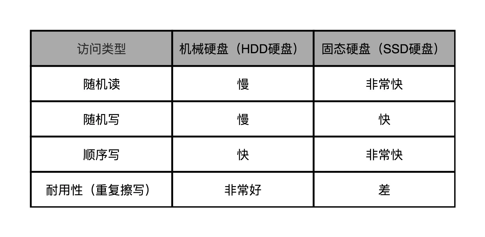
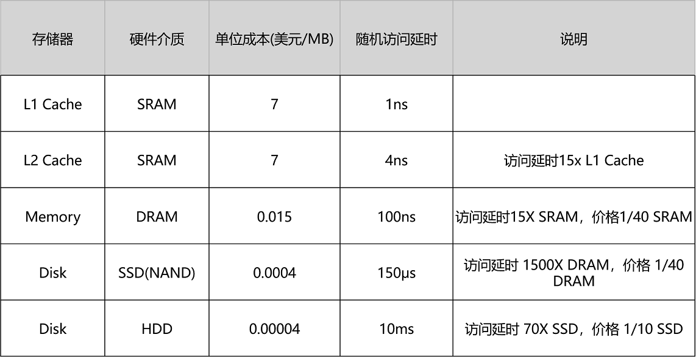
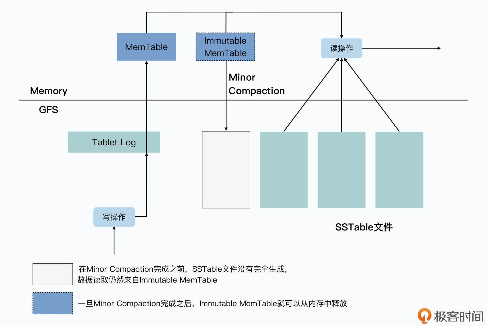
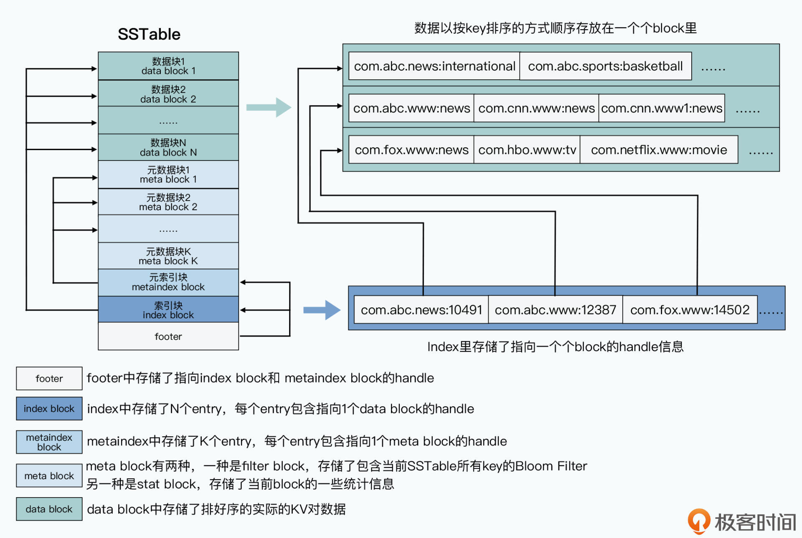
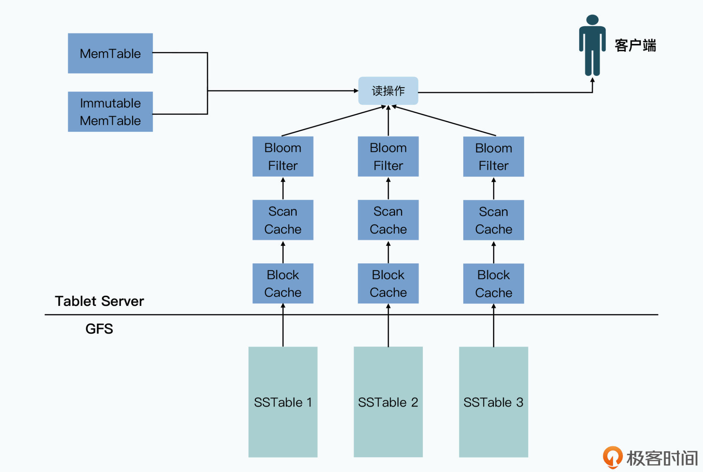
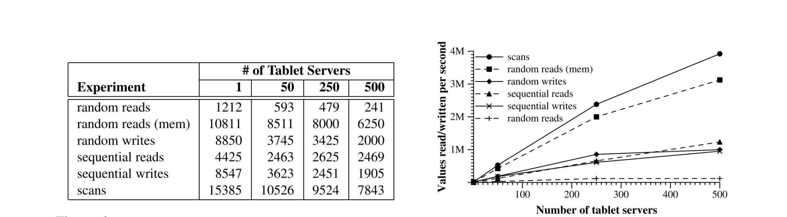

# 10 | Bigtable（三）：SSTable存储引擎详解


### 讲述：徐文浩

时长21:01大小19.26M



你好，我是徐文浩。

在上一讲里，我们已经了解了 Bigtable 的整体架构，知道作为一个分布式数据系统，里面“分布式”的部分是怎么设计的了。那么，今天我就带你一起来详细深入到 Bigtable 的“数据”部分里，去看看它是怎么回事儿。而且今天的这一讲，我们会“超越”Bigtable 的论文，深入到 MemTable 和 SSTable 的具体实现。搞清楚这些问题，不仅对你学懂 Bigtable 不可或缺，也对你深入理解计算机底层原理有所帮助。

在学习完这一讲之后，我希望你能掌握好这两个知识点：

首先，自然是 Bigtable 本身的单个 Tablet 是如何提供服务的。

其次，是我们如何利用好硬件特性，以及合理的算法和数据结构，让单个 Tablet 提供足够强劲的性能。

当你把这两个知识点掌握清楚了，你就能很容易学会怎么实现一个单机存储引擎，并且能够对硬件性能、算法与数据结构的实际应用有一些心得。

## Bigtable 的读写操作

在讲解 Bigtable 底层是怎么读写数据之前，我们先来看一看，Bigtable 读写数据的 API 长什么样子。下面是论文里面提供的一段代码：

```
// Open the table
Table *T = OpenOrDie("/Bigtable/web/webtable");
// Write a new anchor and delete and old anchor
RowMutation r1(T, "com.cnn.www");
r1.Set("anchor:www.c-span.org", "CNN")
r1.Delete("anchor:www.abc.com");
Operation op;
Apply(&op, &r1);
```

Bigtable 论文中写入数据的示例代码 -1

```
Scanner scanner(T);
ScanStream *stream;
stream = scanner.FetchColumnFamily("anchor");
stream->SetReturnAllVersions();
scanner.Lookup("com.cnn.www");
for (; !stream->Done(); stream->Next()) {
  printf("%s %s %lld %s\n",
          scanner.RowName(),
          stream->ColumnName(),
          stream->MicroTimestamp(),
          stream->Value());
}
```

Bigtable 论文中写入数据的示例代码 -2

这两段代码非常简单。第一段，就是在一张叫做 webtable 的数据表上，对行键为 com.cnn.www 的数据进行操作。这个操作在这个 anchor 列族里修改了两个列，分别是将 www.c-span.org 列的值设置为 CNN，以及将 www.abc.com 这个列删除掉了。**因为 Bigtable 支持单行事务，所以这两个修改，要么都完成了，要么都没有完成，不会存在一个成功，一个失败的情况。**

第二段，则是读取同样一张表里行键相同的数据，并且遍历里面所有的列，取出对应所有版本的时间戳和值，然后打印出来。其实就是一个从 Bigtable 里根据行键，随机读取一条数据的操作。

这两个操作，也就是 Bigtable 最常用的数据读写的场景，就是根据某一个行键去随机读写对应的列和列里面的值。那我们今天的主要任务，也是看一看 Bigtable 具体是如何高性能地实现这两个操作的。

## 如何提供高性能的随机数据写入？

在前面解读 GFS 的课程里，我们看到 GFS 这个文件系统本身，对随机读写是没有任何一致性保障的。而在上一讲里，我们又了解到 Bigtable 是一个支持随机读写的 KV 数据库，而且它实际的数据存储是放在 GFS 上的。这两点，听起来似乎是自相矛盾的，**为什么一个对随机读写没有一致性保障的文件系统，可以拿来作为主要用途是随机读写的数据库的存储系统呢？**

而且，在 2004 年，Bigtable 和 GFS 使用的硬盘还是传统的机械硬盘。如果你学习过《深入浅出计算机组成原理》，你就会知道机械硬盘的随机读写性能是很差的。一块 7200 转 / 秒的机械硬盘，随机读写的 IOPS 只有 75。即使你用上了后来的 SSD 硬盘，随机数据写入也需要面临 SSD 特有的写放大问题，不仅比顺序写慢，还会影响硬盘的寿命。可以说，无论是什么硬盘，都不喜欢随机写。



图片来自于《深入浅出计算机组成原理》的第46讲

第 46 讲

所以，Bigtable 为了做到高性能的随机读写，采用了下面这一套组合拳，来解决这个问题：

首先是将硬盘随机写，转化成了**顺序写**，也就是把 Bigtable 里面的提交日志（Commit Log）以及将内存表（MemTable）输出到磁盘的 Minor Compaction 机制。

其次是利用“局部性原理”，最近写入的数据，会保留在内存表里。最近被读取到的数据，会存放到缓存（Cache）里，而不存在的行键，也会以一个在内存里的布隆过滤器（BloomFilter）进行快速过滤，尽一切可能减少真正需要随机访问硬盘的次数。



图片来自《深入浅出计算机组成原理》的第35讲
可以看到内存的随机读写的访问延时是机械硬盘的1/10000

第 35 讲

Bigtable 实际写入数据的过程是这样的：

当一个写请求过来的时候，Tablet Server 先会做基础的数据验证，包括数据格式是否合法，以及发起请求的客户端是否有权限进行对应的操作。这个权限设置，是 Tablet Server 从 Chubby 中获取到，并且缓存在本地的。

如果写入的请求是合法的，对应的数据写入请求会以追加写的形式，写入到 GFS 上的提交日志文件中，这个写入对于 GFS 上的硬盘来说是一个**顺序写**。这个时候，我们就认为整个数据写入就已经成功了。

在提交日志写入成功之后，Tablet Server 会再把数据写入到一张内存表中，也就是我们常说的 MemTable。

而当我们写入的数据越来越多，要超出我们设置的阈值的时候，Tablet Server 会把当前内存里的整个 MemTable 冻结，然后创建一个新的 MemTable。被冻结的这个 MemTable，一般被叫做 Immutable MemTable，它会被转化成一个叫做 SSTable 的文件，写入到 GFS 上，然后再从内存里面释放掉。这个写入过程，是完整写一个新文件，所以自然也是**顺序写。**

如果在上面的第 2 步，也就是提交日志写入完成之后，Tablet Server 因为各种原因崩溃了，我们会通过**重放**（replay）所有在最后一个 SSTable 写入到 GFS 之后的提交日志，重新构造起来 MemTable，提供对外服务。

在整个数据写入的过程中，你会发现**只有顺序写，没有随机写**。那你可能会有一些疑惑了，如果只是插入新数据，追加写当然就可以了。但是在前面的代码示例里面，是去更新数据和删除数据呀，为什么这样顺序写可以删除和修改数据呢？

实际上，这是因为我们并不会在写入的时候，去修改之前写入的数据。我们在插入数据和更新数据的时候，其实只是在**追加一个新版本的数据**。我们在删除数据的时候，也只是写入一个墓碑标记，本质上也是写入一个特殊的新版本数据。

而对于数据的“修改”和“删除”，其实是在两个地方发生的。

第一个地方，是一个叫做 **Major Compaction** 的机制。按照前面的数据写入机制，随着数据的写入，我们会有越来越多的 SSTable 文件。这样我们就需要通过一个后台进程，来不断地对这些 SSTable 文件进行合并，以缩小占用的 GFS 硬盘空间。而 Major Compaction 这个名字的由来，就是因为这个动作是把数据“压实”在一起。

比如我们有 10 个文件，每个文件里都有 com.cnn.www 这个行键下的多个版本的数据，那么合并之后，就可以根据我们设置的数据保留策略，只留下时间戳最近的三个版本的数据。在这个过程中，老版本的数据，就在物理上被真正删除了。

第二个地方，是在我们**读取数据**的时候。在读取数据的时候，我们其实是读取 MemTable 加上多个 SSTable 文件合并在一起的一个视图。也就是说，我们从 MemTable 和所有的 SSTable 中，拿到了对应的行键的数据之后，会在内存中合并数据，并根据时间戳或者墓碑标记，来对数据进行“修改”和“删除”，并将数据返回给到客户端。

相信到这里，你应该就明白了，为什么在整个 Bigtable 的数据写入过程中，是没有任何到 GFS 的随机写入的。GFS 硬盘上的 SSTable 的整个文件，一旦写入完成，就是**不可变**（Immutable）的，所有的数据写入，包括删除，都是写入一个数据的新版本。而后台，会有一个程序会定期地进行类似于“垃圾回收”的操作，通过合并 SSTable，清理掉过期版本和被标记为删除的数据。

这也是为什么在 Bigtable 的数据模型里面，很自然地对于一个列下的值，根据时间戳可以有多个版本。



在Bigtable论文中的读写流程示意图之外，我加上了Immutable MemTable，以及Minor Compaction的示意图

## 如何提供高性能的随机数据读取？

随机写入被转化成了顺序写，但是随机读我们还是避免不了的。而且按照前面的流程，你会发现，**随机读的代价可不小**。一次数据的随机查询，我们可能要多次访问 GFS 上的硬盘，读取多个 SSTable。

别着急，接下来我们就一起来看一看，Bigtable 是怎么在尽可能减少随机读取的情况下，来访问数据的。

我们先来看一下 MemTable 和 SSTable 的数据结构和文件格式。

MemTable 的数据结构通常是通过一个 AVL 红黑树，或者是一个跳表（Skip List）来实现的。而 BigTable 的 Memtable 和 SSTable 的源码，一般被认为就是由 Google 开源的 LevelDB 来实现的。在实际的 LevelDB 源码中，MemTable 是选择使用**跳表**来作为自己的数据结构。之所以采用这个数据结构，原因也很简单，主要是因为 MemTable 只有三种操作：

第一种是根据行键的随机数据插入，这个在数据写入的时候需要用到；

第二种是根据行键的随机数据读取，这个在数据读取的时候需要用到；

最后一种是根据行键有序遍历，这个在我们把 MemTable 转化成 SSTable 的时候会被用到。

而 AVL 红黑树和跳表在这三种操作上，性能都很好，随机插入和读取的时间复杂度都是 O(logN)，而有序遍历的时间复杂度，则是 O(N)。

当 MemTable 的大小超出阈值之后，我们会遍历 MemTable，把它变成一个叫做 SSTable 的文件。SSTable 的文件格式其实很简单，本质上就是由两部分组成：

第一部分，就是实际要存储的行键、列、值以及时间戳，这些数据会按照行键排序分成一个个固定大小的**块**（block）来进行存储。这部分数据，在 SSTable 中一般被称之为**数据块**（data block）**。**

第二部分，则是一系列的元数据和索引信息，这其中包括用来快速过滤当前 SSTable 中不存在的行键盘的布隆过滤器，以及整个数据块的一些统计指标，这些数据我们称之为**元数据块**（meta block）。另外还有针对数据块和元数据块的索引（index），这些索引内容，则分别是**元数据索引块**（metaindex block）和**数据索引块**（index block）。



SSTable的数据结构，可以参看GitHub上LevelDB的文档

文档链接

因为 SSTable 里面的数据块是顺序存储的，所以要做 Major Compaction 的算法也很简单，就是做一个**有序链表的多路归并**就好了。并且在这个过程中，无论是读输入的 SSTable，还是写输出的 SSTable，都是顺序读写，而不是不断地去随机访问 GFS 上的硬盘。Major Compaction 会减少同一个 Tablet 下的 SSTable 文件数量，也就是会减少每次随机读的请求需要访问的硬盘次数。

而当我们要在 SSTable 里查询数据的时候，我们先会去读取索引数据，找到要查询的数据在哪一个数据块里。然后再把整个数据块返回给到 Tablet Server，Tablet Server 再从这个数据块里，提取出对应的 KV 数据返回给 Bigtable 的客户端。

那么在这个过程中，Bigtable 又利用了**压缩和缓存机制**做了更多的优化，下面我就来给你介绍下这些优化步骤。

**首先，是通过压缩算法对每个块进行压缩。**这个本质上是以时间换空间，通过消耗 CPU 的计算资源，来减少存储需要的空间，以及后续的缓存需要的空间。

**其次，是把每个 SSTable 的布隆过滤器直接缓存在 Tablet Server 里。**布隆过滤器本质是一个二进制向量，它可以通过一小块内存空间和几个哈希函数，快速检测一个元素是否在一个特定的集合里。在 SSTable 的这个场景下，就是可以帮助我们快速判断，用户想要随机读的行键是否在这个 SSTable 文件里。

**最后，Bigtable 还提供了两级的缓存机制。**

高层的缓存，是对查询结果进行缓存，我们称之为 **Scan Cache**。比如前面的示例代码中，我们要查询 com.cnn.www 这个行键的数据，那么第一次查询到了这个数据之后，我们会把对应的数据，放在 Tablet Server 的一个缓存空间里。这样，下一次我们查询同样的数据，就不需要再访问 GFS 上的硬盘了。

低层的缓存，是对查询所获取到的整个数据块进行缓存，我们称之为 **Block Cache**。还以 com.cnn.www 这个行键为例，我们会把它所在的整个块数据都缓存在 Tablet Server 里。因为一个块里存储的数据都是排好序的，所以当下一次用户想要查询 com.cnn.www1 这样的行键的时候，就可以直接从 Block Cache 中获取到，而不需要再次访问 GFS 上的 SSTable 文件。

需要注意的是，**这两层缓存都是针对单个 SSTable 上的**，而不是在单个 Tablet 上。而因为 SSTable 是一个不可变的数据，所以只要不出现 Major Compaction，或者整个 SSTable 文件因为过期可以清理的情况，这些缓存都不会因为 Tablet 里写入新的数据而需要主动失效。新写入的数据更新都体现在 MemTable 中，不会影响到我们的 SSTable。



通过Bloom Filter, Scan Cache, Block Cache，尽可能避免需要访问GFS上的SSTable

这样，在有了后面两个优化步骤之后，我们就会发现**访问硬盘的次数大大减少**了。一方面，当读请求里的行键不存在的时候，我们有 90%+ 乃至 99%+ 的概率可以通过 BloomFilter 过滤掉。而当读请求的行键存在的时候，我们访问硬盘的次数也很少。而且对于一个 Tablet 下的多个 SSTable 文件来说，BloomFilter 已经可以快速帮我们排除掉那些，不包含我们要查询的行键盘的 SSTable 的文件了。

然后是 Block Cache，因为元数据和索引也是一个 Block，所以只要一个 SSTable 常常被访问，这些数据就会被缓存在 Tablet Server 的内存里，所以查询索引的过程，也往往在内存里面发生。

而对于索引进行的实际数据查询，只要我们的查询有“**时间局部性**”，比如查询的通常是最近查询过的数据，或者有“**空间局部性**”，也就是连续查询的数据的行键是相邻的，我们就可以通过 Scan Cache 或者 Block Cache 给到答案，而不需要去访问 GFS 的文件系统。



Bigtable论文中的图6，可以看到，需要访问到硬盘的随机读的性能是最差的

只有完全没有规律的随机查询，才会使得我们的查询最终不得不大量进行随机的 GFS 文件访问，也就是变成随机的硬盘访问。而且更糟糕的是，我们还需要在网络上传输大量用不到的整个 block 的数据。在这种情况下，Bigtable 的性能并不好。

在论文第 7 部分的性能评估里，你也可以看到，对于 Bigtable 来说，数据存储在 GFS 上，而不是放在内存里的随机读的性能是最差的，在 500 个 Tablet Server 的环境下，单个节点数据读取的吞吐量，只有随机写入的 1/8 左右。

不过，好在真实世界里，数据访问往往是满足局部性原理的，而且在 Bigtable 论文发表 17 年后的今天，我们大都用上了 SSD 硬盘，可以在很大程度上缓解这个问题。

## 小结

讲到这里，相信你对 Bigtable 的随机读写机制应该弄得很清楚了，那么现在我们就一起来回顾一下。对于 Bigtable 的数据随机写入，我们采用了三个简单的步骤来实现高性能：

首先是将随机写变为顺序写，将数据写入变成追加一条提交日志；

然后是将数据写入到内存而非硬盘上，也就是插入记录到通过跳表实现的 MemTable 里。

最后是定期将太大的 MemTable 冻结起来，变成一个根据行键排好序的 SSTable 文件。

事实上，这种随机写入数据的方式是在各类数据系统中，最常见的一个套路。如果你回头去看 GFS 的 Master 里对于元数据修改的实现，你会发现整个流程其实是非常相似的。只不过，在那里有些操作的名字不太一样而已。GFS 里，对于 Master 里存放的元数据的操作步骤是这样的：

将操作日志（Operation Log）写入到本地和远端硬盘；

在 master 里修改实际的数据结构；

每当日志增长到一定程度，master 会创建对应的检查点（checkpoint）。

**GFS 这里的操作日志和 Bigtable 的提交日志、检查点和定期输出的 SSTable，其实都是起到了相同的作用。**在数据库系统中，一般称之为预写日志（WAL，Write-Ahead-Log），一旦写入，数据就持久化下来了。中间，我们总是把最新的数据更新在内存里更新一次，使得后续的数据查询可以从内存里面获取到。最后一步，不管是叫做 checkpoint、Snapshot 还是其他什么名字，都能够使得数据恢复只需要重放一小段时间的日志，使得故障恢复的时间尽可能短。

Bigtable 的数据，是由内存里的 MemTable 和 GFS 上的 SSTable 共同组成的。在 MemTable 里，它是通过跳表实现了 O(logN) 时间复杂度的单条数据随机读写，以及 O(N) 时间复杂度的数据顺序遍历。而 SSTable 里，则是把数据按照行键进行排序，并分成一个个固定大小的 block 存储。而对应指向 block 的索引等元数据，也一样存成了一个个 block。

另外，对于数据的读取，Bigtable 也采用了三个办法来实现高性能：

首先是定期在后台合并 SSTable，以减少读请求需要访问的 SSTable 的数量；

其次是通过在内存里缓存 BloomFilter，使得对于不存在于 SSTable 中的行键，可以直接过滤掉，无需访问 SSTable 文件才能知道它并不存在；

最后是通过 Scan Cache 和 Block Cache 这两层缓存，利用局部性原理，使得查询结果可以在缓存中找到，而无需访问 GFS 上的硬盘。

回顾这整个存储引擎的实现方式，我们会发现，**我们看到的 Bigtable 的数据模型，其实是一系列的内存 + 数据文件 + 日志文件组合下封装出来的一个逻辑视图**。

数据库的存储引擎并不是用了什么高深的算法、特别的硬件，而是在充分考虑了硬件特性、算法和数据结构，乃至数据访问的局部性，综合到一起设计出来的一个系统。每一个环节都是教科书上可以找到的基础知识，但是组合在一起就实现了一个分布式数据库。而这个数据库暴露给用户的，也是一个非常简单的、类似于 Map 的根据键 - 值读写的接口。

Bigtable 的论文，我们就先解读到这里了。不过，其实我们还有一个重要的话题没有聊，那就是关于 Bigtable 乃至所有数据库的“事务性”，放心，我并没有忘了这个重要的主题。关于 Bigtable 所支持的单行事务，以及数据库的事务性的原理，我们会在后面解读 Megastore 论文的时候，来进行更详细的分说。

## 推荐阅读

这一讲的主要内容，都是围绕着 Bigtable 里，单个 Tablet 的存储引擎的实现。实际的 LevelDB 或者其他的 MemTable+SSTable 的实现，都做了大量优化，以加快检索速度，或者减少存储的空间。如果你想深入了解 MemTable 和 SSTable 文件格式和内部实现的各种细节，一个很好的材料是leveldb handbook。

同时，《数据密集型应用系统设计》的第 3 章的第一部分“数据库核心：数据结构”里，也有对于不同存储引擎的数据结构的讲解，你也可以对照着看。

## 思考题

在 Bigtable 的论文中提到，因为 SSTable 是不可变的，所以彻底删除数据的问题，就变成了对过期的 SSTable 进行垃圾回收，每个 Tablet 的 SSTable 会注册到上一讲所说的 METADATA 的表里，master 可以对过期的 SSTable 进行“先标记后清除”（mark-and-sweep）。那么，学完这节课之后，你能说说为什么我们可以这么做吗？