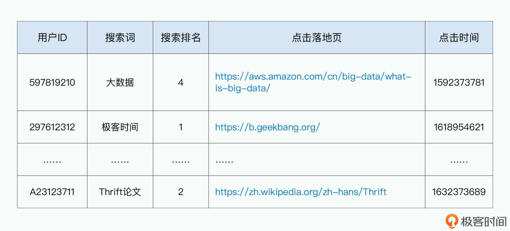
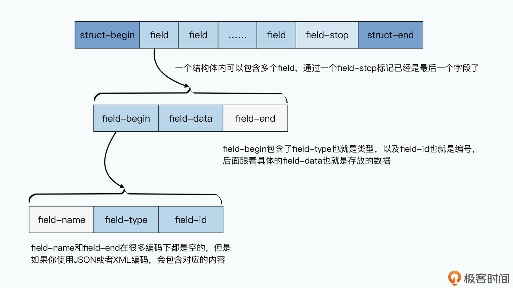
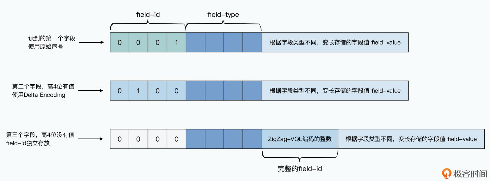
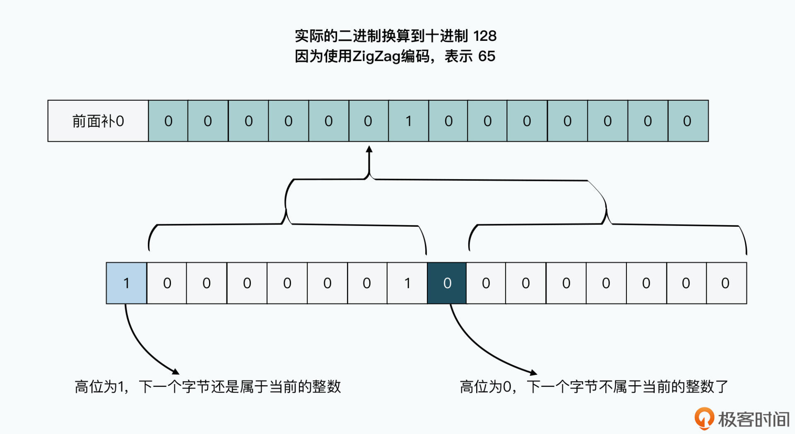
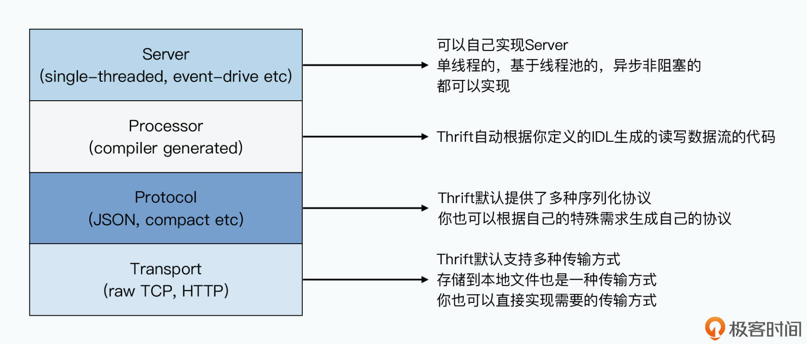

# 11 | 通过Thrift序列化：我们要预知未来才能向后兼容吗？

你好，我是徐文浩。

现在，我们已经解读完了 GFS、MapReduce 以及 Bigtable 这三篇论文，这三篇论文之所以被称为 Google 的三驾马车，一方面是因为它们发表得早，分别在 2003、2004 和 2006 年就发表了。另一方面，是这三篇论文正好覆盖了大数据的存储、大数据的批处理也就是计算，以及大数据的在线服务领域。

相信你到这里，也看到了一个反复出现的关键字，那就是“数据”。在过去的三篇论文里，我们花了很多精力去分析谷歌是如何设计了分布式的系统架构，数据在硬件层面应该怎么存储。其中的很多设计面临的主要瓶颈和挑战，就是硬盘读写和网络传输性能。比如 GFS 里的数据复制，需要走流水线式的传输就是为了减少网络传输的数据量；Bigtable 里，我们会对一个个 data block 进行压缩，目的是让数据存储的空间可以小一些。

**那么，我们能不能在“数据”本身上直接做点文章呢？**答案当然是可以的，今天这节课，我们就来一起读一篇 Facebook 在 2007 年发表的《Thrift: Scalable Cross-Language Services Implementation》技术论文，它的背后也就是这 Apache Thrift 这个开源项目。

Thrift 是我自己长期在大数据处理，以及分布式系统中长期使用的一个开源项目。可能你会问，为什么不选择来自 Google 血统更纯正的 Protobuf 和 gRPC 呢？那是因为 Thrift 更早开源发表。Thrift 发表的时候，Protobuf 还只是在 Sawzall 论文中被提到，它要到 2008 年的 7 月才正式发布，而 gRPC 更是要到 2015 年才正式开源。

好了，闲话不多说，回归正题。在这一讲里，我会带着你从最简单的 CSV 格式开始，根据需求一步步优化扩展，看看为什么我们需要 Thrift 里像 TCompactProtocol 这样的编码格式，然后我会带你来理解它是如何设计，做到可以跨语言、跨协议、可扩展的。

而通过这一讲的学习，相信你在对如何进行高效的数据序列化和反序列化，以及让系统设计的“正交化”这两点上，能有充分的收获。

## 常用的 CSV 和 JSON 格式

我们先来看看，在之前的论文里，Google 有没有说过他们是用什么样的编码来存储数据的。

在 MapReduce 的论文里，Google 说 MapReduce 的实现，输入输出都是字符串，然后让开发者自己决定去做数据的解码，或者编码变成自己需要的类型。的确，最简单的编码数据的方式，就是用字符串把数据存下来，再用各种方法解析就好了。

如果你是做后端开发的，那么日常读写数据最常见的办法之一，无非就是 **CSV 格式**。举一个最简单的例子，要想把 Google 这样的搜索引擎，每一次搜索后的用户点击记录给存储下来，就会是下面这样的：



我们希望存储的数据

```csv

user_id,search_term,rank,landing_url,click_timestmap
597819210,大数据,4,"https://aws.amazon.com/cn/big-data/what-is-big-data/",1592373781
297612312,极客时间,1,"https://b.geekbang.org/",1618954621
……
A23123711,Thrift论文,2,"https://zh.wikipedia.org/zh-hans/Thrift",1632373689
```

CSV 存储上面数据的格式

我们一共存储了 5 个字段，分别是用户 ID、搜索词、搜索排名、用户点击的落地页，以及点击时间。其中，搜索排名和点击时间是一个整数，其他的都是字符串。

我们用 CSV 把这个数据存下来，就是一行代表一条数据记录，各个字段之间用逗号分隔开来，每个字段无论是什么类型，我们都把它用纯文本的方式存储下来。如果我们要用前面讲过的 MapReduce 去处理数据，也很简单，一行就是一条数据，简单用逗号来 Split 一行就能得到需要的各个字段。

但是仔细一琢磨，你会发现这个格式有两个缺点：

**第一个是数据里面没有告诉我们数据类型是什么，我们只能根据字段的名称，以及查看少数几条数据来猜测**。比如数据里面的用户 ID，前几条数据里全部都是数字，我们可能就以为用户 ID 是用一个整型数来表示的，但实际上它是一个字符串。我们很有可能写完代码跑到任务出错了，才会发现这一点，浪费很多时间。

**第二个是很多数据用文本来保存有些浪费空间。**前面例子里的点击时间，如果我们用一个整型数来存储，那么只需要占用 4 个 byte，但是用纯文本的话，需要 10 个 byte。数据量少问题还不大，但是如果记录数量多，这样的字段多，额外占用的空间就会让人难以忽视了。

那么，我们有什么好的办法呢？对于第一个问题，很多前端程序员可能会说，我们可以用 JSON 呀！

没错，我们可以用 JSON Schema，定义好字段类型。但是对于第二个问题，使用 JSON 的话，问题就更糟糕了。因为对于每一条数据，我们不仅要存储数据，还要再存储一份字段名，占用的空间就更大了。

```json
[
  {
    "user_id": "597819210",
    "search_term": "大数据",
    "rank": 4,
    "landing_url": "https://aws.amazon.com/cn/big-data/what-is-big-data/",
    "click_timestamp": 1592373781
  },
  {
    "user_id": "297612312",
    "search_term": "极客时间",
    "rank": 1,
    "landing_url": "https://b.geekbang.org/",
    "click_timestamp": 1618954621
  },
  ……
  {
    "user_id": "A23123711",
    "search_term": "Thrift论文",
    "rank": 2,
    "landing_url": "https://zh.wikipedia.org/zh-hans/Thrift",
    "click_timestamp": 1632373689    
  }
]
```

事实上，CSV 也好，JSON 也好，乃至 XML 也好，这些针对结构化数据进行编码主要想解决的问题是提升开发人员的效率，所以重视的是数据的“人类可读性”。因为在小数据量的情况下，程序员的开发效率是核心问题，多浪费一点存储空间算不了什么。**但是在“大数据”的场景下，除了程序员的效率，存储数据本身的“效率”就变得非常重要了。**

## 优化存储空间为目标的二进制序列化

想要减少存储所占的空间，那最直接的想法，自然是我们自定义一个序列化方法，按照各个字段实际的格式把数据写进去。典型的办法就是 **Java 的序列化**，我们按照 String—>String—>Int—>String—>Int 的顺序，把数据写入到一个字节数组里面，等需要读数据的时候，我们就按照这个顺序读出来就好了。

```java
import java.io.*;
import java.util.Arrays;
public class Main {
    public static void main(String[] args) throws IOException {
        ByteArrayOutputStream buffer = new ByteArrayOutputStream();
        try (ObjectOutputStream output = new ObjectOutputStream(buffer)) {
            output.writeUTF("597819210");
            output.writeUTF("大数据");
            output.writeInt(4);
            output.writeUTF("https://aws.amazon.com/cn/big-data/what-is-big-data/");
            output.writeInt(1592373781);
        }
        System.out.println(Arrays.toString(buffer.toByteArray()));
    }
}
```

通过 Java 代码进行序列化的示例

这个方法的确确保了数据都有类型，并且占用的存储空间尽可能小。**但是这个实现却有一个重大缺点**，就是我们读写数据的 Schema，是隐式地包含在代码里的，而且每有一张新的数据表或者说新的数据格式，我们就要手写序列化反序列化的代码。

那么，我们有没有什么解决办法呢？

## 包含 IDL 并能向前和向后兼容的 Thrift 的 TBinaryProtocol

我能想到的办法，其实已经接近 Thrift 的实现了，我们可以这么做：

通过 Schema 文件，定义出一个结构体，然后在里面列清楚字段的顺序、类型以及名称。

写一个程序，能够解析这个 Schema 文件，然后自动生成可以根据结构体的 Schema 进行序列化和反序列化的代码。这个序列化和反序列化的代码是非常简单的，只要按照 Schema 里面出现的字段顺序，一个个对着字节数组去读或者写数据就好了。

```
struct SearchClick
{
  1:string user_id,
  2:string search_term,
  3:i16 rank,
  4:string landing_url,
  5:i32 click_timestamp,
}

```

Thrift IDL 文件

这里我把前面 5 个字段的 CSV 格式，用 Thrift 的 IDL 写了出来，你会发现它就是定义了序号、类型以及名称。

我们前面的实现思路已经非常接近于 Thrift 里，TBinaryProtocol 这个协议的实现了，但是仍然有小小的差异。这个差异，就是我们要面临的下一个问题：数据格式可能会变，我们需要考虑**数据格式的多版本问题**。

回到前面的搜索点击数据，我们发现，现有的这 5 个字段满足不了需求。根据实际情况，我们需要增加两个新字段，去掉一个老字段：

首先，是我们想要根据用户的地理位置信息，做一些统计分析，所以我们需要在原来的数据里，加上 IP 地址这个字段；

其次，是原先的点击时间字段，用的是 32 位整型数，数据精度只能到秒。那么同一个用户如果在同一秒内连续点击了两条搜索结果，我们就分不清先后了，所以我们希望能够用一个 64 位整型来表示这个数据，而且原先那个字段要废弃掉。

既然如此，那最直接的想法，自然是定义一个新的数据格式呗，有我们需要的 6 个字段就好了。

但是现实生活总是比我们想得更复杂，我们把原来格式的数据叫做 v1 版本的数据，新的格式叫做 v2 版本的数据，现在我们来看看，直接换上一个新的 v2 格式，会遇到一些什么问题：

首先，是我们历史上已经生成了很多 v1 版本的数据了，如果在格式切换之后，要去统计一段时间的数据，我们的新程序就需要同时能够解析 v1 和 v2 版本的数据。这个，也就是我们的程序需要有**向前兼容**能力。

其次，是除了要满足新需求之外，我们可能有各种各样的数据分析程序，仍然依赖原有的数据格式。如果我们要替换数据格式，意味着对所有这些程序都需要在当天切换的时候做完改造。这样既不现实，也不经济。最好，我们的老程序仍然可以读新的数据格式，也就是有**向后兼容**的能力。

这个能够同时向前向后兼容的能力，就是我们对于 Thrift 的 TBinaryProtocol 协议的序列化提出的要求了。

```
struct SearchClick
{
  1:string user_id,
  2:string search_term,
  3:i16 rank,
  4:string landing_url,
  // 5:i32 click_timestamp, deprecated 已废弃
  6:i64 click_long_timestamp,
  7:string ip_address
}

```

加上新字段，废弃老字段的 IDL

而 Thrift 里的 **TBinaryProtocol 的实现方式**也很简单，那就是顺序写入数据的过程中，不仅会写入数据的值（field-value），还会写入数据的编号（field-id）和类型（field-type）；读取的时候也一样。并且，在每一条记录的结束都会写下一个标志位。

这样，在读取数据的时候，老版本的 v1 代码，看到自己没有见过的编号就可以跳过。新版本的 v2 代码，对于老数据里没有的字段，也就是读不到值而已，并不会出现不兼容的情况。

**在这个机制下，我们顺序排列的编号，就起到了版本的作用，而我们不需要再专门去进行数据版本的管理了。**



Thrift 更详细的结构的规格书，可以参看对应开源项目中的文档

而且，**写下编号还带来了一个好处**，就是我们不再需要确保每个字段都填上值了，这个帮我们解决了很多问题。

我们可以废弃字段，并且这些废弃的字段不会占用存储空间。我们会随着需求变更不断新加字段，数十乃至上百个字段的 struct 在真实的工程场景中是非常正常的。而在这个过程中，很多字段都会被逐步废弃不再使用。如果这些字段仍然要占用存储空间的话，也会是一大浪费。

那么，对于不需要的老字段，我们只要在 IDL 中，将对应的编号注释掉，写入数据的时候不写这些数据，就不会占用空间。而且因为 Thrift 读取数据是读取编号并解析值的，这个也不会破坏数据的兼容性。

这样下来，整个 struct 其实就变成了一个稀疏结构，不是每个字段都需要填上值。这个思路其实和 Bigtable 里 Column（列）的设计一脉相成。本质上，在大数据的场景下，我们的代码、需求都无法保证在设计第一个版本的时候就 100% 想清楚。**我们无法预测未来，我们又需要很多人一起共同协作，所以我们就需要保障数据、代码不仅能向前兼容，而且还能向后兼容。**

## 进一步优化的 TCompactProtocol

Thrift 的论文里，对于数据的序列化，到 TBinaryProtocol 就已经结束了。但是作为开发者，我们的优化还没有到极致。通过编号和类型的确让我们有了向前向后兼容性，但是似乎又让我们的数据冗余变大了。

就以一开始 CSV 里的 click_timestamp 字段为例，我们虽然通过把字符串换成了整型数（i32），节约了 6 个字节。但是，我们加了一个编号，就又把这省下来的 4 个字节给用掉了，并且每个字段都需要编号，另外别忘了我们还有类型需要写下来。

不过，为了向前向后兼容性，编号和类型都是少不了的。那么，**有没有什么别的办法能够进一步减少需要的存储空间呢？**

你别说，在 Thrift 的开源项目里还真有这样的办法，那就是通过 TCompactProtocol 进行编码。

### Delta Encoding

顾名思义，**TCompactProtocol 就是一种“紧凑”的编码方式**。Thrift 的 IDL 都是从 1 开始编号的，而且通常两个字段的编号是连续的。所以这个协议在存储编号的时候，存储的不是编号的值，而是存储编号和上一个编号的差。

比如，第一个编号是 1，第二个编号是 5，编号 2、3、4 没有值或者已经被我们废弃掉了，那么，第二个编号存储的直接就是 4。这种方式叫做 **Delta Encoding**，在倒排索引中也经常会用到，用来节约存储空间。我们用 4 个 bit 来存储这个差值。

然后，我们再通过另外 4 个 bit 表示类型信息。那么通常来说，通过一个字节，我们就能把编号和类型表示出来。毕竟，我们的类型不到 16 种，4 个 bit 就够了，而通常两个字段之间的差，也不会超过 15，也就是 4 个 bit 能表示的最大整型数。



TCompactProtocol 的实现其实很简单，如果你想深入了解细节，可以直接去读一读源码

不过，如果两个序号的差如果超过 15 怎么办呢？那么，我们就通过 1 个字节来表示类型，然后再用 1~5 个字节来表示两个连续编号之间的差，也就是下面我要介绍的 **ZigZag+VQL** 的编码方式。

### ZigZag 编码 +VQL 可变长数值表示

很多时候，我们存储的整数都不会很大，比如通过一个整型数来表示系统中存在的状态，我们并不需要 2 的 32 次方，也就是 40 亿种状态，可能一个字节的 127 种状态就绰绰有余了。

所以，TCompactProtocol 对于所有的整数类型的值，都采用了可变长数值（VQL，Variable-length quantity）的表示方式，通过 1~N 个 byte 来表示整数。

这个编码方式的每一个字节的高位，都会用第一个 bit 用来标记，也就是第一个 bit 用来标记整个整数是否还需要读入下一个字节，而后面的 7 个 bit 用来表示实际存放的数据。这样，一个 32 位的整型数，最少只要用一个字节来表示，最多也只需要用 5 个字节来表示，因为 7bit x 5=35 bit 已经足够有 32 位了。



而因为整型数的负数，首位一定是 1。这样，对于像 -1 这样常用的数，用 16 进制表示就会是 0XFFFFFFFF，用 0 和 1 表示的话就是连续 32 个 1，会占用 5 个字节。所以，后面 7 个 bit 一组的编码，并没有采用普通的编码方式，而是采用了一种叫做 **ZigZag** 的编码方式。

简单来说，就是负数变成正数，而正数去乘以 2。这样的情况下，7 个 bit 就可以表示 -64 到 63 这 128 个数了。


通过 ZigZag+VQL 的编码方式，只要整数的绝对值小，占用的空间就少

通过 ZigZag+VQL 这两种方式，你可以看到，存储一个整数，常常只需要 2 个字节就够了，可以说大大缩小了需要占用的硬盘空间。

## 跨语言、跨协议和可扩展性

不知道你有没有发现，直到目前的讲解中，我们并没有涉及到任何编程语言。没错，Thrift 本身并不绑定任何编程语言，这也是论文标题中“**Cross-Language Service Implementation**”的含义，也就是跨语言的。

今天，在 Thrift 的官方文档里，已经支持了 28 种不同的编程语言。并且，Thrift 同样支持生成跨语言的 RPC 代码，就是一个人完成了 Protobuf 和 gRPC 这样两个项目的作用。

```c++
namespace cpp Sample
  namespace java Sample
  namespace perl Sample
  
  //This struct is not used in the sample. Shown here for illustrative purposes only.
  //
  struct SampleStruct
  {
    1: i32 key
    2: string value
  }
  
  
  //A service contains the RPC(s).
  //
  service SampleService
  {
    string HelloThere(1:string HelloString),
    void ServerDoSomething(),
  
    //Client calls this to tell server which port to connect back on.
    void ClientSideListenPort(1:i16 Port),
    //Named pipe version
    void ClientSidePipeName(1:string name),
  }
  
  //Sample RPC on the 'client' side that the master server can call.
  service SampleCallback
  {
    void pingclient(),
  }
```

Thrift 的 IDL 支持直接定义 RPC，其实 RPC 方法的调用，在网络上也是编码成一条“数据”

**跨语言 + 序列化 +RPC，使得 Thrift 解决了一个在“大数据领域”中很重要的问题，就是习惯于使用不同编程语言团队之间的协作问题**。通过定义一个中间格式的 Thrift IDL 文件，然后通过 Thrift 自动生成代码，写 Web 应用的 PHP 工程师和写后端数据系统的 Java 工程师，就可以直接无缝协作了。



不仅如此，Thrift 的设计非常清晰，也非常容易扩展。我们可以根据它的规格书，支持更多的语言，乃至自己定义和实现协议。Thrift 封装好了各类接口，使得底层编码数据的协议（Protocol）、定义如何传输数据的 Transport 都是可以替换的。你只需要实现 Thrift 的一系列函数接口，就能实现一个你需要的协议。

这也是为什么，Thrift 也支持 JSON、XML 这些序列化的方式。如果你想要把对应的数据传输和处理方式，从 TCP 换成 HTTP，那么也只需要实现一个对应的 Transport 就可以了。

```c++
namespace cpp Sample
  namespace java Sample
  namespace perl Sample
  
  //This struct is not used in the sample. Shown here for illustrative purposes only.
  //
  struct SampleStruct
  {
    1: i32 key
    2: string value
  }
  
  
  //A service contains the RPC(s).
  //
  service SampleService
  {
    string HelloThere(1:string HelloString),
    void ServerDoSomething(),
  
    //Client calls this to tell server which port to connect back on.
    void ClientSideListenPort(1:i16 Port),
    //Named pipe version
    void ClientSidePipeName(1:string name),
  }
  
  //Sample RPC on the 'client' side that the master server can call.
  service SampleCallback
  {
    void pingclient(),
  }
```

你只需要实现这些方法，就可以实现一个自己的序列化协议，可以查看文档

## 小结

到这里，我们的 Thrift 论文就讲完了。在学完这一讲之后，相信你能够得到这样三点收获。

第一，你会深入理解 **Thrift 的数据序列化最优方案**是怎么样的，其实 Protobuf 等其他的开源框架，虽然具体细节可能有所不同，但是基本设计是一样的。通过采用编码为二进制，通过存储编号、类型、字段数据，Thrift 做到了向前向后兼容。而通过 Delta Encoding、ZigZag 以及 VQL，TCompactProtocol 这个协议就使得数据序列化之后占用的空间尽可能小了。

第二，你能够学会**逐步根据真实的业务需求进行系统迭代的思路**，希望你也能在未来其他系统的开发过程中借鉴这一思路。我们并不是凭空产生了 TCompactProtocol 这样一个协议，而是通过分析 CSV、JSON、Java 序列化等方式的优缺点，思考如何尽可能向前向后兼容，并且如何尽可能节约空间，逐步迭代到了 TCompactProtocol 这样一个序列化协议。

第三，你能够学会在系统设计中，**尽量让各个模块具有“正交性”，使得系统容易迭代优化**，不会遇到“按下葫芦起来瓢”的情况，导致系统难以进化。为了支持不同的语言、序列化方式（编码协议）、数据传输方式（网络协议），Thrift 通过良好的面向对象设计和分层，给我们做了一个很好的示范。

## 推荐阅读

如果在学习这节课的过程中，你觉得自己缺乏对于数据编码问题的基本了解，你可以去读一读我之前的专栏《深入浅出计算机组成原理》的第 11 讲，对数据编码问题建立一个基本的认识。

如果你对数据序列化这个问题非常有兴趣，你可以进一步去研究Apache Avro，相比于 Thrift 和 Protobuf，Avro 无需预先进行代码生成，并且也不需要指定数据的编号。

## 思考题

最后，给你留一道思考题。

在使用 Thrift 的情况下，其实数据序列化，是依赖于数据文件之外的一个外部 IDL 文件的。那么，我们是否可以把这个 IDL 直接序列化，然后放到存储实际数据的 Header 里呢？这样是不是我们的序列化程序，就可以像操作系统读取引导扇区一样，直接从存储数据的文件里面读到我们应该怎么序列化数据呢？如果这么做的话，我们会遇到那些困难呢？

欢迎在留言区，留下你的思考和答案，我们共同探讨。