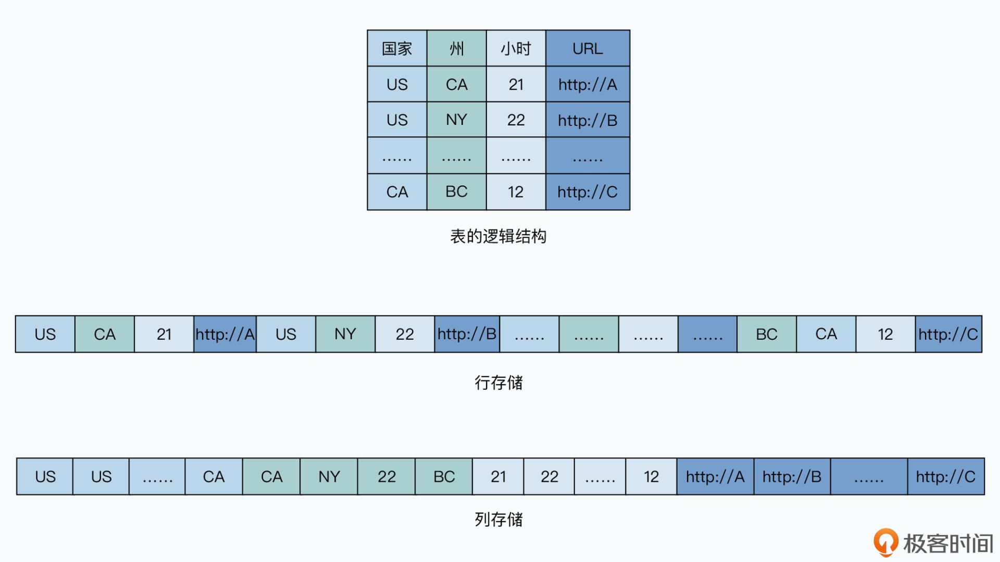
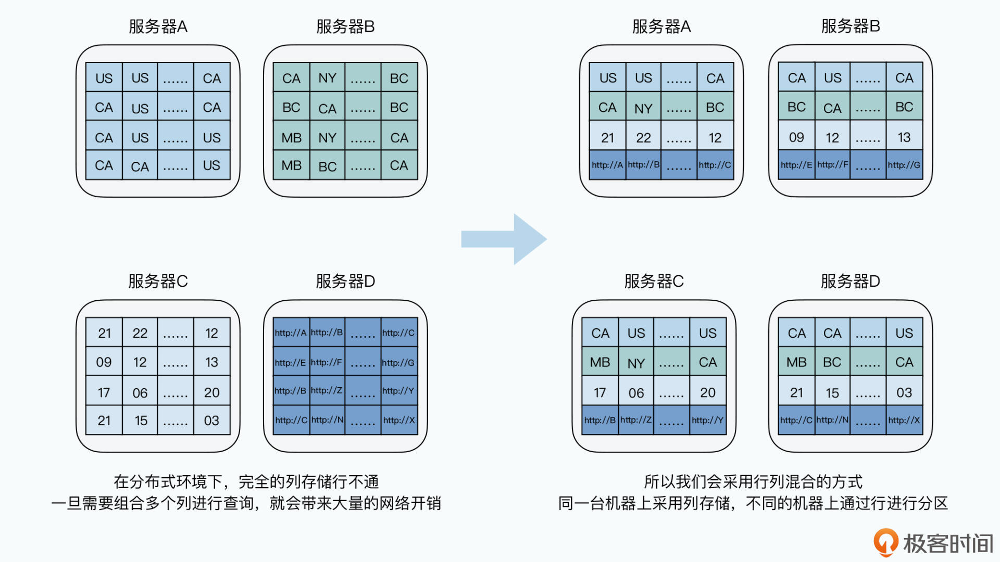
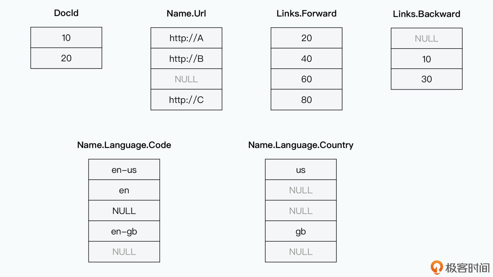
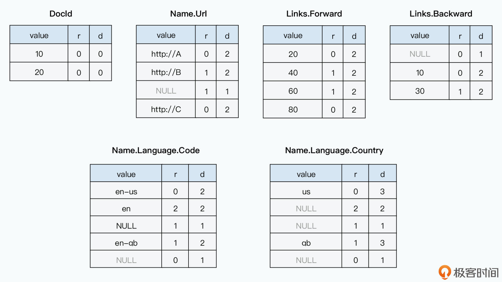
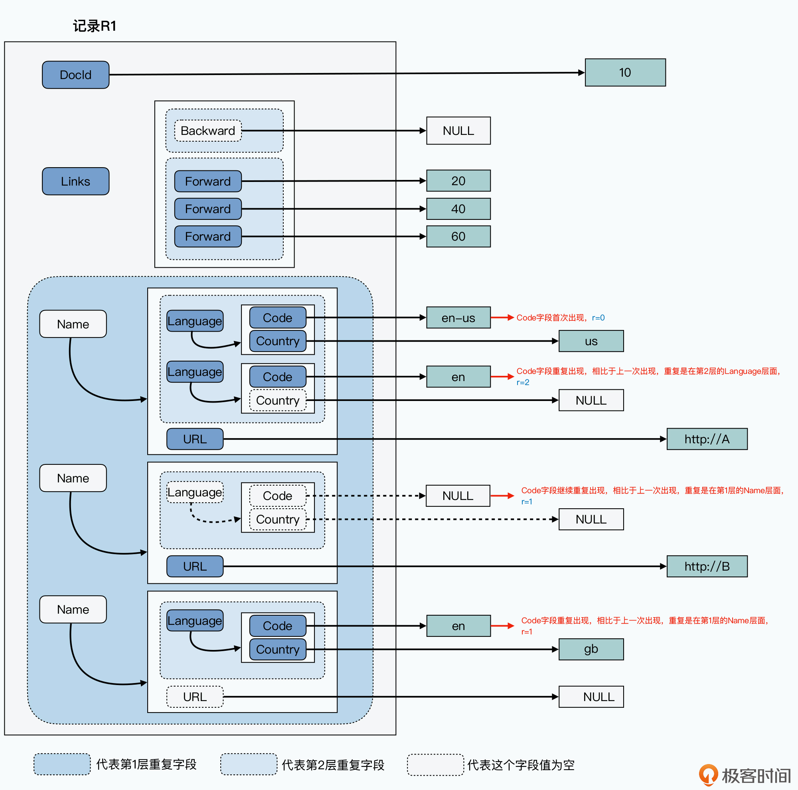
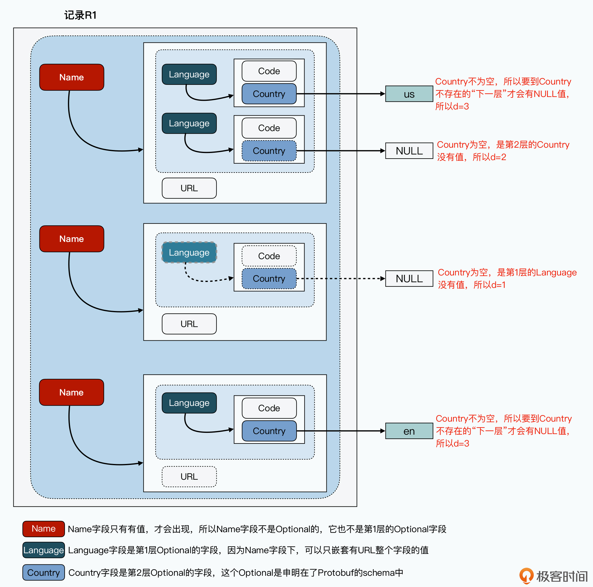

# 16 | 从Dremel到Parquet（一）：深入剖析列式存储

你好，我是徐文浩。

在解读 Hive 论文的过程中，我们看到 Hive 已经通过分区（Partition）和分桶（Bucket）的方式，减少了 MapReduce 程序需要扫描的数据，但是这还远远不够。

的确，MapReduce 有着非常强的伸缩性，架起一个 1000 个节点的服务器毫无压力。可 MapReduce 的缺陷也很明显，那就是**它处理数据的方式太简单粗暴，直接就是把所有数据都扫描一遍。**

要知道，通常来说，我们的 Hive 表也好，或者以 Thrift 序列化后存放到 HDFS 上的日志也好，采用的都是“宽表”，也就是我们会把上百个字段都直接存放在一张表里。但是实际我们在分析这些日志的时候，往往又只需要用到其中的几个字段。

比如，我们之前的日志，有超过 100 个字段，但是如果我们想要通过 IP 段和 IP 地址，查看是否有人刻意刷单刷流量的话，我们可能只需要 IP 地址等有限的 4~5 个字段。而如果这些字段在 Hive 里并不是一个分区或者分桶的话，MapReduce 程序就需要扫描所有的数据。这个比起我们实际需要访问的数据，多了数十倍。

但是，我们又不可能对太多字段进行分区和分桶，因为那样会导致文件数量呈几何级数地上升。就以上节课的例子来说，如果我们要在国家之后再加上“州”这个维度，并进行分区，那么目录的数量会增长 50 倍（以美国为例有 50 个州）。而如果我们再在时间维度上加上一个“小时”的数据维度，那么目录的数量还要再增长 24 倍。

这么一算，我们只是加入了两个维度进行分区，目录数就已经变成了原来的 1200 倍，这会使得我们在 HDFS 上的文件数量大增，而每个文件都变得很小。而在这种大量、小文件的场景下，是发挥不出 MapReduce 进行顺序文件读写的吞吐量的优势的。

所以，即使已经进行了分区，我们的很多数据分析任务，仍然浪费了大量的性能在访问不需要的数据上。

```
/wh/T/ds=20090101/ctry=US/state=CA/00/000000_0
/wh/T/ds=20090101/ctry=US/state=CA/00/000001_0
/wh/T/ds=20090101/ctry=US/state=CA/00/000002_0
……
/wh/T/ds=20090101/ctry=US/state=CA/01/000000_0
/wh/T/ds=20090101/ctry=US/state=CA/01/000001_0
/wh/T/ds=20090101/ctry=US/state=CA/01/000002_0
……
……
/wh/T/ds=20090101/ctry=US/state=CA/24/000000_0
……
……
/wh/T/ds=20090101/ctry=US/state=NY/00/000000_0
/wh/T/ds=20090101/ctry=US/state=NY/00/000000_0
/wh/T/ds=20090101/ctry=US/state=NY/00/000000_0
……
```

如果加上州和小时维度的分区，我们的文件和目录数量会瞬间爆炸。

MapReduce 的缺点并不只有这一个，还有一个很明显的缺陷其实我们之前也提到过，那就是**每个任务都有比较大的额外开销**。在 Hive 里每执行一个 HQL，都需要经过把程序复制到各个节点、启动 Master 和 Worker，然后进行整个 MapReduce 的过程。如果你自己用早年的 Hadoop 跑过数据分析程序，你应该对这个额外开销会有切身体会。

可能我们只是访问 1GB 的数据，即使按照单机读写硬盘的吞吐量来计算，也就是一两分钟的事情。但是整个 MapReduce 运行的过程却很难少于 3 分钟，其中可能有一半时间，都花在了 MapReduce 这个程序运行机制带来的额外开销上了。

总而言之，MapReduce 乃至已经针对 MapReduce 作出了一定优化的 Hive，虽然可伸缩性很强，但是在整体的运行过程中其实非常“浪费”。

那么，想要解决这个问题，就请你和我一起来学习这篇《Dremel: Interactive Analysis of Web-Scale Datasets》论文。我们会通过两节课的时间来解读这篇论文，今天这节课，我们会主要关注 Dremel 里的数据是如何存储的，在下节课里，我们会来了解 Dremel 的数据是如何计算的。

通过这一讲的学习，你会搞清楚列式存储是怎么一回事儿，你也会知道，如果要在列式存储中支持复杂的嵌套结构类型，应该怎么做。并且，通过学习 Dremel 的论文，你也就搞清楚了 Parquet 这个开源的列式存储结构是怎么一回事儿了。

## 从行存储到列存储

无论是上节课我们看到的最初版本的 Hive，还是更之前看过的 Thrift，它们存储数据的方式都是“**行存储**”。所谓的行存储，就是一行（Row）或者说一条数据，是连续存储在一起的。这对于我们写程序去解析数据来说非常方便，我们只需要顺序读取数据，然后反序列化出来一个个对象，遍历去顺序处理就好了。

但是，当一行数据有 100 个字段，而我们的分析程序只需要其中 5 个字段的时候，就很尴尬了。因为如果我们顺序解析读取数据，我们就要白白多读 20 倍的数据。

那么，能不能跳着只读我们需要的字段呢？当然也是不行的，因为**对于硬盘来说，顺序读远远要优于随机读**，这个问题我们在 GFS、MapReduce 以及 Bigtable 里都已经反复强调过了。如果每个字段都要根据索引或者偏移量进行随机数据访问，那性能恐怕还不如直接把所有数据都顺序读入呢。

所以，一个新的想法就进入了工程师的脑海中。对于有很多列，并且后续要进行大量分析的数据，**我们能不能不要一行一行存储数据，而是一列一列存储数据？**这样，当分析程序只需要几列数据的时候，就顺序地读取连续的、存放在一起的那几列数据就好了。

最极端的情况下，我们可以把每一列的数据都单独存储成一个文件，这样，当我们需要分析哪些字段，就只需要读取哪些文件就可以了。我们可以在内存里，把分析程序用到的各个列的数据重新组装成一行行的记录，然后来进行分析就好了。



列存储的方式下，所有列的数据连续存储，可以放在一个文件里，也可以每列一个单独文件

不过，这样存储之后，数据写入就变得有些麻烦了。原先我们只需要顺序追加写入数据，而现在我们需要向很多个文件去追加写入数据，那有没有什么好办法呢？

其实办法也并不复杂，我们在 Bigtable 里面已经用过一次了。我们还是可以用类似于 **WAL+MemTable+SSTable 组合的解决方案**。对于追加写入的数据，我们可以先写 WAL 日志，然后再把数据更新到内存中，接着再从内存里面，定期导出按列存储的文件到硬盘上。

这样，我们所有的数据写入，也一样都是顺序写入的。我们并不需要追加一行数据，就跑去在上百个列存储文件后面追加记录，那样的话我们一样会面临海量的随机写请求。如果你对这个方法已经有些记不清了，你可以回头去看看课程的第 10 讲。

当然，在 Hadoop 这样的大数据环境中，甚至这样的追加写入操作都不需要。我们可以直接通过一个 MapReduce 程序，把原来的按行存储的数据做一个格式转换就好了，在这个 MapReduce 的过程中，数据的读写都是顺序的，我们的分析程序也只需要读取这个数据转换的结果就好了。

事实上，在一个分布式的环境里，我们的数据其实并不能称之为 100% 的列存储。因为我们在分析数据的时候，可能需要多个列的组合筛选条件。比如，我们可能同时需要采用用户所在的州和小时作为筛选条件。如果这两列的数据在不同的服务器上，那么我们就需要通过网络传输这些数据。我们在GFS 的论文里也看到了，网络往往是大数据系统的第一瓶颈。



分布式环境下需要行列混合存储

所以，更合理的解决方案是**行列混合存储**。因为，我们需要把一批行相同的数据，放在同一个服务器上。

而这个解决方案我们之前也已经用过了，那就是像 Bigtable 一样**对数据进行分区**。只要行键在同一区间的列存储的数据，存储在相同服务器的硬盘上，我们也就不需要通过网络传输，来把基于列存储的数据，组装成一行行的数据了。而这种存储方式，正好和我们前面通过 MapReduce 进行数据格式转换对上了。我们可以让所有的 Map 函数都读取分配给它的数据，然后转换成列存储，存储到自己所在的节点的硬盘上。这整个过程中，完全不需要网络传输。

## 解决嵌套结构问题

列存储并不是什么新鲜玩意儿，传统的 OLAP 数据库里，其实早就用上了。那么，为什么 Dremel 值得单独发上一篇论文呢？原因就在于，**在大数据领域，这些数据对象支持复杂的嵌套结构。**

下面是 Dremel 论文里面，给出的需要分析的一行数据对象，Protobuf 的定义文件和对应的示例数据。

```
message Document {
  required int64 DocId;
  optional group Links {
    repeated int64 Backward;
    repeated int64 Forward; }
  repeated group Name {
    repeated Language {
      required string Code;
      optional string Country; }
    optional string Url; }}
```

论文中的图 2，一个 Document 对象的 schema。

```
// 论文中图2的示例数据 r1
DocId: 10
Links
  Forward: 20
  Forward: 40
  Forward: 60
Name
  Language
    Code: 'en-us'
    Country: 'us'
  Language
    Code: 'en'
  Url: 'http://A'
Name
  Url: 'http://B'
Name
  Language
    Code: 'en-gb'
    Country: 'gb'
```

> 论文中图 2 的示例数据 r1。

```
// 论文中图2的示例数据 r2
DocId: 20
Links
  Backward: 10
  Backward: 30
  Forward:  80
Name
  Url: 'http://C'
```

> 论文中图 2 的示例数据 r2。

即使你没有接触过 Protobuf，通过这个例子相信也不难看懂。这里定义了一个 Document 的结构体，它通过唯一的一个 ID 标识了出来。其中，Links 里面可以存放正向链接（也就是对应链接指向的文档）的 Document ID，以及反向链接（也就是是链接指向当前的网页）的 Document ID。

**不过这里有一点需要注意**，那就是一个 Document 里，可以有很多个正向链接，也可以有很多个反向链接。也就是说，Document 的结构里面被申明为 repeated 的 Backward 和 Foward 字段，都是一个 List，它们可以有很多个值。

我们再往下看，其中的 Name group 和 Name group 里的 Language 也是一样的，都被申明为了 repeated，也就是一个网页可以有多个 Name，每个 Name 里又会有多个 Language。**也就是我们可以在 List 里面，再套一层 List。**

这样一来，问题一下子就变得麻烦了。原先我们的列存储，每个列有多少行数据是固定的。我们要组装数据也很容易，只要每个列的第 1 条数据和另一个列的第 1 条数据，合并在一起就好了。

但是在现在这个，一行数据的一个列，可能有多条数据。如果我们把每个字段的数据都按列存储，那么不同列的数据行数就不一样多了。比如，我把论文里图 2 的 r1 和 r2 两条数据，都按列存放下来，那么你能看得出来，Links.Backward 的第三个值到底应该是在哪条记录里吗？



简单地直接把每个字段按照顺序在一列里面存储下来，我们无法区分repeated的字段具体属于哪一条记录

你可能会想，那我记录一下每行数据里，有多少个值不就好了？不过问题可没有那么简单，因为这里存在 List 套 List 的情况，甚至还可以有 List 套 List 再套 List 的情况。

所以即使我们知道，前面的示意图里，Name.Language.Code 的连续三个值都属于记录r1，但是我们没法儿知道，它是属于里面的 Name 这个 List 里的第一个 Name，还是第二个 Name。其他多层嵌套的字段也有类似的问题。而且更进一步的，Dremel 支持 Optional 的字段，也就是说，Name 下面可能有 Language 字段，也可能没有。

这样，我们就没有办法把已经转化成列存储的数据，简单地重新组装回原始对象了。

而 Dremel 的论文，就对重复嵌套字段和可选字段这两个问题提供了一个解决方案，那就是除了在列里存储每一个值之外，它还额外存储了两个字段。有了这两个字段，我们就能反向组装出原来的一行行数据了。

第一个字段叫做 **Repetition Level**，用来告诉我们，当前这个值相对于上一次出现，是由第几层嵌套结构引起的。

第二个字段叫做 **Definition Level**，用来告诉我们，当一个字段是 Optional，也就是可选的时候，它现在没有填充值，是因为多层嵌套的哪一层的字段为空。



来自论文中的图3，r代表存储的Repetition Level，d代表存储的Definition Level

### Repetition Level

我们先来看看 Repetition Level 是怎么一回事。为了方便理解，我们下面把每个字段的 Reptition level 的值，简称为 r。

以 Name.Language.Code 这个字段为例，这个嵌套结构有三层，第 1 层是 Name，第 2 层是 Language，第 3 层则是 Code。其中，只有 Name 和 Language 是 repeated，也就是会重复出现的，第三层 Code 只是一个简单的值。

```
// 论文中图2的示例数据 r1
DocId: 10
Links
  Forward: 20
  Forward: 40
  Forward: 60
Name
  Language
    Code: 'en-us'
    Country: 'us'
  Language
    Code: 'en'
Name
  Url: 'http://A'
Name
  Language
    Code: 'en-gb'
    Country: 'gb'
```

- 对于 r1 这条记录，存放的第一个值'en-us'，因为它是第一个出现的，之前没有重复出现过，所以它的 r 是 0。你可以认为，每当遇到一个 r=0，意味着它已经到了一条新的 Document 记录中了。
- 存放的第二个值'en'，它的 r=2，也就是说，这是一条重复出现的记录，并且，它是在第 2 层重复出现的。所以你可以看到，这个'en'在原来的结构当中，是新出现了同一个 Name 下的 Lanuage，而不是新出现了一个第 1 层的 Name。
- 存放的第三个值 null，说明这个 Name.Language.Code 的值为空，而 r=1，说明它也还是重复出现的一条记录，不过这次它是在第 1 层重复出现的了。也就是一个新的 Name，这就对应着 r1 里面，URL 为'http://A'的那个 Name，里面的确也没有 Code，并且连 Language 也没有。
- 存放的第四个值'en-gb'的 r=1，则是说明重复在第 1 层，也就是又需要一个新的 Name
- 存放的第五个值 null 的 r=0，则是说明这个值不来自于之前重复的列表，也就是一条新的 Document 记录，其实也就是进入论文图 2 里面的 r2 这条记录了。



我们一层层来看Repetition Level，就很容易理解这个Repetition Level意味着什么了

**这个 Repetition 其实指向的就是 Protobuf 中的 repeated 的关键字。**我们通过这个 Repetition Level，就能够区分清楚，这个值存储的是哪一层的 repeated 的值。

### Definition Level

那么到这里，你可能会觉得：这样看来问题就解决了呀，我们为什么还需要一个 Definition Level 呢？

这是因为，对于很多取值为 NULL 的字段来说，我们并不知道它为空，是因为自己作为一个 Optional 字段，所以没有值，还是由于上一层的 Optional 字段的整个对象为空。

就以论文中的数据示例来说，记录 r1 里面的第二、三个 Country 都是空。我们不知道是因为 Country 字段没有填值，还是上一层嵌套里的整个 Language 字段就是空的。当然，你可以说我们可以把所有数据组装出来，再反向看看是否整个 Language 字段到底存不存在。

但是，在列存储的场景下，我们分析数据只要读取少数几个列，组装的也只是部分列，并不需要把所有的列都组装成完整的对象。如果我们只根据部分字段组装出来的结果，揣测哪一层的对象是空的，那么猜测的结果很有可能是错的。

而这个 Definition Level，是要告诉我们，**对于取值为 NULL 的对象，具体到哪一层 Optional 的对象的值变成了 NULL**。知道了这个信息，我们通过列数据反向组装成行对象的时候，就能够 100% 还原了，不会出现不知道哪一层结构应该设置为空的情况。

在下面的讲解中，我们把这个 Definition Level 就记录为 d，我们还是来看看 Name.Language.Code 这个字段。

可以看到，在 Protobuf 的定义中，对于 Code 字段来说，Name 字段本身是必然需要的。只有 1 层 Language 字段是可要可不要的。那么，当 Code 字段为 Null 的时候，只有一种可能性，也就是第 1 层的 Language 是空，这个时候，d=1。**因为只要 Code 出现，Name 字段本身必然出现。**



Definition Level，看的是到第几层嵌套的Optional字段为NULL

在前面的数据示例里，我们把这个 Definition Level，记录为了 d。可以看到，只要取值不是 Null 的情况，这个 d 其实就是当前字段作为 Optional 字段，定义的层数加 1。

如果你去看 Name.Language.Country 这个列的数据，可以更清楚地做一个对比。

首先和前面一样，Name 字段本身不能为 NULL。而 Language、Country 字段都是 Optional 的，那么 Country 没有值，可能是因为第 1 层的 Language 就已经是 Null 了，也可能是因为第 2 层的 Country 字段本身是 NULL。

这里你可以看到，第一个 Country 的值是'us'，那么它的 d 就是 Country 本身，作为 Optional 字段嵌套的层数加 1，也就是 d=3；第二和第三个值为 null，但是它们的 Definition Level 并不一样，分别是 2 和 1。

通过对比原始的数据，可以看到，第一个 Country 没有值，但是第 1 层 Optional 的 Language 不是空的，里面还有一个 Code 取值是'en'，因为它是到 Country 这个第 2 层的时候，才是 NULL 的，所以 d=2。

而第二个 Country 没有值，它的第 1 层的 Language 也不存在，所以 d=1。

就这样，**Dremel 通过 Repetition Level 和 Definition Level 这两个字段，就巧妙地在把数据拆分成列之后，能够重新把它们组装起来，100% 还原了原先一行行的数据。**而这样拆分成按列存储，在大部分的数据分析情况下，都会大大减少我们需要扫描的数据，提升我们进行数据分析的效率。

## 小结

好了，相信到这里，你应该就明白 Dremel 是如何对数据进行列存储的了。通过列存储，对于大部分数据分析程序来说，我们就不再需要扫描所有的数据，而只需要访问对应的列的数据就好了。

在分布式的大数据环境中，数据是**以行列混合的形式存储**下来的。在单个服务器上，数据是列存储的，但是在全局，数据又根据行进行分区，分配到了不同的服务器节点上。

而为了让列存储的数据的追加写入，不需要在不同的字段对应的文件后面进行追加，我们可以采用和 Bigtable 类似的 **WAL+MemTable+SSTable** 的形式，采用先写日志、再更新内存，最后定期输出到硬盘的方式，确保所有的数据写入都是顺序的。当然，在大数据应用的场景下，解决方法更加简单粗暴。我们用来分析的列存储数据，可以直接通过一个 MapReduce 程序，进行数据格式转换来生成。

那么，相较于普通的数据库的列式存储，在大数据的应用场景下，我们一“行”数据的结构会更加复杂。无论是 Thrift 还是 Protobuf，乃至于 Hive，都支持一行数据里，包含 List 类型的字段，其中还可以嵌套 List 的结构。而这个，就为数据的列式存储带来了挑战。

Dremel 通过对列里的每一个值，定义了 **Repetition Level 和 Definition Level**，区分清楚了每一个值是隶属于哪一层嵌套中的，以及是否需要填充对应的 Optional 的字段或者结构体，使得我们能够反向 100% 还原，转化成列存储之前的每一行的数据。而整个数据还原的组装过程，也能够简单地通过一个有限状态机实现出来。

可以看到，Dremel 在列存储上，有两个亮点。第一个是**在数据模型上，Dremel 支持复杂的嵌套结构**，可以直接采用 Protobuf 的 Schema，多层 List 和 Group 的互相嵌套也没有问题。这一点非常好地满足了我们在大数据场景下的数据模型要求。第二个是**在工程上，如何实现这个数据模型**，Dremel 简单地采用了为每个值添加两个属性，一个是 Repetition Level，另一个是 Definition Level，从而巧妙地解决了这一问题。

到这里，Dremel 想要解决的问题中关于数据列式存储的部分，我们就已经学习完了。那么下节课，我们就一起来看一下，Dremel 的数据计算架构是怎么样的。

## 推荐阅读

Dremel 的论文发表之后，的确也有很多工程师表示，论文里对于列存储的解决方法写得不够清楚。Twitter 的工程团队，在 2013 年发表了开源项目 Parquet，并专门在他们的官方博客上，详细解释了 Parquet 的数据存储格式，是如何通过 Dremel 论文里面的原理实现的。我在这里放上对应的链接，你可以去读一下。

## 思考题

最后按照惯例，给你留一道思考题。很多教材和论文里都提到，采用列存储之后，对数据进行压缩的压缩率也上来了，这进一步提升了列存储的价值。不过，你有没有想过为什么采用列存储之后，数据的压缩率也能提升呢？你能不能研究一下这是为什么呢？

欢迎在留言区分享你的答案和思考，和其他同学相互交流，共同进步。