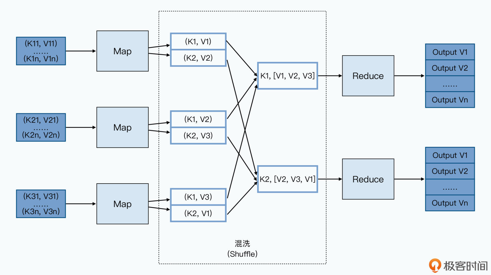
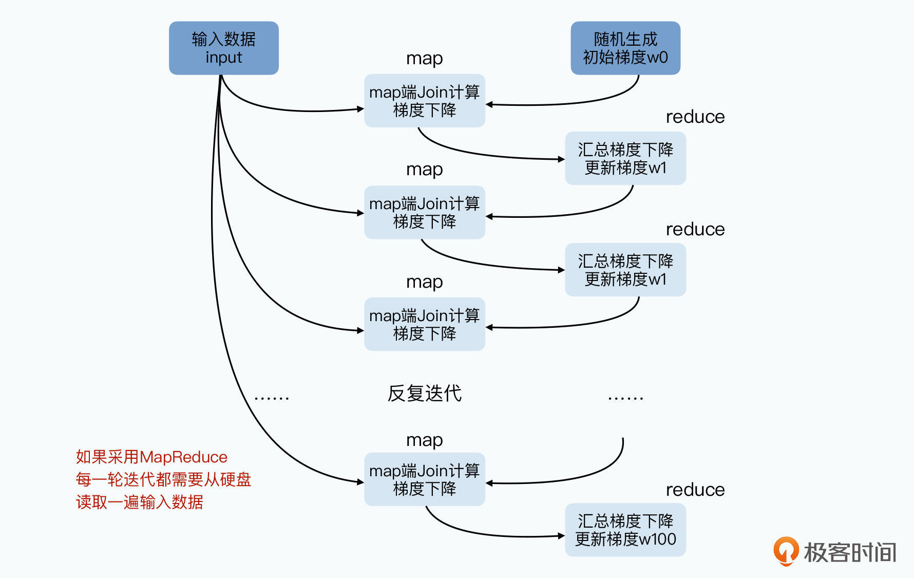
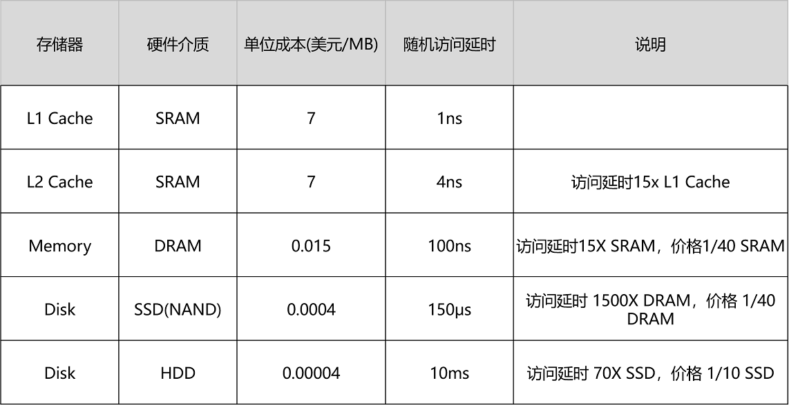
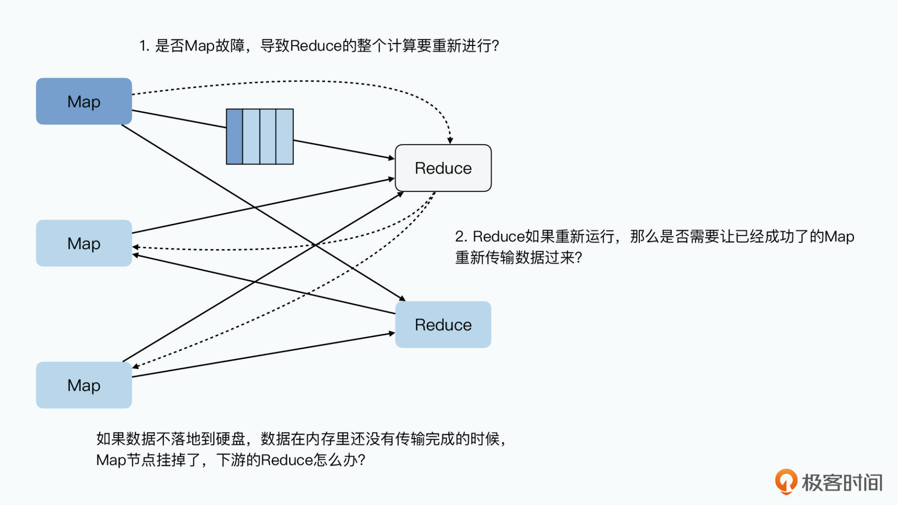
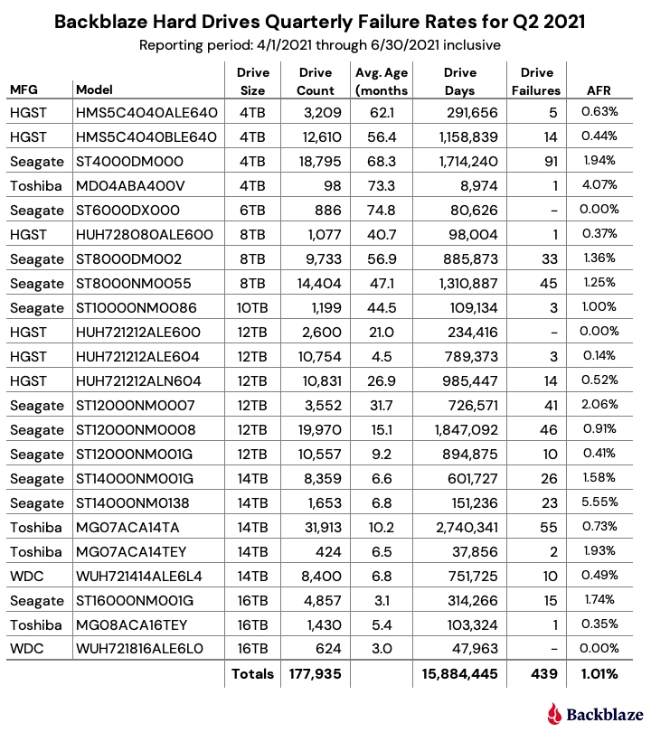
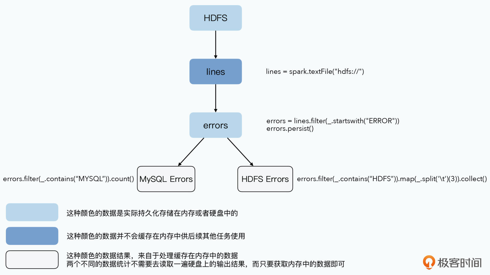
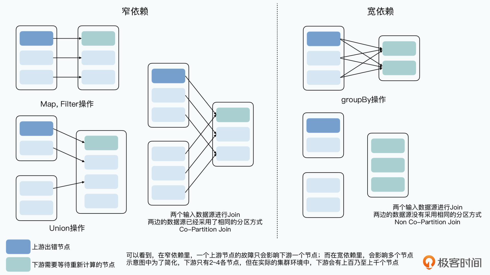

# 18 | Spark：别忘了内存比磁盘快多少

你好，我是徐文浩。

过去几讲里，无论是 Hive 这样基于 MapReduce 的系统，还是 Dremel 这样抛开 MapReduce 的系统，其实都已经反映了 MapReduce 这个大数据处理的计算模型，在 2010 年这个时间节点已经有一些“落后”了。来自 Facebook 的 Hive 选择了在 MapReduce 上优化改良，仍然基于 MapReduce 的模型。而 Google 自家的 Dremel 则是另起炉灶，用一个新的底层架构来支持 OLAP 的数据分析。

不过，在工业界之外，学术界一样不会在整个大数据飞速发展的时代里缺席。2010 年，来自 Berkeley 的博士生Matei Zaharia发表了一篇论文《Resilient Distributed Datasets: A Fault-Tolerant Abstraction for In-Memory Cluster Computing》。伴随着这篇论文的，是一个开源系统，也就是 **Spark**。在之后的几年里，Spark 不仅逐步侵蚀了 Hadoop 的市场份额，成为大数据分析的第一选择，也在实时数据处理，以及大规模机器学习里占据了重要的地位。

Spark 的计算模型，其实可以看作一个是支持多轮迭代的 MapReduce 模型。不过它在实现层面，又和稍显笨拙的 MapReduce 完全不同。通过引入 RDD 这样一个函数式对象的数据集的概念，Spark 在多轮的数据迭代里，不需要像 MapReduce 一样反反复复地读写硬盘，大大提升了处理数据的性能。

最重要的是，Spark 的这篇引入了 RDD 概念的论文，让我们看到了一个优秀的系统设计并不需要有多复杂，Spark 论文发表的时候，整个系统也就 1 万多行代码，一个人花上一两个月就能写出来。整个系统也没有太多复杂难懂的学术概念，只是针对 MapReduce 明显的不足之处做了改造而已。

那么，接下来我们就一起来看看 Spark 是如何做到这一点的，它的系统设计又有什么精妙之处。通过这一讲的学习，我希望你能够掌握以下几点：

Spark 里核心的 RDD 是一个什么概念，它是通过什么方式来优化分布式数据处理的，它的设计思路和计算机科学中的哪些观念比较相像。

在系统设计层面，我们怎么利用人的经验，预先设计好系统，针对正常情况下和异常情况下的性能进行权衡和选择的。

## 使用硬盘来“容错”的 MapReduce

在深入到 Spark 的论文之前，我们先来简单回顾一下 MapReduce 的整个流程。我把我们在讲解MapReduce 的论文中用到的数据流程图放到了这里，你可以再复习下。



来自第6讲的MapReduce的数据流程图

MapReduce 的过程并不复杂，Map 函数的输出结果会输出到所在节点的本地硬盘上。Reduce 函数会从 Map 函数所在的节点里拉取它所需要的数据，然后再写入本地。接着通过一个外部排序的过程，把数据进行分组。最后将排序分完组的数据，通过 Reduce 函数进行处理。

你会发现，**在这个过程里，任何一个中间环节，我们都需要去读写硬盘。**Map 函数的处理结果，并不会直接通过网络发送给 Reduce 所在的 Worker 节点，Reduce 也不会直接在内存中做数据排序。

这还只是单个的 MapReduce 任务，如果我们要通过 MapReduce 来跑一些机器学习任务，比如通过 L-BFGS 这样的算法，来进行大规模的逻辑回归的模型训练，我们需要跑上百个 MapReduce 的任务。其中每一个 MapReduce 的任务都差不多，都是把所有日志读入，然后和一个梯度向量做计算，算出新的梯度。接着下一轮计算要再读入一遍原来的日志数据，再和新的梯度做计算。在这个过程中，我们原始的日志，会被重复读取上百遍。



在迭代式的机器学习算法中，每一轮迭代我们都需要利用输入数据做一次计算
如果采用MapReduce，那么海量的输入数据会被重复读取100遍

而我们知道，内存的读写速度是远远快于硬盘的，这里我放了《深入浅出计算机组成原理》专栏里的一张数据表。可以看到，无论你在用机械硬盘还是 SSD 硬盘，访问数据的延时和内存比都有 1000 倍以上的差距。



之所以 MapReduce 把所有数据都往硬盘里一写，是因为它追求的是设计上的“简单”，以及在大规模集群下的“容错”能力。把 Map 节点的输出数据，直接通过网络发送给 Reduce 的确是一个很直观的想法，让 Reduce 节点在内存里就直接处理数据，也的确可以提升性能。

但是，如果在这个过程中，**Map 或者 Reduce 的节点出现故障了怎么办？**

因为 Reduce 对于前面的 Map 函数有依赖关系，所以任何一个 Map 节点故障，意味着 Reduce 只收到了部分数据，而且它还不知道是哪一部分。那么 Reduce 任务只能失败掉，然后等 Map 节点重新来过。而且，Reduce 的失败，还会导致其他的 Map 节点计算的数据也要重来一遍，引起连锁反应，最终等于是整个任务重来一遍。



如果数据没有在Map本地落地，那么故障会导致我们丢失掉中间的计算结果
并且整个Reduce的计算也要完全重新进行
Reduce重新计算，需要其他Map也重新发送数据过来，最终导致整个任务重算一遍

这只是我们尝试让数据不需要落地到硬盘处理中，会遇到的一种情况，我们还可能遇到网络拥塞、内存不足以处理传输的数据等种种情况。

事实上，你可以认为传统的 MPI 分布式计算系统就是这样，让一个节点直接往另外一个节点发送消息来传递数据的，但是这样的系统，容错能力很差，所以集群的规模往往也上不去。

而 MapReduce 针对这个问题的解决方案非常简单粗暴，那就是**把整个数据处理的环节完全拆分开来，然后把一个个阶段的中间数据都落地到硬盘上**。这样，针对单个节点的故障，我们只需要重新运行对应节点分配的任务就好了，其他已经完成的工作不会“半途而废”。

## 分布式系统里的“函数式”数据集

但是，这样的方式真的是效率最高的吗？

虽然因为整个 GFS 和 MapReduce 系统规模很大，节点很多，我们的各个节点必然会出现故障。但是，毕竟硬件也好、系统也好，出现故障是小概率事件。我们在第 8 讲里看过，一个数据中心里的 18 万块硬盘，90 天坏了 439 块，算到年度的损坏率也就是 1% 左右。我们为了这 1% 的错误，却要把 99% 的数据都反复从硬盘里读出来写进去，感觉的确有点划不来。



来自第8讲的数据中心硬盘损坏率的统计数据

所以，很自然地，我们需要有一个更有效率的容错方式。一个很直观的想法自然也就冒出来了，那就是我们是否可以做这三件事情：

第一个，是我们**是否可以把数据缓存在内存里**。如果是计算的中间结果，我们不一定要把它写到硬盘上。如果是反复读取的输入数据，我们可以缓存在内存里而不是每个迭代重新读取一遍。

第二个，是可以**记录我们运算数据生成的“拓扑图”**。也就是记录数据计算的依赖关系，一旦某个节点故障，导致这个依赖关系中的一部分节点出现故障，我们根据拓扑图重新计算这一部分数据就好了。通过这样的方式来解决容错问题，而不是每一次都把数据写入到硬盘。

第三个，是可以**通过检查点来在特定环节把数据写入到硬盘**。当我们的拓扑图层数很深，或者数据要反复进行很多次的迭代计算。前面通过“拓扑图”进行重新计算的容错方式会变得非常低效，那么我们可以在一部分中间环节，把数据写入到硬盘上。这样一种折衷的方式，既避免了每次都去从硬盘读写数据，也避免了一旦某一个环节出现故障，“容错”方案只能完全从头再来的尴尬出现。

举一个具体的例子，如果前面提到的大规模逻辑回归的机器模型训练，需要进行 100 轮迭代。我们最好的解决方案，既不是每轮迭代都需要重新读写数据，那样太浪费硬盘的 I/O 了。也不是把几小时的计算过程都放在内存里，那样万一计算梯度结果的数据在第 99 轮丢失了，我们就要从头开始。

我们完全可以把读取的日志数据缓存在内存里，然后把每 10 轮计算完的梯度数据写入到硬盘上。这样，一旦出现故障，我们只需要重新读取一次日志数据，并最多计算 10 轮迭代的过程就好了。

```
val points = spark.textFile(...)
                  .map(parsePoint).persist()
var w = // random initial vector
for (i <- 1 to ITERATIONS) {
  val gradient = points.map{ p =>
    p.x * (1/(1+exp(-p.y*(w dot p.x)))-1)*p.y
  }.reduce((a,b) => a+b)
  w -= gradient
}
```

> 论文 3.2.1 部分使用 Spark 实现分布式逻辑回归的代码。我们的输入数据会通过.persistent 缓存在内存中，而不需要每个迭代都重新从硬盘读取。

其实这个思路，就是 Spark 整个系统设计的出发点。根据这个朴素的思路，Spark 定了一个新的概念 **RDD**，全称是 Resilient Distributed Dataset，中文叫做弹性分布式数据集。整个系统设计的其实就是 **“弹性”+“分布式”+“数据集”** 这三点的组合。

**分布式**和**数据集**这两个关键字，我们应该不需要再进行太多的解释了。我们在 GFS、Bigtable 乃至 Dremel 里，都采用了数据分区的方式，来确保数据是分布式的。

### “函数式”的 RDD

而 RDD 最核心的设计关键点，就在这个**弹性**上。论文里的 2.1 部分，给出了 RDD 明确的定义，这句话是这样说的：

RDD 是只读的、已分区的记录集合，RDD 只能通过明确的操作，以及通过两种数据创建：稳定存储系统中的数据；其他 RDD。

 

这个明确的操作，是指 map、filter 和 join 这样的操作，以和其他的操作区分开来。

按照这个定义，我们可以看到这个是对于数据的一个**抽象**。我们的任何一个数据集，进行一次转换就是一个新的 RDD，但是这个 RDD 并不需要实际输出到硬盘上。实际上，这个数据都不会作为一个完整的数据集缓存在内存中，而只是一个 RDD 的“抽象概念”。只有当我们对某一个 RDD 实际调用 persistent 函数的时候，这个 RDD 才会实际作为一个完整的数据集，缓存在内存中。

一旦被缓存到内存里，这个 RDD 就能够再次被下游的其他数据转换反复使用。一方面，**这个数据不需要写入到硬盘**，所以我们减少了一次数据写。另一方面，**下游的其他转化也不需要再从硬盘读数据**，于是，我们就节省了大量的硬盘 I/O 的开销。



lines = spark.textFile("hdfs://...") 

errors = lines.filter(_.startsWith("ERROR")) 

errors.persist()

// Count errors mentioning MySQL: 

errors.filter(_.contains("MySQL")).count() 

// Return the time fields of errors mentioning 

// HDFS as an array (assuming time is field 

// number 3 in a tab-separated format): 

errors.filter(_.contains("HDFS")).map(_.split(’\t’)(3)).collect()

我们可以对照着论文 2.2.1 中的示例代码，来看这样一个过程。我们从 HDFS 上，读入原始数据，根据关键词 ERROR 进行了一次过滤，然后把它 persistent 下来。而接下来分别有两个分析任务，会用到这个缓存在内存里的 ERROR 数据，一个是找出所有带有 MySQL 关键词的错误日志，然后进行统计行数；另一个则是找到所有带有 HDFS 关键字的日志，然后按照 Tab 分割并收集第 3 列的数据。

这里面，一开始从 HDFS 里读入的 line 数据，因为没有 persistent，所以不会缓存在内存中。而 errors 会缓存在内存里面，供后面两个任务作为输入使用。errors 我们不需要写入到硬盘里，而后面分析 MYSQL 和 HDFS 关键字错误的两个任务，也不需要从硬盘读数据，数据都是直接在内存中读写，所以性能大大加快了。

从 RDD 的这个逻辑上，其实我们可以看到计算机工程上的其他系统中的影子。

第一个是**惰性求值**（Lazy-Evaluation），我们的一层层数据转化，只要没有调用 persistent，都可以先不做计算，而只是记录这个计算过程中的函数。而当 persistent 一旦被调用，那么我们就需要把实际的数据结果计算出来，并存储到内存里，再供后面的数据转换程序调用。

第二个是**数据库里的视图功能**。为了查询方便，对于复杂的多表关联，很多时候我们会预先建好一张数据库的逻辑视图。那么我们在查询逻辑视图的时候，其实还是通过一个多表关联 SQL 去查询原始表的，这个就好像我们并没有调用 persistent，把数据实际持久化下来。

当然，我们也可以把对应视图的查询结果，直接写入一张中间表，这样实际上就相当于把计算的结果持久化下来了，后续查询的 SQL 就会查询这个中间表。如果视图里的数据会被后续的 SQL 反复多次查询，并且对应的原始数据集也和 RDD 一样是不可变的话，一样会大大提升系统整体的效率。

### 宽依赖关系和检查点

那么，通过调用 persistent 来把数据缓存到内存里，就减少了大量的硬盘读写。但是我们仍然会面临节点失效，导致 RDD 需要重新计算的情况。所以 Spark 对这部分流程做了进一步的优化，这个优化说起来其实也不复杂。

那就是，如果一个节点失效了，导致的数据重新计算，需要影响的节点太多，那么我们就把计算结果输出到硬盘上。而如果影响的节点少，那么我们就只是单独重新计算被响应到的那些节点就好了。

所以，在 Spark 里，会对整个数据计算的拓扑图在分布式系统下的依赖关系做一个分类。如果一个 RDD 的一个分区，只会影响到下游的一个节点，那么我们就称这样的上下游依赖关系为**窄依赖**。而如果一个 RDD 的一个分区，会影响到下游的多个节点，那么我们就称这样的上下游关系为**宽依赖**。

对于窄依赖，即使重算一遍，也只是影响一条线上的少数几个节点，所以对应的中间数据结果，并不需要输出到硬盘上。而对于宽依赖，一旦上游的一个节点失效了，需要重新计算。那么它对应的多个下游节点，都需要重新从这个节点拉取数据并重新计算，需要占用更多的网络带宽和计算资源。

换句话说，在宽依赖下，一个上游节点的失效，会以几倍的影响在下游得到放大。所以，在宽依赖的场景下，上游会像 MapReduce 里的 Map 一样，**把输出结果序列化到硬盘上**，以减少故障后的恢复成本。



宽依赖，会放大上游节点故障对下游节点的影响

同样的，对于有多轮迭代，或者是整个拓扑图很长的数据处理任务，Spark 在 persistent 的时候，支持你添加一个 **REPLICATE 参数**，把当前的计算结果作为一个检查点存储下来。一旦添加了这个参数，数据就不只是存储在内存中，而是会序列化到硬盘里。这样，同样可以减少你在出现故障时候的重新计算的时间。

可以看到，无论是 persistent、宽依赖下的数据会被持久化存储，还是允许用户去自己通过检查点存储中间步骤的计算结果，**都是为了在日常情况下的性能，和容错情况下的性能做一个平衡。**

如果不做任何持久化存储，那么平时系统会跑得很快，但是一旦某个节点出错就要从头再来。而如果都做持久化存储，那么节点出错的时候，计算可以恢复得很快，但是没有问题的时候会有很多浪费。

本质上，Spark 就是根据人的经验，在这两点上做好了平衡。

## 小结

其实，Spark 里的 RDD 的设计思想并不复杂。和 MapReduce 一样，RDD 的设计思路也是来自于函数式编程。相对于过程式地把每一个数据转换（Transformation）的结果存储下来，RDD 相当于记录了输入数据，以及对应的计算输入数据的函数。

这个方式，和把一步步的计算结果存储下来的效果一样，都可以解决容错问题。当某一个 RDD 的某一个分区因为故障丢失的时候，我们可以通过输入数据和对应的函数，快速计算出当前 RDD 的实际内容。而这个输入数据 + 对应函数的组合，就是 RDD 中的 Lineage 图。

RDD 和其他分布式系统**最大的差异**，就在代表**弹性**的 R 这个关键字上。这个弹性体现在两个方面。

**第一个是数据存储上。**数据不再是存放在硬盘上的，而是可以缓存在内存中。只有当内存不足的时候，才会把它们换出到硬盘上。同时，数据的持久化，也支持硬盘、序列化后的内存存储，以及反序列化后 Java 对象的内存存储三种形式。每一种都比另一种需要占用更多的内存，但是计算速度会更快。

**第二个是选择把什么数据输出到硬盘上。**Spark 会根据数据计算的 Lineage，来判断某一个 RDD 对于前置数据是宽依赖，还是窄依赖的。如果是宽依赖的，意味着一个节点的故障，可能会导致大量的数据要进行重新计算，乃至数据网络传输的需求。那么，它就会把数据计算的中间结果存储到硬盘上。

同时，Spark 也支持你自己定义检查点，你可以把一些关键节点的数据通过检查点的方式，持久化到硬盘上，避免出现特定节点的故障，导致大量数据需要重新计算的问题。

可以看到，Spark 的 RDD，是在没有破坏 MapReduce 的易用性的前提下，支持了 MapReduce 可以支持的所有运算方式。并且，它通过尽可能利用内存，使得需要多个 MapReduce 的组合或者迭代的任务的执行速度大大加快了。从分布式的逻辑回归来看，Spark 的性能会比使用原始的 MapReduce 一轮轮迭代快上 20 倍。这也是为什么，Spark 一出现在市场上，就很快替代了大量的 MapReduce 的分析工作，并在迭代式的机器学习算法中成为了主流。

## 推荐阅读

其实在 Spark 出现之前，已经有很多人意识到 MapReduce 这个计算框架在性能上的不足了。也有各种各样的论文和系统，尝试去解决需要反复多轮迭代算法的效率问题。在 RDD 的论文中也有提到两篇，分别是来自于 Google 的 Pregel，它的出发点是用来解决 PageRank 的多轮迭代。以及改造自 Hadoop 的 Haloop，它的出发点是解决大规模数据集上迭代式的机器学习问题。

如果你想对比看看 Spark RDD 这个更加统一抽象的框架，相对于这些“专用**”**系统的改进和优化，你可以回头去看看这两篇论文。我把链接放在了这里：Pregel 论文、Haloop 论文。

## 思考题

论文里提到，除了对 RDD 持久化之外，我们还可以自己定义 RDD 如何进行分区，并且提到了可以对存储优化有用，比如把两个需要 Join 操作的数据集进行相同的哈希分区。那么，为什么这么做会对存储优化有用呢？它在应用层面到底优化了什么？

欢迎你在留言区分享自己的思考和答案，和你的同学、朋友一起讨论，共同进步。