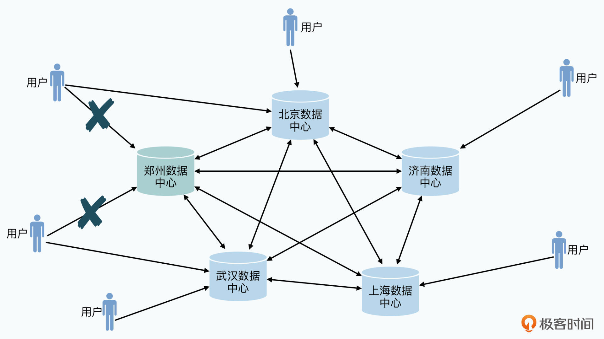
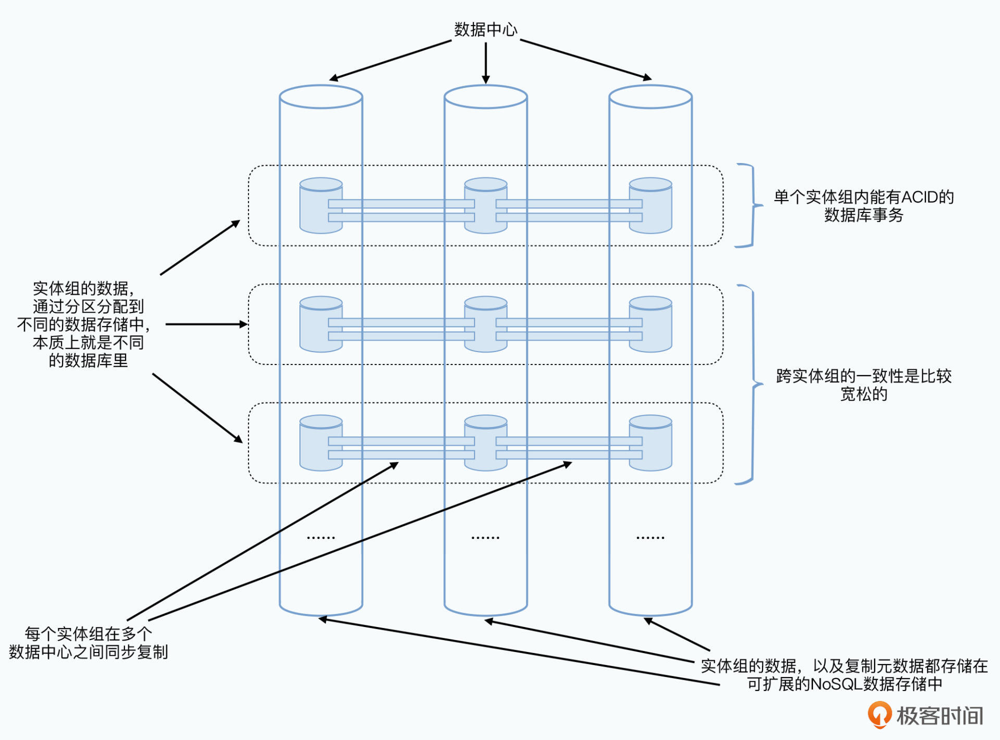
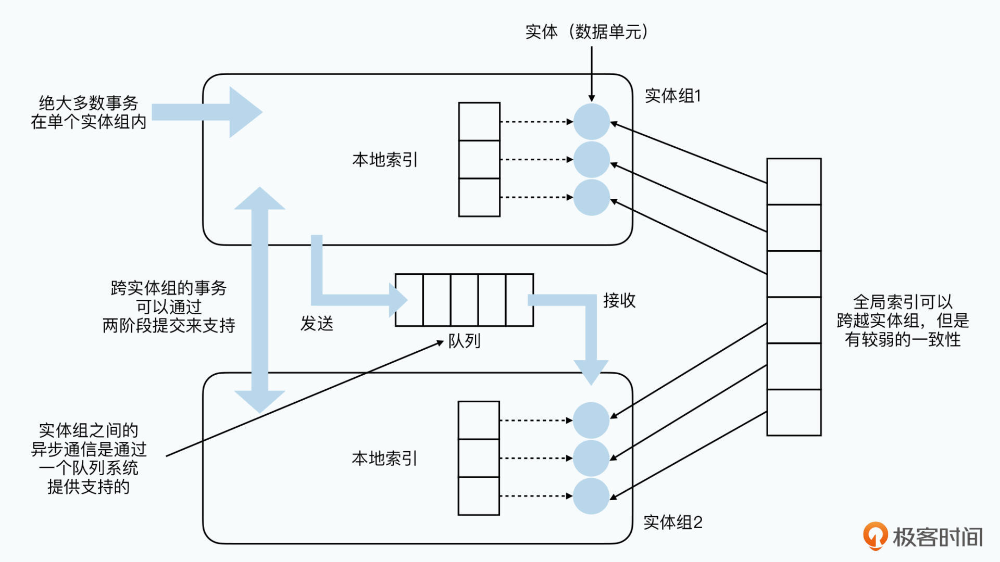

# 19 | Megastore（一）：全国各地都能写入的数据库

你好，我是徐文浩。

大数据技术一开始，更像一个专有系统。但是随着时间的推移，工程师们越来越多地让这些大数据系统支持上了 SQL 的特性。于是我们看到了 Hive 让大家可以用 SQL 来执行 MapReduce 任务，Dremel 这样的系统更是一开始就支持了 SQL。对于 OLAP 的分析类系统来说，支持 Schema 定义、支持字段类型、支持直接用类 SQL 的语言进行数据分析，很快就成为了新一代大数据分析系统的标准。

所以，Google 想要在 Bigtable 这样的 OLTP 数据库上支持 SQL，也不会让我们意外了。那么接下来，我们就一起来看一看《Megastore: Providing scalable, highly available storage for interactive services》这篇论文，为我们带来了一个什么样的分布式系统。

Megastore 是一个雄心勃勃的系统，支持 SQL 这样的接口只是它想要做到的所有事情中的一小项。如果列出 Megastore 支持的所有特性，相信也是一个让人两眼放光的系统，好像是分布式数据库的终极答案：

- 跨数据中心的多副本同步数据复制；
- 支持为数据表的字段建立 Schema，并且可以通过 SQL 接口来访问；
- 支持数据库的二级索引；
- 支持数据库的事务。

不过，**Megastore 最终只是 Google 迈向 Spanner 中的一个里程碑。Megastore 的大部分高级特性，都基于实际的应用场景做了取舍和妥协。**相比于略显高深的 Spanner，Megastore 的设计对大部分工程师和架构师来说更有实践意义。我会通过接下来的三讲，带你解读 Megastore 的论文：

第一讲，主要讲解论文中的第二部分，也就是 Megastore 的整体系统架构，以及这个架构是怎么从我们的应用场景需求妥协而来的。

第二讲，我们会来看一看 Megastore 的 API 设计、数据模型以及事务和并发控制是怎么做的，看看 Megastore 是怎么利用好 Bigtable 的特性来实现一个更高级的数据库。这个也是论文中的第三部分。

第三讲，我们会深入论文的第四部分，研究 Megastore 的数据复制机制，一起来看看，一个为跨数据中心复制而优化的 Paxos 算法实现，是怎么样的。

那么，通过今天第一讲的学习，相信对你根据业务实践来设计系统，以及如何在各种工程实践上进行取舍的能力有所裨益。

## 互联网时代的数据库

在我们前面介绍过的那些论文里，会发现工程师们对于“可用性”问题的考虑，往往是局限在一个数据中心里。GFS 里我们会对数据做三份备份，但是这三份数据还是在同一个数据中心的三台服务器里；针对 Chubby 这样的服务，我们用了五个节点，放到不同的交换机下，但这仍然是在一个数据中心里。

可是，如果我们的分布式数据库只能在一个数据中心里，那无论是在“可用性”上，还是在“性能”上，在互联网时代都有点不够看。

在“**可用性**”这个角度，尽管我们在数据中心内部可以有非常完善的分布式、多路供电以及柴油发电机等方案，但是一旦遇上像水灾、地震这样的自然灾害，这些手段都无济于事。而往往在这个时候，让每个人能够访问到网络、发送消息又是特别重要的。前一阵我们遇到的郑州水灾就是一个很典型的例子。

在“**性能**”这个角度，如果我们的数据中心设在旧金山，那么一个上海用户的一个请求，在最理想的情况下，也至少需要 100 毫秒以上才能够完成一个网络请求的往返。在真实的网络环境里，其实 100 毫秒是远不够的，往往要到 150 乃至 200 毫秒。而这个访问速度，显然会让很多用户觉得“网络慢”，体验不好，容易流失用户。

真正高可用的架构里，数据会在多个数据中心同步，用户会就近访问最近的数据中心
如果特定数据中心出现问题，可以访问附近的其他数据中心
其实过去几年，大型的互联网公司都在建设“异地多活”的系统架构，就是为了保障系统的可用性和访问性能

那么，解决这两个问题最好的办法，就是我们**有多个数据中心**。每个用户的请求都可以访问到就近的本地数据中心，对应的数据也直接就近写入本地数据中心里的数据库，也都从本地数据中心的数据库里读。而各个数据中心的数据库之间，会进行数据复制，确保你在旧金山写入的数据，我在上海一样可以读到。

而且既然是一个互联网层面的数据库，也就是用户量可能像 Facebook 或 Google 这样，达到几十亿，那这个数据库也需要有非常强的水平扩展能力，通过简单地增加服务器就能够服务更多的用户。

这些需求点，也就是 Google 需要 Megastore 这样一个系统的起因。而论文在第二部分的一开始，就写明了 Megastore 的解决方案：

- **对于可用性问题，通过实现一个为远距离链接优化过的同步的、容错的日志复制器。**
- **对于伸缩性问题，通过把数据分区成大量的“小数据库”，每一个都有独立进行同步复制的数据库日志，存放在每个副本的 NoSQL 的数据存储里。**

那么接下来，我们就一起看看这个方案具体是怎么样的。

## 复制、分区和数据本地化

和 Hive 没有重写计算引擎而是直接用了 MapReduce 一样，Megastore 也没有重写数据存储层，而是直接使用了 Bigtable。那么，Megastore 想要解决的第一个问题，就是**如何在多个数据中心的 Bigtable 之间复制数据**。

我们常见的数据复制的方案，其实无非就是三种：

第一种是**异步主从复制（Asynchronous Master/Slave）**，这个我们之前在讲解Chubby的时候就讨论过。异步主从复制有两个核心问题，第一个是如果 Master 节点挂了，Slave 如果还没有及时同步数据的话，我们可能会丢数据。第二个是如果写数据在数据中心 A，读数据在数据中心 B，那么刚写入的数据我们会读不到，也就是无法满足整个系统是“可线性化”的。

第二种是**同步主从复制（Synchronous Master/Slave）**，这也是大部分系统的解决方案。

第三种叫做**乐观复制（Optimistic Replication）**，这种方案是 AP（Availability + Partition Tolerance）系统中常常用到的方案。也就是数据可以在任何一个副本中写入，然后这个改动会异步地同步到其他副本中。因为可以在任何一个副本就近写入，所以系统的可用性很好，延时也很低。但是，什么时候会同步完成我们并不知道，所以系统只能是**最终一致**（eventually-consistent）的。而且，这个系统基本无法实现事务，因为两个并发写入究竟谁先谁后很难判定，所以隔离性就无从谈起了，而“可线性化”自然也就没法做到了。

Megastore 在这件事情上的选择非常简单明确，那就是直接使用 Paxos 算法来进行多个数据中心内的数据库的同步。要注意，Megastore 并不是像我们之前讲解 Bigtable+Chubby 那样，只是采用 Paxos 来确保只有一个 Master。**Megastore 是直接在多个数据中心里，采用 Paxos 同步写入数据，是一个同步复制所有的数据库日志，但是没有主从区分的系统。**

不过，Megastore 选择直接使用 Paxos，最大的一个问题就是**性能**。

一方面，我们的数据传输无法突破物理学的限制，跨数据中心的延时是省不掉的。所以 Megastore 对于 Paxos 算法的实现，专门做了优化。这个优化，我们会在下一讲里专门讲解。

另一方面，即使把 Paxos 算法优化到极限，我们也避免不了，Paxos 算法的每一次“共识”都需要超过半数节点的确认。如果是通过 Paxos 来保障一个数据库日志的同步复制，那么写入数据的性能就受限于单台服务器了，这也是为什么在 Bigtable 里，我们只是使用 Chubby 来管理粗粒度的锁，而不是直接用 Paxos 来进行同步复制。

那么在 Megastore 里，我们该怎么解决这个 Paxos 的性能瓶颈呢？

### 从业务需求到架构设计

我们先来回想一下分布式系统，需要做到“可线性化”的原因是什么。

以最常见的电商为例子，我下订单的数据库操作完成了之后，我再去查询这张订单是否完成，应该要能看到刚刚下的这一张订单。要不然的话，我一定会觉得很奇怪也非常担心，觉得钱付出去了，但是东西可能拿不到。

但是，几乎在我下单之前，另一位在海南的朋友也下单了。那么，他下的这张订单是否在我下单之前可以读取到，我却并不在意。一方面，自然我也没有权限看到他的订单，另一方面，在业务上我们也并不需要分辨，几乎在同一时间下单的人谁先谁后。

根据这个例子我们可以看到，从业务上来说，**我们不一定需要全局的“可线性化”，而只要一些业务上有关联的数据之间，能够保障“可线性化”就好了**。不仅从“可线性化”的角度是这样的，其实数据库事务隔离性的“可串行化”也是这样的。

我的订单，如果从业务上就不会和我在海南的朋友之间有冲突，不会去读写相同的数据。那么我们在下单过程中，互相之间的“可串行化”的隔离性，“有”和“没有”是没有区别的。也就是我们的“可串行化”的要求，也不是全局的。

而这个现实业务中，对于数据库事务的“可串行化”，以及分布式系统的“可线性化”不需要是全局的，就给 Megastore 带来了解决问题的思路。

Megastore 是这么做的。

首先，它引入了一个叫做**“实体组”**（Entity Group）的概念。Megastore 里的数据分区，也是按照实体组进行数据分区的。

然后，一个分区的实体组，会在多个数据中心之间通过 Paxos 进行数据同步读写。本质上，**Megastore 其实是把一个大数据表，拆分成了很多个独立的小数据表。**每一个小数据表，在多个数据中心之间是通过 Paxos 算法进行同步复制的，你可以在任何一个数据中心写入数据。但是各个小数据表之间，并没有“可线性化”和“可串行化”的保障。

> 论文中的图1，Megastore的架构，好像是一个二维矩阵，按行是数据分区，按列是不同的数据中心

你可以看一看论文里的图 1，整个 Megastore 的架构，就好像是一个二维矩阵。横向按行，是按照数据分区进行了切分，纵向按列，是一个个独立的数据中心。

每一个分区的数据，可以在任意一个数据中心写入，同步复制到其他数据中心去。不过，不同分区的实体组之间的数据，其实就可以看作是两个独立的数据库的写操作，互相之间没有先后顺序和隔离性的关系了。

**那么实体组到底是什么呢？**你可以把实体组，当成是一个实体，以及挂载在这个实体下的一系列实体。

比如在前面电商的例子里，每一个用户是一个实体，这个用户的所有订单，可以以一个 List 的形式挂载在这个用户下，这个用户的所有和商家的消息，也可以挂载在这个用户下。这些东西打包在一起，就是一个实体组。一个实体组下的数据，往往我们经常会一起操作。比如，我们会去查看自己最近下的订单，意味着一个用户下的所有订单会在一起读取。

Megastore 在每一个实体组内，支持一阶段的数据库事务。但是，如果你有跨实体组的操作需求，你该怎么办呢？你有两个选择，第一个，是使用两阶段事务，当然它的代价非常高昂，是一个阻塞的、有单点的解决方案。而第二个，则是抛弃事务性，转而采用 Megastore 提供的**异步消息机制**。因为一旦跨实体组，我们就不能保障数据操作是在同一个服务器上进行的了，就需要跨服务器的操作需求。

两阶段事务相信你已经非常熟悉了，我们来看看这个消息传递机制是怎么样的。当我们需要同时操作两个实体组 A 和 B 的时候，我们可以对第一个实体组，通过一阶段事务完成写入。然后，通过 Megastore 提供的一个队列（queue），向实体组 B 发起一个消息。实体组 B 接收到这个消息之后，可以**原子地**执行这个消息所做的改动。

所以，A 和 B 两边的改动，在这个消息机制下，都是事务性的。但是两边的操作并没有共同组成同一个分布式事务。所以，如果在跨实体组的操作中采用了消息机制，Megastore 本质上没有实现数据库事务，它实现的仍然是数据库的最终一致性。

> 论文中的图2，Megastore只支持单个实体组内的一阶段事务
> 跨实体组要么使用异步队列机制，要么采用两阶段提交

如果我们拿一个具体的应用案例，可以更容易看清楚 Megastore 的这个设计。我们就以即时聊天，比如微信这个场景作为例子好了。

- 我们可以把每个微信账号，当成是一个实体组。
- 账号里面的每一条收和发的消息，也挂载在这个实体组里。
- 当你要发一条消息出去的时候，其实会影响到两个实体组，一个是你的微信账号，因为你的聊天记录里会多一条发出的消息。另一个是收件人的微信账号，他的聊天记录里也会多一条消息。
- 但是我们并不需要保证，你这里看到发出消息和他看到收到消息同时发生。那么我们就可以采用 Megastore 的异步消息机制。
- 我们先用一个一阶段事务，在你的微信账号的实体组里写入这条消息。然后再通过 Megastore 的异步消息机制，往收件人的微信账号里发送一条“写入消息”的请求。而他的实体组在收到这个“写入消息”的请求之后，把整个消息事务性地写入自己的实体组就可以了。

而之所以这个消息机制是有效可行的，其实还是回到我们开头说的，**在实际应用层面，我们对于“可串行化”以及“可线性化”的需求并不是全局的，而是可以分区的。**我们只需要保障自己发出的消息，在自己的微信界面上，看起来是按照顺序出现的就可以了。而并不要求收件人的微信和发件人的微信之间，也是“可线性化”的。

## 小结

好了，这一讲到这里就告一段落。在这一讲里，我们看到 Megastore 的设计提出了一系列雄心勃勃的目标。首先是跨数据中心的同步复制，让数据可以在任意一个离用户最近的数据中心写入。然后是支持为数据表建立 Schema、定义字段类型、支持 SQL 接口和二级索引、支持数据库事务，想让工程师们像使用关系型数据库一样使用 Megastore。而这些目标，既是顺应互联网时代的用户需求，也是大数据 OLTP 数据库不断发展的必然目标。

当然，Megastore 并没有选择从头开始、另起炉灶，而是准备直接基于 Bigtable 和 Paxos 算法来实现这些目标。不过，无论是多么天才的工程师，也逃脱不了地心引力。Paxos 算法本身的性能是有限的，所以 Megastore 采取了分区这个办法。**本质上，Megastore 不是一个“可线性化”的分布式数据库，而是很多个分布式数据库的一个合集。**

而在事务性上，Megastore 也作出了种种限制。**Megastore 只支持一个实体组下的一阶段事务**，如果你需要跨实体组进行操作，那么要么你得使用代价高昂的二阶段提交，要么你可以使用 Megastore 提供的异步消息机制。而实体组这个概念本身，就是把一些经常要在一起操作的数据，组合在一起，方便进行快速操作。

可以看到，Megastore 虽然提出了雄心勃勃的目标，但是在实际最终的实现上，作出了种种的妥协和限制。Megastore 并不是一个“透明”的分布式数据库，而是要你在充分了解它的特性之后，对于你自己的数据库表进行对应的适配性设计，才能发挥出它的这些有意思的特性。

那么，在下一讲里，我们就来看看 Megastore 的 API、数据模型是怎么回事儿，以及它的事务和并发控制是怎么做的。如果我们要基于 Megastore 来实现我们的业务系统，搞清楚这些原理是至关重要的。

## 推荐阅读

相比开创时代的 Bigtable，和成为最终答案的 Spanner，Megastore 在网络上的资料相对少一些。实体组的概念，也和大部分你熟悉的关系型数据库和 KV 数据库都有些区别。不过，你可以直接去用一下 Google Cloud 里的Datastore这个产品，它其实就是进化多年之后的 Megastore。当然，我也推荐你反复读一下 Megastore 的论文原文，这是一个每一个优秀工程师都能通过自己的思考和分析找出的解决方案。

## 思考题

Megastore 通过把“实体组”分区，让各个分区相互独立，使得可以有很多组 Paxos 的日志复制在并行进行。但是，对实体组分区，让它们之间没有业务关联并不是一个很容易的事情。我在这一讲里举了很多电商的例子，你能想一想其中哪些例子，看似各个实体组之间是相互独立没有关联的，但是在实际业务中仍然可能会存在各种关联么？

欢迎你在留言区中分享你的答案和思考，和你的朋友、同学一起讨论，互相交流，共同进步。