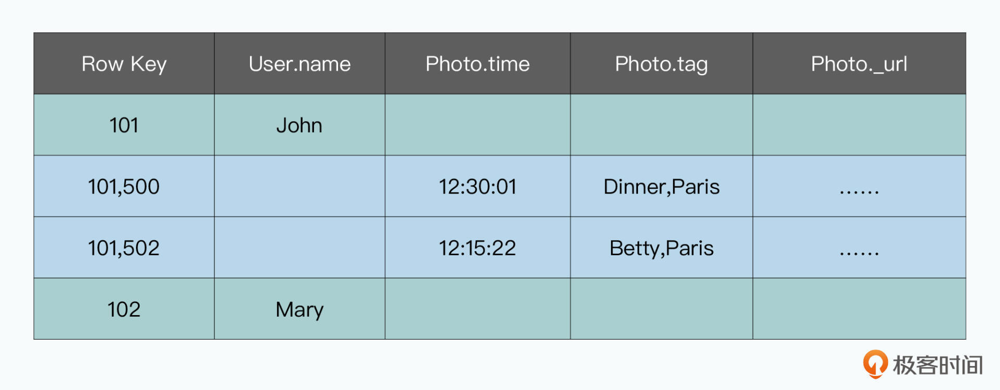
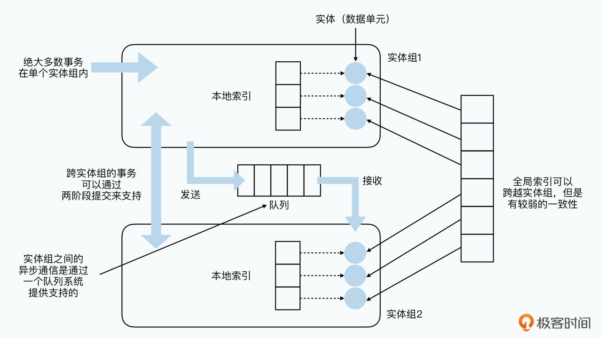
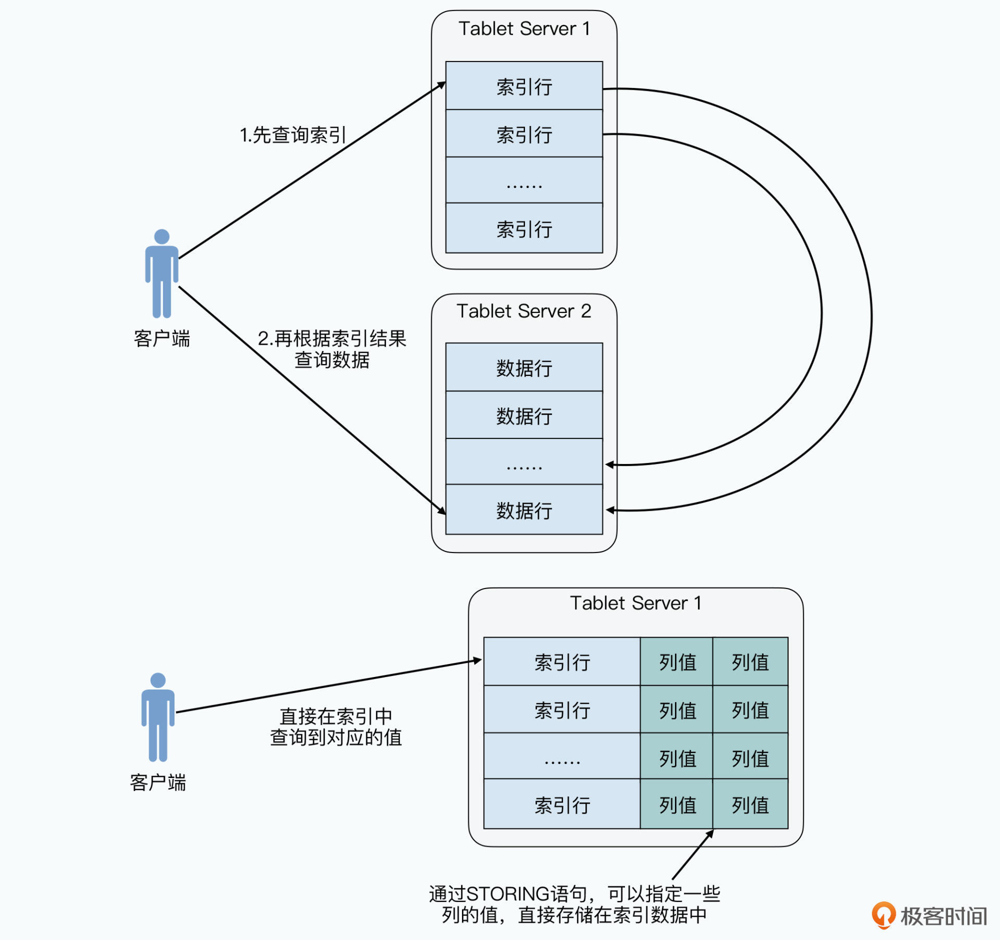
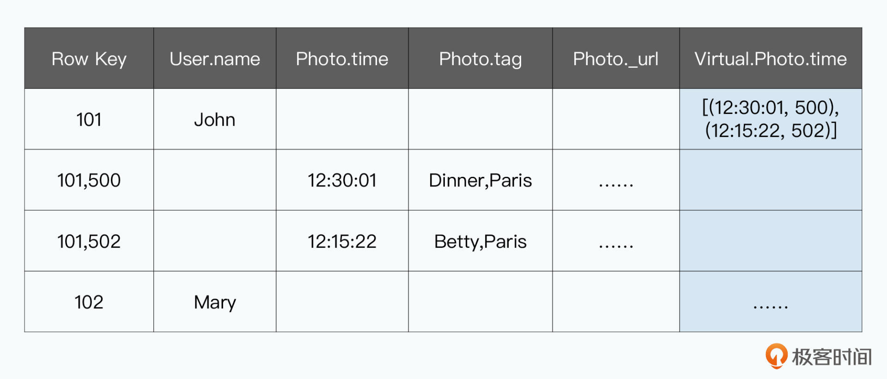
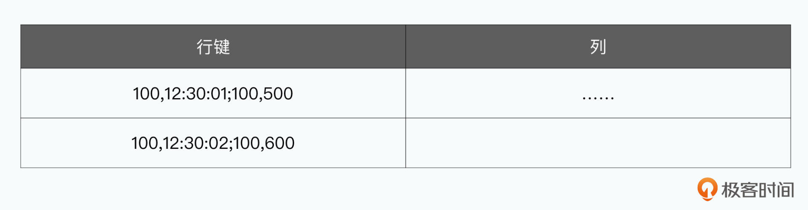
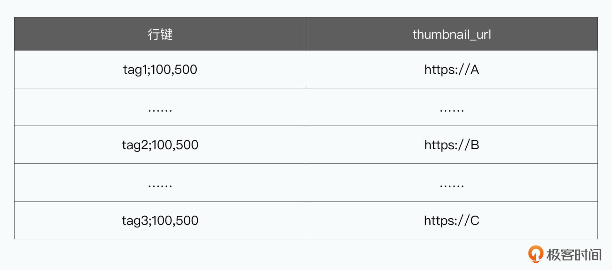
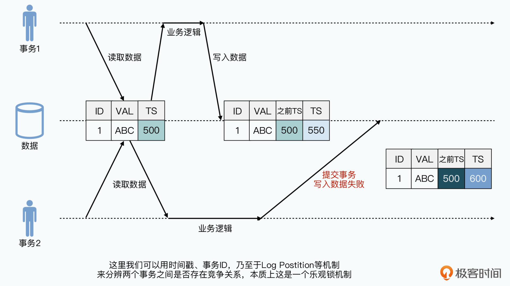
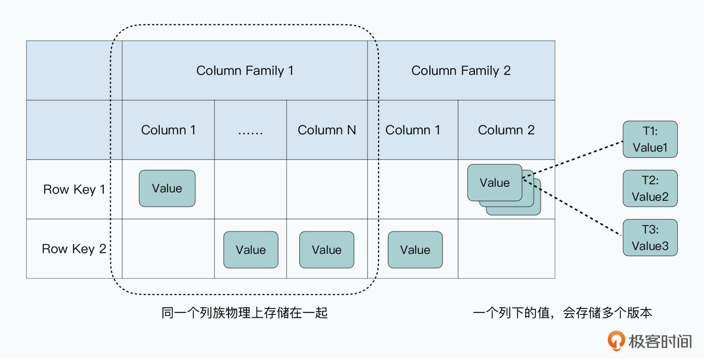

# 20 | Megastore（二）：把Bigtable玩出花来

你好，我是徐文浩。这节课，我们继续来解读 Megastore 的论文。

在上一讲里，我们了解了 Megastore 的设计目标和整体架构。Megastore 虽然定了一个雄心勃勃的设计目标，但是当我们深入它的整体架构的时候，发现它还是根据实际的应用场景做了种种的妥协。

Megastore 把数据按照分区划分成了很多“小数据库”，来解决 Paxos 算法的单节点性能瓶颈问题。而针对数据库事务，Megastore 支持的是**单个实体组内的一阶段事务**。一旦要跨实体组，要么就要选择两阶段事务，要么就要采用并非事务性的异步消息机制。所以，Megastore 虽然支持了 SQL 形式的接口，但是实际在应用中，仍然需要我们针对自己的数据模型进行精心的设计。

那么，这一讲，我们就看看 Megastore 的数据模型是怎么样的，它在底层又是如何使用 Bigtable 来存储数据的，它实现的实体组层面的事务又是怎么一回事儿。

在学完这一讲之后，希望你能够发现，其实 Megastore 并不神秘。通过有效利用 Bigtable 本身的各个特性，Megastore 就已经能够实现很多，原先我们觉得在分布式环境下相对复杂的特性了。当然，这些特性也作出了种种妥协，使得 Megastore 并不能成为分布式数据库的终极方案。

事实上，与其说 Megastore 是一个独立的分布式数据库方案，不如说它更像一个 Bigtable 上的应用层的封装。那么在深入了解了 Megastore 的数据模型之后，相信你能够学会善用现有的系统，利用好现有系统的各种特性，就能有效组合出各类原先觉得难以做到的数据库高级特性。

## 实体组到底是什么？

实体组这个名字，我们在上一讲里，就已经反复提过很多次了。我们给出了一个抽象的概念，说它是一系列会经常共同访问的数据，也给出了一些像是用户和他的订单这样的例子。那么这一讲，我们就深入来看看，实体组到底是个什么东西。

```sql
CREATE SCHEMA PhotoApp
CREATE TABLE User {
  required int64 user_id;
  required string name;
} PRIMARY KEY(user_id), ENTITY GROUP ROOT;
CREATE TABLE Photo {
  required int64 user_id;
  required int32 photo_id;
  required int64 time;
  required string full_url;
  optional string thumbnail_url;
  repeated string tag;
} PRIMARY KEY(user_id, photo_id),
  IN TABLE user,
  ENTITY GROUP KEY(user_id) REFERENCES User;
  
CREATE LOCAL INDEX PhotosByTime
  ON Photo(user_id, time);
CREATE GLOBAL INDEX PhotosByTag
  ON Photo(tag) STORING (thumbnail_url);
```

> 论文中的图 3，一个照片分享服务的示例 Schema。

我在这里列出了论文中的图 3，里面是一个最简单的实体组的示例 Schema。其中包含了这些信息。

首先是定义了一个叫做 PhotoApp 的 Schema，你可以认为是定义了数据库里的一个库（database）。

然后定义了一张叫做 User 的表，并且定义其中的 user_id 是主键，并且定义了这个表是**实体组（Entity Group）**的一个**根（Root）**。一条 User 表的记录，就代表了一个用户。

接着，定义了一张叫做 Photo 的表，其中的主键是 user_id 和 photo_id 两个字段的组合。并且，**这张表是关联到前面的 User 表这个根上的。这个挂载，是通过 user_id 这个字段关联起来的。**这个关联关系，就是我们上一讲所说的“挂载”。

实际上，我们可以有多个表，都关联到 User 表这个根上。而所谓的实体组，在逻辑上就是一张根表 A，并且其他表可以通过外键，关联到根表 A 的主键上。并且，这个关联是可以层层深入的。比如我们还可以再定义一个表，叫做 PhotoMeta，里面可以再通过 user_id 和 photo_id，再关联到 Photo 表上。

最后，Schema 里分别建立了两个索引：

- 一个是叫做 PhotosByTime 的**本地索引（Local Index）**，索引的是 Photo 表里 user_id 和 time 字段的组合；
- 另一个，是叫做 PhotosByTag 的**全局索引（Global Index）**，索引的是 Photo 表里的 Tag 这个字段，并且它专门设置了一个特定的 STORING 参数，指向了 Photo 表里的 thumbnaill 这个字段。

如果你仔细看一下这个 Schema，你会发现其实这个 Schema 的定义，更像是我们前面见过的 Thrift 或者 Protobuf 的定义文件。每个字段不仅有类型，还有是否是 required 以及 optional，并且我们可以定义 repeated 的字段，也就是有某一个字段在某一条记录里面是 List。

这个其实是我们在大数据系统中常见的一种技术方案。**为了减少数据需要跨越特定的服务器进行 Join，不如直接支持嵌套的 List 类型的字段。**而 Megastore 也直接使用了 Protobuf 的 Schema，使得跨语言跨团队使用 Megastore 变得更加容易了。

### 实体组的数据布局

抛开这些题外话，我们一起看看为什么在一个实体组内，我们可以让数据经常共同访问，而跨越实体组就不合适呢？

其实只要观察一下上面的这个示例 Schema，在 Bigtable 内是如何存储的，你自己就能得出答案。



> 论文里的图5，示例Schema在Bigtable中的数据布局

我把论文里面的图 5，也就是前面的 PhotoApp 表在 Bigtable 里是怎么存储的放在了这里，并把示例数据分别标成了绿色和蓝色。对于 PhotoApp 里的 User 和 Photo 这两张表，是存放在同一张 Bigtable 的表里的，其中，绿色部分的数据是来自 User 表的，而蓝色部分的数据来自 Photo 表。

可以看到，我们是直接拿 User 表的主键 user_id，作为了 Bigtable 里的行键。而对于 Photo 表，我们是拿 user_id 和 photo_id 组合作为行键，存放在同一张表里。因为 Bigtable 里面的数据，是按照行键连续排列的。所以，同一个 User 下的 Photo 的数据记录，会连续存储在对应的 User 记录后面。

在前面的第 9 讲解读 Bigtable 这篇论文的时候，我们说过在 Bigtable 里，数据是按照行键分区的，实际的数据存储，也是按照行键连续存储的。并且，当我们用一个行键去 Bigtable 里面查询数据的话，Bigtable 会有 Block Cache，也就是把底层的 SSTable 的整个 Block 都获取回来。而这个里面，其实就会包含当前行键前后连续行键所包含的数据。

所以，当我们去查询某一条 User 记录的时候，会有非常高的概率，直接把 User 记录下的 Photo 记录一并获取到，而不需要再次访问对应的硬盘。自然读写的性能，就会比随机布局的数据要好上很多。在 Megastore 的论文里，这样的数据布局是被称之为**对 Key 进行预 Join**（Pre-Joining with Keys）。

除此之外，为了避免热点问题，Megastore 支持你对数据表添加一个 SCATTER 参数，添加了这个参数之后，所有的行键都会带上 Root 实体记录的 Key 的哈希值。这样，虽然同一个实体组里的数据还是连续排列的，但是同一张表的两个连续实体组的 Root 记录的 Key，就不一定存储在一个服务器上了。

而数据库里的每一个列也非常简单，我们就直接使用 Bigtable 的 Column 就好了。而且 Megastore 这样混合一个实体组里的多个表的结构，其实是非常适合 Bigtable 的。因为 Bigtable 的列是稀疏的，对于不存在的列，并不需要存储，当然也不会占用存储空间。这样，虽然一个 Bigtable 里的表，实际存放了一套实体组的 Schema 下的很多张表，但是并不会存在存储上浪费的情况。

### Megastore 的索引

了解了 Megastore 的实际数据是怎么存储在 Bigtable 里的，我们再来看看它的索引是怎么回事儿。

Megastore 的索引，分成了两种类型，一个是本地索引，另一种叫做全局索引。**本地索引的数据，是直接存储在实体组“内部”的**，它是我们已经确定是哪一个实体组的情况下，去寻找具体的记录位置。这个，你可以看看我在上一讲里，放过的论文图 2 里面索引的位置。



> 论文中的图2，本地索引的数据是和实体组数据存储在一起的

而我们通过看前面的 Schema 的例子也会非常清楚，PhotosByTime 这个本地索引，需要通过 user_id 和 time 这样两个字段才能查询到。其实，也就是我们先通过 user_id，知道是哪一个 User 实体组，再在这个实体组里查询数据。

```sql
CREATE LOCAL INDEX PhotosByTime
  ON Photo(user_id, time);
```

> 本地索引，索引中需要包含实体组的根的主键信息。

而另一种全局索引，就不需要预先知道是哪一个实体组了，但是它的更新就不是实时的了。最新的数据更新，不一定会在全局索引里反映出来，这也是为什么论文里说，**全局索引是弱一致的**。我们也不难猜到，全局索引应该是异步更新的。

#### 索引优化

除了把索引区分成本地索引和全局索引之外，Megastore 在索引上，还花了更多的功夫做了三点改造，让 Megastore 支持了更加复杂的索引功能。

**第一点，是 Megastore 支持在索引中存储数据。**

传统的数据库索引里，往往只存储指向具体数据记录的主键。这就意味着，当我们查询数据的时候，需要两次请求：第一次请求是查询索引，拿到对应数据记录的主键；第二次请求是再通过主键，去查询对应的整条数据，然后拿到我们需要的字段的值。

而在 Megastore 里，你可以通过一个 STORING 语句，指定索引里存储下对应的数据记录的某一个字段的值。这样，我们的查询只需要检索索引，就能拿到需要字段的值。

这个优化听起来微不足道，但是在分布式数据库里其实作用很大。在一般的单机数据库里，索引和数据都是在同一台服务器上，所以索引里不存储数据，只是多了硬盘随机访问的压力。**但是在分布式数据库里，如果我们的索引和数据不存储在一个节点上，就意味着还会多一次网络往返，进一步会拉低整个集群的性能。**



通过STORING语句，我们可以指定把特定列的值，存储在索引数据里，这样只要查询索引就能拿到想要的结果

不过，需要显示指定索引里存放哪一个字段，也意味着开发人员需要预先判定，业务中未来特定的查询会使用到的字段值，其实这也给开发人员带来了很多挑战。

**第二点，是 Megastore 支持为 repeated 类型的字段建立索引（Repeated Indexes）。**

这里对应的例子，仍然是前面的 PhotosByTag 索引，它对应的索引字段，是 Photo 这个实体里的 tag 这个字段。tag 这个字段，在 Photos 表里是申明为 repeated 的，也就是一张 Photo 表里面可以有多个 Tag。

而 Megastore 会为里面的每一个 tag 都记录一条索引。这样，我们就可以通过索引，**反向查询**到某一个 tag 关联到的所有的 Photo 记录。Megastore 这种支持 repeated 字段的索引，使得我们不需要为这样的单个 repeated 字段，去单独建立一张子表。无论这张子表是一张独立的表，还是像 Megastore 的实体组一样挂载在 Root 表上，都很浪费存储空间，也让这个数据表结构变得过于复杂，不容易理解。

```sql
CREATE TABLE Photo {
  required int64 user_id;
  required int32 photo_id;
  required int64 time;
  required string full_url;
  optional string thumbnail_url;
  repeated string tag;
} PRIMARY KEY(user_id, photo_id),
  IN TABLE user,
  ENTITY GROUP KEY(user_id) REFERENCES User;
CREATE GLOBAL INDEX PhotosByTag
  ON Photo(tag) STORING (thumbnail_url);
```

> 为 repeated 字段建立索引，就是为里面的每一个值都建立了一条索引记录。

**最后一点，是 Megastore 提供了对于内联索引（Inline Indexes）的支持。**

这个索引类型，是为了帮助父实体（Parent Entity）能够快速访问子实体（Child Entity）的某些字段。

还是回到论文中的例子，我们可以把 Schema 中定义的本地索引，PhotosByTime 这个原本索引 Photo 实体的索引，变成 User 实体的内联索引。这样，User 表实际上会相当于多了一个 repeated 的虚拟字段（virtual）。而既然是 repeated 字段，那它其实就是一个 List。List 里的每一个结构体，都存放了两个信息，一个是 PhotosByTime 里面的 time 信息，另一个是对应的这个 time，对应的是 Photos 里的哪一条记录。

这样，通过在父实体里添加了一个虚拟字段，我们对于子实体里的数据查询，直接在父实体里就能够完成了，而不需要再去查询具体的索引数据。因为在应用开发的时候，比如在 Instagram 里，我们看一个用户最近的照片，都是先取到 User 这样的父实体，再根据 user_id 和索引去查询它的照片信息。当有了内联索引之后，我们在第二步查询子实体数据的时候，就可以少一次索引的访问了。



内联索引相当于把索引直接作为一个repeated字段存储在父实体的一个列中
这样我们不需要访问索引数据，就能查询到我们想要的结果

#### 索引实现

其实，Megastore 的索引实现也并不复杂。**每一条索引，都是作为一行数据，存储在 Bigtable 里的。**这条记录的行键，就是建立索引的字段，和索引到的数据的主键的组合。我们还是回到论文里的例子来看：

```sql
CREATE LOCAL INDEX PhotosByTime
  ON Photo(user_id, time);
```

PhotosByTime 这个索引由 user_id 和 time 这两个字段组成；

并且它索引的是 Photo 这个表，对应的 Photo 表的主键就是 user_id 和 photo_id；

那么，索引这一行的行键，就是 ((user_id, time), (user_id, photo_id)) 这样的一个组合；

而如果我们的索引，指向的是一个 repeated 的字段，比如 tags，那么每一个 tag 都会有一行数据。比如有三个 tag，分别是 [tag1, tag2, tag3]，我们的索引，就会有三条记录，分别是 (tag1, (user_id, time)), (tag2, (user_id, time)) 和 (tag3, (user_id, time))。



索引直接以行键的形式存储在Bigtable里



对于repeated的字段，每个repeated里面出现的值，都会有一行索引
而对应的STORING语句中指定的列，可以存放在值列中

而这样的索引，其实是充分利用了 Bigtable 的特性。因为 Bigtable 的行数据，是按照行键范围分区，连续的数据会存储在一起。所以，无论是根据索引值进行范围内查询一段数据，还是随机查询某一条数据，都会很容易。

可以看到，这个索引的实现，也和前面的实体组的数据布局一样，是充分利用了 Bigtable 的特性的一个很好的应用。

## Megastore 的事务与隔离性

在聊完了 Megastore 的索引之后，我们最后来看看 Megastore 的事务和隔离性是怎么做的。因为 Megastore 只支持同一个实体组下的一阶段事务，那我们就**可以把同一个实体组下的所有数据行，看成是一个抽象的“迷你数据库”**。在这个迷你数据库上，Megastore 也支持了“可串行化”的 ACID 语义。

我们先来回顾一下数据库的隔离性。

在课程的第 13 讲，我们深入讲解了数据库的 ACID 里的隔离性 I（Isolation），其实其他三个 ACD 都不复杂，可以说大部分我们面临的复杂性，都在隔离性这个 I 上。而为了让数据库对应用层来说尽量简单易用，我们希望数据库的隔离性能够做到“可串行化”，也就是在外部应用看起来，每个事务是一个一个在数据库里面提交的。这样的隔离性，会使得我们的数据库事务不会遇到脏读、不可重复读、幻读等各种异常情况。

那么，要实现“可串行化”的隔离性，当然不只有真的把所有的事务排一个队，一个个来执行这样一种办法。这样的方式，就彻底丧失了数据库事务的并发性，会大大拖累数据库的性能。现代的关系型数据库，都是采用一种叫做 **MVCC**（Multiversion Concurrency Control）的机制来实现，中文名称叫做多版本并发控制。

这个机制，通俗来讲，就是数据库中的数据会有多个历史版本。你的每一次事务请求，都会拿到当前最新已经提交的那个版本的快照，**在整个事务提交的时候，会检查当前数据库里数据的最新版本，是否和你拿到的快照版本一致**。

如果一致的话，数据提交会成功，并且数据库里的版本会更新。而当有两个并发的数据库事务都会去读或者写同一份数据的时候，先尝试提交的 A 事务的会成功。后尝试提交的 B 事务，因为数据的最新版本已经变了，就会失败。而当你有一个事务正在提交，或者数据写入到一半，另一个读取事务的请求并不会读到你写到一半的数据，而是读取上一个完成提交的事务的一个快照。



数据库的单条记录会有多个版本，事务执行过程中获取的是某个版本的快照
而可线性化的要求，使得我们提交的时候需要检查是否有其他事务已经更新过当前事务读/写的数据

看完这个对于 MVCC 机制的描述，不知道你是不是和我一样，发现 Bigtable 的底层数据读写机制，和它非常匹配。因为 Bigtable 天然会存储数据的多个版本，每一次的数据写入，都是追加了一个新版本，而不是把原来的数据覆盖掉。这样我们就可以把每一个事务提交时的时间戳，用作 MVCC 机制里面的版本。

Megastore 的一个实体组，可能包含多行的数据。而你就要问了：可是 Bigtable 本身只支持单行数据的事务呀？别着急，我们完全可以使用时间戳这个版本信息，来实现基于 MVCC 的事务性和隔离性。

我们在**提交事务的时候，需要指定一个时间戳**，而不是让每一行的数据更新都使用当前的时间戳。然后我们在读取数据的时候，只需要找到最后成功提交的事务的时间戳，我们读取这个时间戳版本的数据，就是最新的版本。

而如果这个时候，有一个事务提交到一半，一个实体组里的一部分数据更新了，另一部分数据还没有来得及更新，也不要紧，我们的读请求并不会读到这个数据。



Bigtable里的一个值，根据时间戳就会有多个版本

正是因为这个时间戳机制的存在，Megastore 对于读取数据提供了 current，snapshot 以及 inconsistent 三种模式。这三种模式其实看名字就很明白了：

- **current** 就是读取最新版本的数据。在读数据之前，Megastore 的事务系统，会先确认已经提交的事务都已经应用成功。然后，事务系统会读取最新事务对应的时间戳的数据版本。
- **snapshot**，则不会等待当前是否有已经提交的事务应用完成，而是直接返回上一个完全应用的事务对应的数据版本。
- **inconsistent**，则是完全忽视事务系统的日志信息，直接获取到 Bigtable 里面最新的数据就好了。自然，在这个机制下，我们就会读到“不一致”的数据，因为我们可能在事务提交到一半的时候，读取到不同行的不同版本的数据。

看到这里相信你也猜到了，Megastore 在 Bigtable 本身的存储系统之外，添加了一个独立的事务系统。而这个事务系统，其实就是我们在 Chubby 里面所说的，是一个复制日志的状态机。而我们的事务提交，是通过下面这样 5 个步骤来进行的：

- **读**（Read）：我们先要获取到时间戳，以及最后一次提交的事务的日志的位置。
- **应用层的逻辑**（Application Logic）：我们要从 Bigtable 读取数据，并且把所有需要的写操作，收集到一条日志记录（log entry）中。
- **提交事务**（Commit）：通过 Paxos 算法，我们要和其他数据中心对应的副本，达成一致，把这个日志记录追加到日志的最后。
- **应用事务**（Apply）：也就是把实际对于实体和索引的修改，写入到 Bigtable 里。
- **清理工作**（Clean UP）：也就是把不需要的数据删除掉。

你可以看到，其中的第 3 步和第 4 步，其实就是在 Bigtable 之外，又包装了一层 Bigtable 的单行事务机制。第 3 步相当于是一个预写日志（Write-Ahead-Log），而第 4 步，像是 Bigtable 里的 MemTable+SSTable，我们的变更需要再更新到对应的内存和存储系统里去。

而第 3、4 步之间的这个**时间差**，也是为什么我们的数据需要区分是读取 current 版本，还是读取 snapshot 版本。current 版本，就是预写日志已经完成，但是数据还没有更新到 Bigtable 里，那我们就等待数据更新完到 Bigtable 里，再获取这个最新的数据。snapshot 版本，则不会等待预写日志已经完成，但是数据还没有更新到 Bigtable 里的数据，而是直接获取上一个已经更新到 Bigtable 的数据版本。

所以，如果我们所有的数据读，都是用 current 读，我们就能保障“可线性化”，但是它在有些情况下的延时，会比 snapshot 读长一些，性能会差一些。

**那么，当我们出现并发写的时候怎么办呢？**请你回头去看一下前面的第 1 步，其中会获取到最新的日志位置。两个并发写入，会在第 3 步，去竞争写入同一个日志位置，但是只有一个会成功。而失败的那个，就会从头来过，重新拿到新的最新日志位置，来发起事务。

看到这里，相信你就弄明白，Megastore 是如何通过一个只支持单行事务的 Bigtable，来实现实体组内的事务机制的了。

至于消息机制、两阶段提交，我们已经在上一讲以及更之前的 Chubby 论文讲解中深入剖析过了，在这里我们就不再一一重复了。

## 小结

好了，这一讲，我们一起深入了解了 Megastore 的数据模型是怎么样的。我们发现，无论是 Megastore 的实体组的设计，还是它的索引的实现，都是在充分利用 Bigtable 这个底层存储系统。

**实体组的设计**，其实是把多张数据表存放在一个 Bigtable 的表的方式，来让根据一个主键能够关联起来的数据，在物理上连续排布在一起。这样无论是读写数据，都有很强的局部性，数据读写的性能都会大大增强。而对应的**索引**，其实也是 Bigtable 里一行行的记录，同样是根据 Bigtable 行键连续分布的特性，使得根据索引的范围查找和随机查找都变得很容易。

Megastore 在数据库事务层面的实现，同样是这样。和其他数据库一样，Megastore 采用了 **MVCC** 这样的机制，来实现事务中对于冲突资源的处理。而 Bigtable 又天然地通过每个数据版本都有的 TimeStamp（时间戳），很好地支持了这样的机制。

可以看到，**Megastore 与其说是一个数据库系统，不如说是对 Bigtable 的特性进行了合理封装后的一个数据应用层。**固然，这些特性的使用，使得 Megastore 支持了很多有用的特性，比如特定实体组内的事务、数据库 Schema、本地和全局的索引。

但是我们同时也要看到，这些特性也使得 Megastore**更像一个专有系统**，而不是一个我们熟悉的标准的关系型数据库。我们必须熟悉 Megastore 的这一系列底层设计，才能设计出一个合理的数据模型。而且这个数据模型，往往和我们熟悉的关系模型也会有差异。这些不足之处也限制了 Megastore 的推广和应用，最终 Megastore 也只能算是分布式数据库发展史上的一个“过渡品”，而不是最终的解决方案。

最后，也请你做好准备进入下一讲。在下一讲里，我会讲解 Megastore 是如何优化 Paxos 算法，使得在一个跨数据中心的远距离传输的场景下，Paxos 算法仍然尽可能有还算不错的性能的。

## 推荐阅读

可以看到，Megastore 在数据模型和数据存储上，是重度使用了 Bigtable。所以如果你对这一讲的一些内容觉得还不够清晰的话，我推荐你回头去复习一下我们对于 Bigtable 的讲解。

此外，对于 Megastore 的数据库事务部分，我为你介绍了通过 MVCC 的方式，来实现数据库的隔离性。如果你想对数据库的隔离性有更深入的了解，我推荐你阅读一下《数据密集型应用系统设计》的第 7 章的事务部分，这个对你理解事务的隔离性，特别是“MVCC 是如何在数据库内部实现的”会非常有帮助。

## 思考题

这一讲里，我们讲解了 Megastore 的实体组数据、索引以及事务机制。在了解完了 Megastore 的事务机制之后，你觉得这个事务日志的数据应该存放在哪里呢？应该采用什么样的结构来存储呢？请结合你过去那么多讲课程学习的知识，给出你的想法和设计，和周围的朋友、同学、老师共同探讨、相互学习，一起进步。