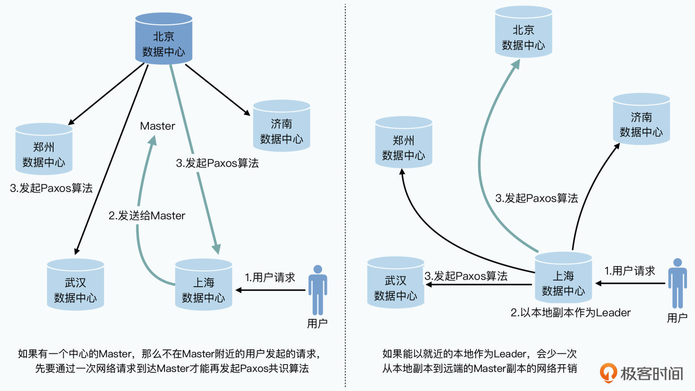
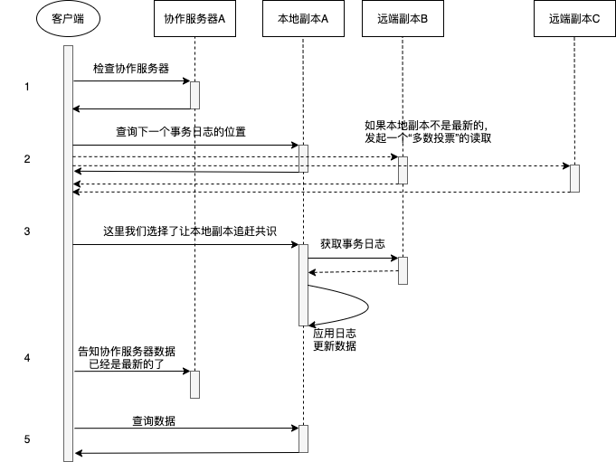
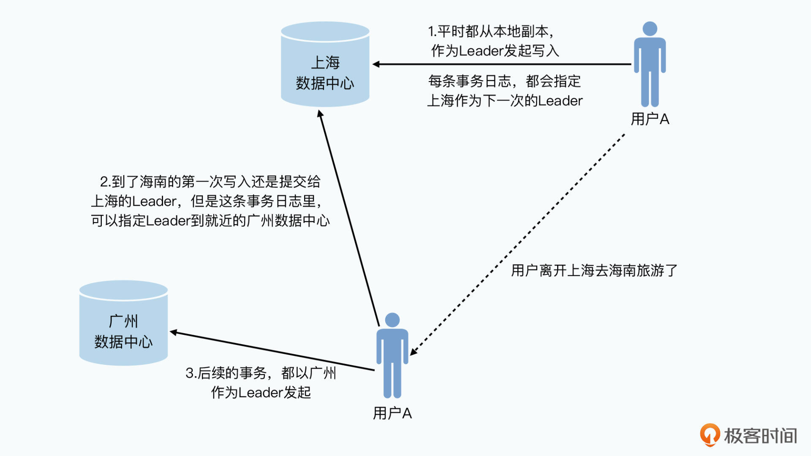
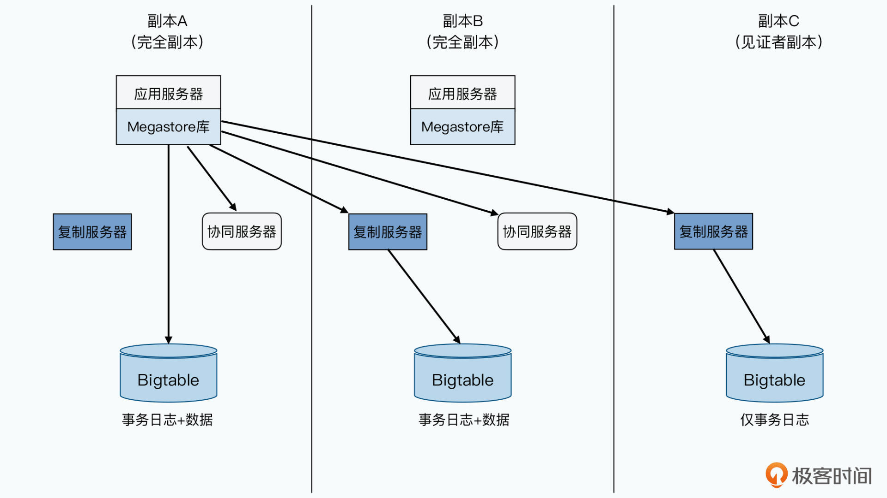

# 21 | Megastore（三）：让Paxos跨越“国界”

你好，我是徐文浩。

过去的两讲，我们分别了解了 Megastore 的整体架构设计，以及它对应的数据模型是怎么样的。Megastore 在这两点的设计上都非常注重实用性。

**在架构设计上**，它把一个大数据库分区，拆分成了很多小数据库，互相之间相互独立。这样可以并行通过多组 Paxos 来复制每一个分区的事务日志，来解决单个 Paxos 集群的性能瓶颈问题。

**在数据模型里**，Megastore 更是进一步地引入了“实体组”这个概念，Megastore 的一阶段事务，只发生在单个实体组这样一个“迷你”数据库里。这些设计，都大大缓解了大型分布式数据库可能会遇到的各种单个节点的极限压力。

不过，在 Megastore 里我们还有一个非常重要的问题需要解决，那就是**跨数据中心的延时问题**。我们在解读Chubby 的论文里已经了解过 Paxos 算法了，任何一个共识的达成，都需要一个 Prepare 阶段和一个 Accept 阶段。如果我们每一个事务都要这样两个往返的网络请求，我们的数据库性能一定好不到哪里去。所以，Megastore 专门在原始的 Paxos 算法上做了改造和优化。

那么，今天我们就一起来看看 Megastore 具体是怎么做的。通过这一讲的学习，你可以了解这样两点：

Megastore 是如何优化改造 Paxos 的算法，它是如何做到既利用了单 Master 的性能优点，又不用承担单 Master 的可用性缺点的。

Megastore 为什么要把每一个实体组，变成一个迷你数据库，它的架构设计如何限制了我们使用的数据模型。

通过这一讲，我不仅希望你了解 Megastore“是什么”，更要理解里面的设计是“为什么”，并且能够在理解它的优点的时候，明白它又有哪些不足之处。

## 为什么 Chubby 是个粗粒度锁？

我们先来回顾一下我们在 Chubby 论文中讲解过的 Paxos 算法。在 Chubby 里的 Paxos，有这样**两个特点**：

首先是 Chubby 里的整个 Paxos 集群，是要选举出一个 Master 的。所有的数据读写其实都是通过 Master 进行的。其他的节点，是作为“容错”而存在的。

而由于 Master 本质上是一个单点，当 Master 出现故障的时候，通常有一个超时监测机制来监测 Master 的故障。然后，我们还要等新的 Master 被选举出来，整个系统才能对外提供服务。

这两个特点，使得 Chubby 很容易使用，但是也有很大的**局限**。

首先是所有的读写都通过 Master 进行，使得单个 Master 会成为全系统的性能瓶颈；其次是 Master 故障切换的时候，系统虽然是有“容错”能力的，但是会有一段较长的不可用时间。而且，尽管所有的其他节点，只有在 Master 出错的时候才有可能转变成 Master 节点，我们仍然要给它们和 Master 一样的硬件配置，而这个配置在 99% 的时间里，是相对空闲的。

这也是为什么 Chubby，没有被直接用来为 Bigtable 提供事务功能，而是只作为一个粗粒度的锁。因为这样，Chubby 只需要管理极少发生变化的元数据，确保元数据的一致性，而不需要去管理高并发的数据库事务请求。

而这种先选举出单个 Master，然后都基于 Master 进行操作的 Paxos 算法实现，显然是不适合 Megastore 的。而且除了这两个特性之外，这个单 Master 的策略对于 Megastore 还有一个难以接受的点，那就是**网络延时**。

不要忘记，**Megastore 最重要的特性之一，就是“跨数据中心复制”。**明明用户离得最近的数据中心是在上海，你非要把请求先发送到在北京的 Master，然后再让 Master 向上海的数据中心发起提案，这可就白白多出了很大一段的网络延时。

就近写入可以减少一轮跨数据中心的网络开销

这么看来，Megastore 显然应该让提案可以从集群里的任何一个节点发起。也就是，用户的请求会到达离他最近的数据中心，然后对应的提案也是从这个数据中心的 Paxos 节点发起的。这个，也就让我们重新回到了最初的 Paxos 算法。

不过，选举出一个 Master 的算法也是有好处的，那就是 Master 可以减少 Paxos 算法的网络开销。

这个优化是这样的：对于原本是两阶段的 Prepare-Accept 的请求，我们可以在 Accept 请求里，带上下一次 Paxos 算法里的 Prepare 请求。因为所有的外部请求都会先到达 Master，然后由 Master 发起提案，所以这样的策略在实现上非常容易。而且因为请求都是从 Master 发起的，所以达成共识的过程中很少会有冲突，往往一个 Prepare-Accept 的过程，共识就已经达成了。

这样，原先是两阶段的 Prepare-Accept，常常只要一个网络请求就已经完成了，我们的 Paxos 算法在大部分情况下，就变成一个一阶段就能完成的了。

## Megastore 面临的 Paxos 挑战

基于 Master 的 Paxos 算法，既有缺点，就是所有的读写都要通过 Master，又有优点，那就是能够通过合并两次 Paxos 算法的 Accept 和 Prepare 阶段来减少网络请求。那么，我们能不能只享受这个办法的优点，又不用去承担这个算法的缺点呢？

这个，就是 Megastore 想到的办法，也就是**基于 Leader 的 Paxos 算法**。接下来，我们分别就从读和写两方面，来看一看 Megastore 是怎么做的。

### 两个保障

我们在上一讲里讲过，Megastore 支持三种读数据的方式，分别是 current、snapshot，以及 inconsistent。为了确保数据的“可线性化”，我们最关注的当然就是 current 读，对于 current 读来说，Megastore 其实就是要作出这样两个保障：

**每一次读都需要能够观察到最后一次被确认的写入。**

**一旦一个写入被观察到了，所有未来的读取都能观察到这个写入。**这句话乍听起来有点拗口，好像和前面那句是一个意思。其实，是因为写入，可能在被“确认”之前就被观察到，在这种情况下，后续的数据读取，即使这个写入还有没有被“确认”，也要能读取到这个写入。这样，我们才能在实体组层面，保障数据的“可线性化”。

### 数据的快速读

要做到数据的快速读取，最直观的想法，就是不要从 Master 读取，而是从本地的副本读取就好了。但是，Paxos 并不是一个两阶段锁的复制算法，而是一个“共识”算法，这个意味着，你的本地副本在“共识”达成之后，并不一定知道最新的“共识”是什么。即使知道共识，本地的 Bigtable 里也不一定已经更新了这份数据。

说不知道最新的共识是什么，是因为 Paxos 的共识算法，只需要超过一半的节点投票达成共识就可以了。你的本地副本，可能会因为网络故障，在最新一轮的共识中没有参与。而即使参与了投票，并且知道了共识，还会面临一个问题，那就是实际的事务日志写入到本地，与这个对应的更新应用到本地的 Bigtable，还有一个时间差。

所以，Megastore 在每个数据中心，都引入了一个叫做**协同服务器**（Coordinator Server）的节点，这个节点是用来追踪一个当前数据中心的副本里，已经观察到的最新的实体组的集合。对于所有在这个集合里的实体组，我们只需要从本地读数据就好了。如果实体组不在这个集合里，我们就需要有一个“追赶共识”（catch up）的过程。

所以，实际的 Megastore 数据的快速读取，比简单的一句“从本地副本读”，还是要复杂一些的。它的具体过程是这样的。

第一步，是查询本地的协同服务器，看看想要查询的实体组是否是最新的。

第二步，是根据查询的结果，来判断是从本地副本还是其他数据中心的副本，找到最新的事务日志位置。

所谓的日志位置，你可以认为是一个自增的事务日志的 ID。因为我们的事务日志，并不像单机的数据库那样，写到文件系统里，而是写到 Bigtable 的一张表里的。因为 Bigtable 支持单行事务，所以事务日志作为一行数据写到 Bigtable 也是一个原子提交。而 Bigtable 的数据存储又是按照行键连续存储的，也非常适合事务日志的这种追加写的特性：

如果协同服务器告诉我们，本地的实体组就是最新的。那么，我们就从本地副本，拿到最新的日志位置，以及时间戳就好了。**在实践当中，Megastore 不会等待查询到本地是不是最新版本，再来启动这个查询。而是会在查询协同服务器的同时就从 BigTable 里面获取这个事务日志的数据。这样通过并行查询的方式来缩短网络延时，即使本地不是最新版本，也无非浪费一次 Bigtable 的数据读取而已。**

而如果本地副本不是最新的，那么我们就要用到 Paxos 的投票特性了，我们会向 Paxos 其他的节点发起请求，让它们告诉我们最新的事务日志位置是什么。根据多数意见，我们就知道此时最新的事务日志的位置了。然后，我们可以挑一个响应最及时的，或者拥有最新更新的副本，从它那里来开始“追赶共识”。**因为我们的本地节点往往是响应最快的，所以从本地副本去“追赶共识”，往往也会是一种常用策略，但这不是我们的必然选择。**

接着第三步，就是“追赶共识”的过程了。一旦从哪个副本启动“追赶共识”的过程确定了，我们就只要这样操作就好了：

我们先去看，这个副本是否存在某些“空洞”。也就是，根据最新的日志位置，具体有哪些日志位置上，我们没有一个已经知道的值。如果有的话，我们就使用 Paxos 算法中的 **no-op 操作**，来确定这个日志位置的值，也就是日志内容。在对所有的这些“空洞”都确认了这个值之后，我们的事务日志就补齐了。你可能要问，如果这个副本是知道最新事务日志的位置的话，它也会有空洞么？答案是有，因为我们的这个节点，可能因为网络中断，没有拿到中间一段的事务日志。而在网络恢复参与投票之后，根据 Paxos 算法它可以知道最新的日志位置。

然后我们在这个副本的 Bigtable 里，顺序应用这些事务日志，就能让这个副本的 Bigtable 追赶上整个分布式系统的“共识”了。

如果在这个追赶共识的过程里失败了，我们就换一个其他的副本来尝试启动这个追赶过程。

第四步，如果我们在“追赶”的过程中，是通过本地副本来发起整个追赶过程的。那么一旦这个追赶的过程完成，意味着本地的数据已经更新到了最新的状态。那么它会向本地的协同服务器发起一个 Validate 的消息，让协同服务器知道这个实体组的数据已经是最新的了。这个消息不需要等待协同服务器确认返回，因为即使它失败了，无非是下一次读数据的时候，把前面的整个过程再走一遍就是了。

等到前面的这个过程完成，在第五步，我们就根据使用了哪一个“副本”来“追赶共识”，通过我们拿到的日志位置和时间戳，去问它的 Bigtable 要数据。如果这个时候，这个副本不可用了，那么我们就要再找一个副本，从前面的第三步“追赶共识”开始重复一遍。

论文中的图7，从本地副本A读取数据的时间线

这么一看 Megastore 的查询似乎还挺复杂的，但是其实你不用担心。因为在实践当中，我们的数据中心，不是慵懒的 Paxos 城邦里的居民，想要参与共识算法的时候就来参与，没空的时候就不来参与。**我们分布在多个数据中心里的 Paxos 集群，是尽全力参与整个共识过程的。**在绝大部分情况下，我们数据的写入，会在所有的副本中都写入成功。网络中断和硬件故障，毕竟是低概率事件。

这也就意味着，一般来说，我们的客户端请求只需要通过前面的第一步、第二步的第一小步和第五步这三个步骤，就能获取到数据，其中的第一步、第二步的第一小步这两个步骤，也是并行进行的，而且这些请求都是来自本地数据中心的副本里。而第二步的第二小步、第三步和第四步，都是在“容错”情况下，我们仍然要确保整个系统的“共识”和整个分布式系统的“可线性化”的表现，而设计出来的步骤。

这整个读数据的过程，其实就是论文中的 4.6.2 部分，以及对应的图 7，你可以再对照着仔细看一下。

### 数据的快速写

Megastore 读数据的思路很直接，其实就是尽可能从本地读取。但是到写数据的时候，问题就没有那么容易了。因为我们前面刚刚说过，我们既希望像基于 Master 的 Paxos 那样，可以把两阶段的 Prepare-Accept 过程，合并成一个过程。但是我们又不希望，单个 Master 成为我们写入数据的瓶颈。所以，Megastore 采用了一个叫做**基于 Leader**（Leader-Based）的实现方式。

这个思路，首先是借鉴基于 Master 的合并策略，把前一次的 Paxos 算法的 Accept 和后一次的 Prepare 的请求合并。不过，相比于 Master 节点一旦故障，我们就有一段不可用时间。而基于 Leader 的算法，仍然可以在 Leader 节点故障的时候，正常完成整个算法过程。我们只要在 Leader 故障或者不可用的时候，直接退回到原始的 Paxos 算法就好了。

那接下来，我们就来看看这个基于 Leader 的算法是怎么样的。

首先，为了确保我们的“可线性化”要求，在任何一个副本去写入数据之前，我们会**先“读”一次数据**，确保能够拿到下一次事务日志位置、最后一次写入数据的时间戳，以及哪一个副本在上次一次 Paxos 算法的时候，被确定是整个集群的 Leader。

那么这个 Leader 是谁，我们是怎么知道的呢？其实这是我们在每次提交事务的时候，“写”进去的。我们的每一次事务写入的“值”（也就是事务内容），除了原本要写入到数据库里的数据之外，还会加上对于 Leader 节点的“提名”，一旦事务写入成功，我们就认为提名通过了，下一次 Paxos 算法的 Leader 也就确定了。

当确认了下一个事务日志的位置，以及 Leader 是哪个节点的时候，我们就可以去写入数据了，这个过程是这样的：

首先是一个叫做 **Accept Leader** 的阶段，客户端会先尝试直接向 Leader 副本发起一个 Accept 请求。并且这个请求，会设定为 Paxos 算法中的第 0 轮的 Accept 请求。如果这个请求被 Leader 接受了，我们就会跳转到后面的第 3 步，向所有的副本都发起 Accept 请求来达成共识。

如果第 1 步的请求失败了，那么我们就正常走一个 Paxos 算法的流程，向所有的副本，发起一个 Prepare 请求。Prepare 请求里面带的提案编号，就是正常 Paxos 算法的提案编号，从 1 开始，用当前客户端见过的最大的编号 +1。

然后是 **Accept** 阶段，也就是让所有副本都去接收客户端发起的提案。如果没有获得多数通过而失败了，那么我们就重新回到第 2 步，重新走 Prepare-Accept 的过程。

在 Accept 阶段成功之后，我们需要向所有没有 Accept 最新的值的副本，发起一个 Invalidate 的请求，确保它们的协同者服务器，把对应的实体组从 Validate 的集合中去除掉了。

最后是一个 **Apply 阶段**，在 Apply 阶段，客户端会让尽可能多的副本，去把实际修改应用到数据库里。如果发现要应用的数据和实际提案的数据不同，会返回一个冲突的报错（conflict error**）。**

> 论文里的图8，数据写入的时间线

整个写入的过程，也对应着论文里的图 8，我也把这张图放在了这里，你可以对照着看。

可以看到，Megastore 里面通过 Paxos 实现的事务，和我们之前看过的 Paxos 算法和数据库事务有一点不同。

**在 Paxos 算法层面**，无论从哪一个客户端的数据中心发起事务，我们都会先尝试向 Leader 所在的副本提交。那么，这就和基于 Master 的 Paxos 实现一样，我们可以先在 Leader 这个单节点解决并发冲突。这样如果有并发冲突，我们不会需要通过多轮的 Paxos 算法才能解决冲突。而如果 Leader 节点挂掉了，也没有关系，我们可以直接退回到多轮协商的 Paxos 算法。这样，我们也不会遇到 Master 挂掉，我们就要等待 Master 恢复才能推进事务，导致整个系统的可用性偏弱的问题。

不过，如果我们的写入请求都要发送给 Leader 副本，那是不是做不到数据都是“就近”写入的呢？这个，我们就要重新回到 Megastore 的数据模型里了。

**在 Megastore 的数据模型里**，每一个实体组，就是一个“数据库”，对应的 Accept 包含的下一次 Prepare 的 Leader，其实是针对同一个“实体组”的。而同一个“实体组”，往往都会是在同一段时间、同一个地域内进行多次写入的。那我们在每次的 Paxos 算法实例去“提名”下一个 Leader 的时候，只要提名此时响应最快的最近的副本就好了。这样，我们大概率下一次的数据写入，也会是“就近”的。

比如，上一讲里我们就看过，User 这个实体组里，有很多 Photo 这些子实体，这个模型最合适的就是一个相册的应用。那么，因为一个用户是一个实体组，而用户不可能频繁地搬家到不同的城市。就比如我住在上海，拍摄上传的照片大概率都在上海。自然 Megastore 就可以根据前一次写入的时候，离哪个数据中心近，就提名哪个数据中心的副本作为 Leader 就好了。

而如果我出门旅游去了广州，那么只有第一次上传的照片，会需要跨越地域提交到在上海的 Leader 副本，接下来旅游连续拍摄的照片，又会就近提交到广州的数据中心。可以说，Megastore 的这个策略，很好地利用了我们的数据写入，是有局部性的这个特征。

不过，我们也要看到，**这个策略是和 Megastore 的数据模型，以及开发者设计的数据表结构高度相关的。**如果我们设计了一个订单实体，Order 作为实体组，那么订单可能来自全国各地，我们就会遇到大量的事务提交需要跨地域的问题了，会非常影响整个系统的性能。

只要实体组的数据写入，在连续的时间段内有地域的局部性
那么我们的数据写入在大部分情况下都是提交给就近的数据中心的Leader副本

**在数据库事务层面**，Megastore 也和一般的数据库事务稍有不同。我们传统的数据库事务，事务提交成功了，就可以直接读数据了。在论文里称之为，在提交点（commit point）和可见点（visibility point）是相同的。

但是在 Megastore 的数据写入里，在 Paxos 算法确认哪个提案胜出之后，事务提交已经完成了。而此时，并不是所有的副本都已经接受了这个最新事务的“值”，也不是所有的协同服务器，都已经把对应的实体组在自己这里标注为“失效”。只有当这两者之一完成之后，我们才能确保下一次读取对应副本的数据，一定能读取到实体组最新版本的数据。

到这里，相信你也能明白，我们一开始 Megastore 的“两个保障”里所说的，“写入，可能在被确认之前就被观察到”究竟是怎么一回事儿了。在数据写入的第 3 步，Accept 已经完成了，事务已经提交了。但是，对应的数据更新还没有同步到所有的副本，这个时候，可能某一个节点的副本已经更新完成了。所以用我们前面的数据读取过程，从这个副本读取数据的时候，会读取到最新版本的数据。但是，在其他副本，这个数据可能还没有更新到 Bigtable 的数据表里。也就是，并不是所有副本都已经完成了事务的“应用”，所谓的**事务确认**（acknowledge）的过程还没有完成。

### 系统整体架构

因为事务提交成功，和数据在实际存放的 Bigtable 里可见，其实是分开的两个步骤。这一下子就凸显出**协同服务器**的重要性出来了。

Megastore 的事务日志，是存放在 Bigtable 里，Megastore 的数据库数据也存放在 Bigtable 里，我们在每一个数据中心里，都有这样一份数据副本。但是此时此刻，到底本地 Bigtable 的事务日志，以及数据是不是最新版本，我们并不知道。这些信息，其实都是通过协同服务器来维护的。

但是这也意味着，我们为整个系统引入了一个新的“故障点”。不过，好在协同服务器的这些数据，都只维护在内存里，而且只需要维护本地数据中心的实体组是否是最新的这样一个状态。并且它也没有任何外部依赖，即使节点故障，重新启动一个新的节点，里面的数据也可以通过 Paxos 的“多数投票”过程，恢复出来。

**因为足够简单，所以协同服务器会比 Bigtable 更加稳定。**

不过，**只要会出错的一定会出错**。我们同样需要考虑它的“容错”问题，在 Megastore 里，协同服务器的容错是这么来处理的：

协同服务器，会在服务启动的时候，去远程数据中心的 Chubby 锁服务里，获取特定的锁。

如果要处理请求，协同服务器，需要持有超过半数的锁。

一旦因为网络故障，导致它不再持有超过半数的锁，那么它就会退回到一个保守的默认状态，也就是它会认为本地所有的实体组的数据版本，都是过时的。

那么后面所有的数据，都需要通过 Paxos 的“多数投票”方式，请求多个远程的副本。

换句话说，也是一旦协同服务器觉得网络出现分区了，那么就放弃自己维护的本地状态，退回到原始的 Paxos“多数投票”的策略。

> 论文中的图5，Megastore的架构示例

最后，到了这里，整个 Megastore 的系统架构也就呼之欲出了。那就让我们来看一下整个 Megastore 系统的整体架构。

**横向来看**，是这样的：

每一个数据中心里，都有我们的**应用服务器**，应用服务器本身会通过一个 Megastore 的库，来完成和 Megastore 的所有交互操作。所有的外部请求，比如用户数据更新、上传照片，都是先到应用服务器，再由应用服务器调用它所包含的 Megastore 的库，来进行数据库操作。

每一个数据中心里的**数据，都是存储在底层的 Bigtable 里的**。无论是事务日志，还是实际的数据，都是通过 Bigtable 存储。所以我们也就不用操心数据存储层面的灾备、容错、监控等一系列问题了。

**中间层，Megastore 有两类服务器**。一类是我们刚刚说过的协同服务器，用来维护本地数据是否是最新版本。另一类，叫做复制服务器（Replication Server）。我们所有的数据写入请求，如果是写到本地数据中心里的，直接写 Bigtable。如果是要告诉远端的另外一个数据中心，则是发送给那个数据中心的复制服务器。这个复制服务器，本质上就是起到一个代理的作用。此外，复制服务器还要负责定期扫描本地的副本里，因为网络故障、硬件故障，导致没有完整写入或者应用的数据库事务，然后通过 Paxos 里的 no-op 操作去同步到最新的完整数据。

而为了进一步提升性能和服务器使用的效率，Megastore 对于每一个数据中心的副本，还分成了三种不同的类型：

- 第一种叫做**完全副本**（Full Replica），也就是拥有前面我们说的所有的这些服务。
- 第二种叫做**见证者副本**（Witness Replica），这样的副本只参与投票，并且记录事务日志。但是它不会保留实际的数据库数据，所以我们也不能从这些副本查询数据。如果我们的完整副本比较少，比如只有北京和上海两个数据中心，这样我们无法完成 Paxos 需要的至少三个节点的投票机制。那么，我们就可以随便在哪个数据中心，再增加一个见证者副本，确保可以完成“多数通过”的投票机制。
- 第三种叫做**只读副本**（Read-Only Replica），它恰恰和见证者副本相反，它不会参与投票，但是会包含完整的数据库数据。读取这个副本，可以拿到特定时间点的数据快照，我们可以把它当作是一个异步的数据备份。在明确知道我们读取数据的时候，不需要保障“可线性化”的时候，也可以直接去读取这个数据。因为大部分的数据库都是读多写少的，这个副本也可以减轻我们的完全副本的负载。

可以看到，尽管 Megastore 已经支持了“可串行化”的数据库事务，在整个分布式系统下，也是“可线性化”的。但是为了性能考量，我们仍然会在实践中，提供一些异步更新的节点供数据读取，只是我们需要明确让客户端知道这一点。

## 小结

好了，到这里，我们就通过三节课的时间，把 Megastore 的论文解读完了。可以看到，Megastore 的跨数据中心复制机制，做了不少优化动作。

相比于固定选取一个服务器作为 Master，Megastore 选择了在每一个 Paxos 算法实例里都能**指定一个 Leader 的方式**，既享受了基于 Master 算法的高性能，也避免了基于 Master 容易出现故障切换时间的可用性损失。同时，只要我们的数据模型合适，选择 Leader 的策略得当，我们的大部分数据写入，都会就近选择本地副本作为 Leader。

在系统的整体架构上，Megastore**完全使用 Bigtable** 用来存储事务日志，以及数据库内的数据。然后通过一个**协同服务器**，来存储数据是否是最新的这样一个信息。通过协同服务器，我们就剥离出去了在多数据中心下，保障数据是“可线性化”的这个复杂性。

而为了减少服务器的硬件消耗，Megastore 又把 Paxos 集群里的参与者，分成了三种。分别是包含完整日志和数据的**完全副本**，只参与投票、有事务日志但是没有数据库数据的**见证者副本**，以及不参与投票、但是保留完整数据的**只读副本**。

不过，**Megastore 并没有真的突破物理限制**。每一个数据库事务，仍然是要至少一次跨数据中心的 Accept 请求给所有的 Paxos 里的参与者。而为了保障可线性化，每次数据写入之前，都需要先读一下数据，来确保本地副本的数据是最新的。并且考虑到跨数据中心的延时，Megastore 的一个实体组，最多也只能支持每秒几次的事务请求。当然，由于每一个独立的实体组，都是一个“迷你数据库”，我们整个数据表里，能够支持的并发请求还是很大的。

回顾过去三讲，我们可以看到，Megastore 的确做到了跨数据中心同步复制、数据库事务、数据库 Schema 等一系列特性。但是，为此，Megastore 也对数据模型作出了很多限制。而且如果你要善用 Megastore，发挥出 Megastore 的性能，你也需要了解 Megstore 的底层实现。

所以，Megastore 并没有成为市场上流行的数据库。不过，Megastore 本身充分利用 Bigtable，思考应用层的数据模型和系统架构设计的关系，以及对于 Paxos 算法实现的优化，对我们学习分布式架构，有着很强的指导意义。希望通过这三讲的学习，你不仅能够了解 Megastore 的整体架构，也能够学会如何从实践出发，通过利用好现有的系统，实现复杂而宏伟的系统目标。

## 推荐阅读

Megastore 虽然只是一个过渡性的数据库产品，但是它的整个设计思路仍然有大量我们可以借鉴的地方。不过对于 Megastore 的剖析和介绍材料相对比较少，这里我放上了 2008 年，Google I/O 里对于 App Engine 里的 Datastore 的 1 小时的讲座视频链接，这是少有的通过视频讲解 Megastore 的使用和原理的材料，你可以看看。

而 Megastore 的多数据中心同步复制数据的机制，是基于 Paxos 的。如果你还没有看过原始的 Paxos 论文，建议你一定花时间去读一下Paxos Made Simple这篇论文。

## 思考题

最后，还是给你留一道思考题。

其实在后面的 Spanner 的论文里，提到了 Megastore 的写入的吞吐量很糟糕，结合你过去三讲对于 Megastore 系统整体架构的理解，你觉得这是为什么呢？Megastore 数据写入的吞吐量的核心瓶颈在哪里？我们是否有办法改造然后优化这个写入性能呢？

欢迎在留言区，分享出你的思考过程和答案。也欢迎你把今天的内容分享给你的老师、同学和朋友们。